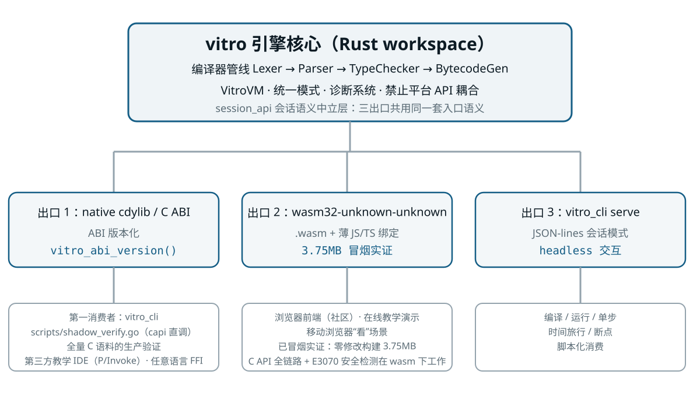
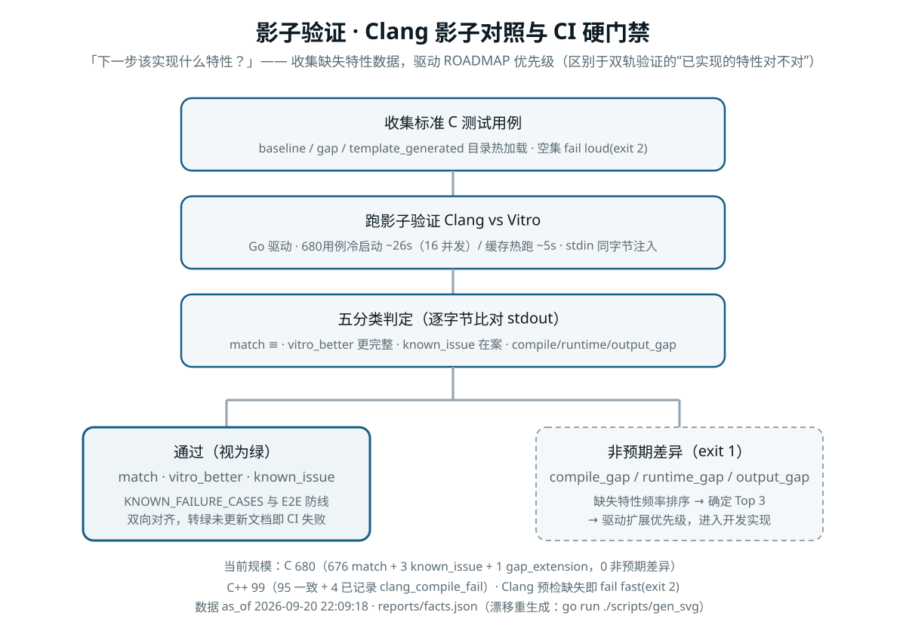
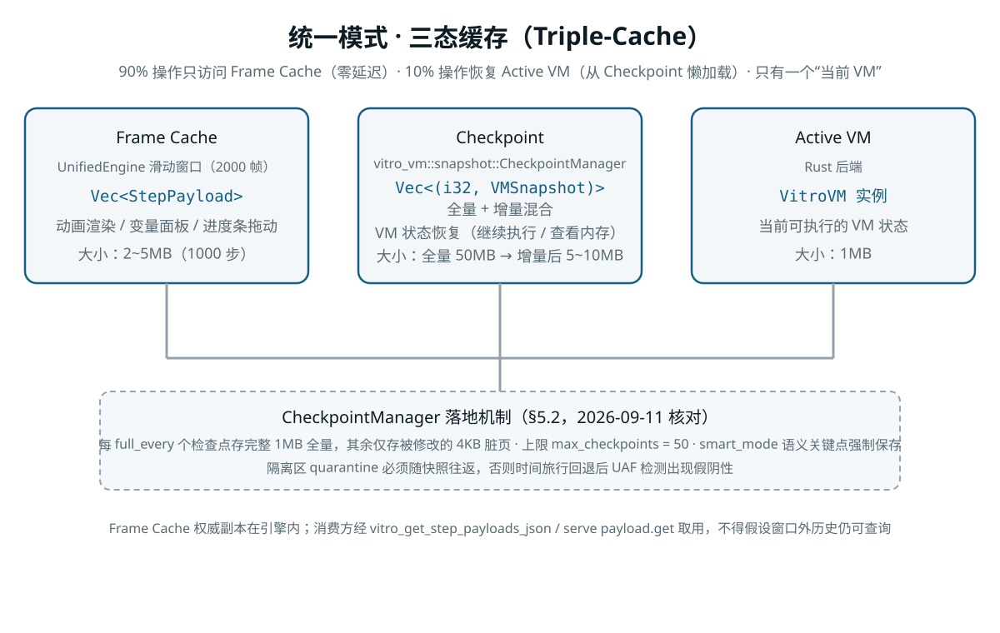
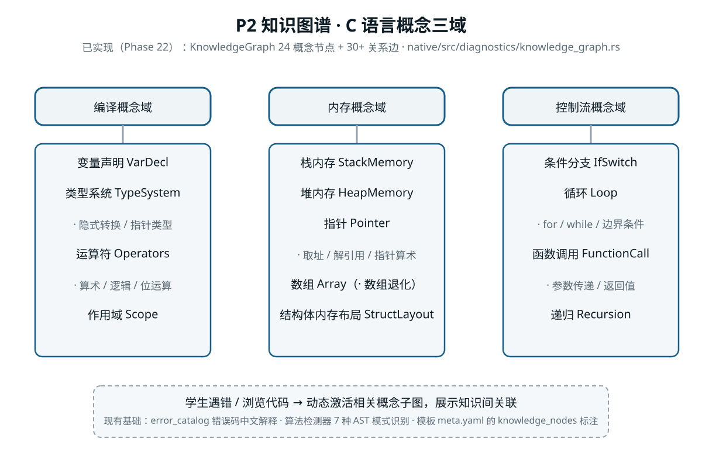

<p align="center">
  
</p>

# Vitro

> 教学 C/C++ 子集参考执行引擎（白箱后端）

一个用 Rust 从零实现的教学 C/C++ 子集编译器与字节码虚拟机：**Lexer → Parser → TypeChecker → BytecodeGen → VitroVM** 全链路自研，以 Clang / Clang++ 为行为基准做诚实对照，把"程序究竟怎么跑"变成可见、可解释、可回放的教学素材。

> **本仓库只做后端（MIT 许可）。** 2026-09-11 完成前端切割：`CideFlutter/`、FRB 桥接、web 部署 workflow 与全部 Flutter 构建脚本已迁出，前端交给社区；原生移动端放弃（"看"的场景由 wasm32 + 任意 Web 前端的移动浏览器天然覆盖）。切割前最后完整状态由标签 `before-frontend-split` 保留（`git checkout before-frontend-split -- CideFlutter` 可取回）。
>
> **MoonBit 迁移进行中（2026-09-18 起，同仓绞杀者模式）**：引擎核心正以绞杀者方式向 MoonBit 重建——上方 Rust 版已冻结为**差分对照 oracle**（tag `rust-oracle-freeze`，只收安全修复，新特性一律不做），`moonbit/` 活跃区承载全部新开发；迁移 v1 范围 = **C only**（C++ 已裁砍，2026-09-20），目标出口为 **wasm-gc 单出口多宿主**。mooncakes [`vitro/engine`](https://mooncakes.io/docs/#/vitro/engine/) 已发布至 **0.5.0**。形态裁定、包切分与逐片进度见 [MoonBit迁移总计划](docs/current/01-定位与路线/MoonBit迁移总计划.md)，活跃区操作手册见 [`moonbit/AGENTS.md`](moonbit/AGENTS.md)。
>
> 定位转型的决策依据与路线见 [`docs/current/01-定位与路线/后端定位与白箱计划.md`](docs/current/01-定位与路线/后端定位与白箱计划.md)。

## 三出口一核心

```
vitro 引擎核心（Rust workspace，禁止平台 API 耦合）
│
├─ 出口 1：native cdylib / C ABI（native/src/capi/，ABI 版本化 vitro_abi_version()）
│    第一消费者：vitro_cli、scripts/shadow_verify.go（capi 直调，683 个用例的生产验证）
│    外部消费者：第三方教学 IDE（.NET P/Invoke 子进程等）、任意语言 FFI
│
├─ 出口 2：wasm32-unknown-unknown（.wasm + 薄 JS/TS 绑定）
│    浏览器前端（社区）、在线教学演示、移动浏览器"看"场景
│    已冒烟实证：零修改构建 3.75MB，C API 全链路 + E3070 安全检测在 wasm 下工作
│
└─ 出口 3：vitro_cli serve（JSON-lines 会话模式）
     headless 交互：编译 / 运行 / 单步 / 时间旅行 / 断点 的脚本化消费
```

**架构纪律**：新能力一律先落语言中立的 Rust 层，三个出口只做薄包装且共用同一套入口语义（`native/src/session_api.rs`）；复杂结构过边界统一走 JSON 字符串；capi 是公共 API，承诺即契约。

## 项目图览

<p align="center">
  
</p>

**三出口一核心架构** —— 引擎核心（编译管线 + VitroVM + 统一模式 + 诊断）经 C ABI、wasm32、`vitro_cli serve` 三个薄出口对外，共用 `session_api` 会话语义中立层。
详图与决策：[架构设计.md](docs/current/01-定位与路线/架构设计.md)

<p align="center">
  
</p>

**影子验证门禁** —— 同一份 C/C++ 语料喂给 Clang 与 Vitro 逐字节对拍，"通过 / 非预期差异"分流驱动扩展优先级；CI 硬门禁，图内规模数字由 facts 台账机判防漂移。
机制与判定表：[影子验证框架.md](docs/current/04-标准库与防线/影子验证框架.md)

<p align="center">
  
</p>

**统一模式三态缓存** —— 时间旅行教学交互的三层缓存：Frame Cache 承接动画与面板的零延迟浏览，Checkpoint 支撑状态恢复，Active VM 保持唯一可执行现场。
设计与落地口径：[统一模式设计.md](docs/current/05-教学体验/统一模式设计.md)

<p align="center">
  
</p>

**认知推理知识图谱** —— 把 C 语言离散知识点建模为编译 / 内存 / 控制流三域概念图，学生遇错时动态激活关联子图。
节点分类树与已实现范围：[认知推理系统设计.md](docs/current/05-教学体验/认知推理系统设计.md)

> 以上插图由 `go run ./scripts/gen_svg` 从 `reports/facts.json` 生成（快照数字带 `data-fact` 锚，`go run ./scripts/facts check` 机判漂移），勿手改；全部 11 张插图（另含 MoonBit 包切分两张 / 统一模式架构与状态机 / 内存布局 / StepPayload 帧结构 / wasm 并发隔离）见 [`docs/README.md`](docs/README.md) 插图约定。

## 技术栈

| 层级 | 技术 |
|------|------|
| 语言 | **Rust 1.95.0**（`#![forbid(unsafe_code)]` 覆盖核心 crate） |
| 编译器 | 手写 Lexer / Parser / TypeChecker / BytecodeGen（10 个独立子 crate） |
| 执行 | 自研 VitroVM 字节码解释器，1MB 线性内存，指令级边界检查 |
| 加速 | 模板 JIT（热点循环 trace → 预编译 Rust 函数指针序列，非机器码 JIT） |
| 出口 | C ABI（capi）、wasm32、`vitro_cli serve`（JSON-lines） |
| 迁移目标 | **MoonBit**（`vitro/engine` workspace，同仓绞杀者重建中；Rust 版冻结为差分对照 oracle） |
| 许可 | MIT |

> **注意**：模板 JIT 不是传统机器码 JIT。由于核心 crate 启用 `#![forbid(unsafe_code)]`，无法动态生成机器码，因此把热点循环的字节码 trace 编译为预编译 Rust 函数指针序列（超级指令），跳过解释器 dispatch 开销，不匹配时回退标准解释执行。

## 当前状态（2026-09-23 实测）

**现役 Rust 引擎（冻结对照 oracle）**：

- **C 教学子集**：C Shadow Verification **683 个用例**（完全匹配 679 + known_issue 3 + gap_extension 1，无非预期差异；vitro_better 已清零）
- **C++ 教学子集**：C++ Shadow Verification **99 个用例**（95 一致 + 4 个已记录的 `clang_compile_fail`：`cpp_vitro_vec_class` / `cpp_vitro_list_class` / `cpp_u3_class_instantiate_in_template` / `cpp_u3_vec_class_twice`）；C++ E2E 回归 83 个用例。**C++ 已裁砍（2026-09-20）**：冻结区内防线继续跑到 Rust 区退役为止，MoonBit 侧零迁移
- **真实程序回归**：K&R 81 题全绿；LeetCode 138 题全部通过；Baseline 用例全部通过
- **全量测试**：`cargo test --workspace --all-features` 全绿（**实测数字行，随工具链版本漂移**：2026-09-23 实测 1029 用例 / 64 套件，CI `windows-latest` 与本地同平台——按实测行人工维护）；clippy 0 warning
- **capi 第一批**：13 个新入口全部落地（`vitro_abi_version` 首批 `1.1.0`，现 `2.1.0`），StepPayload schema v0.1 发布
- **wasm32 出口**：零修改构建 3.75MB `.wasm`，Node 下 C API 全链路（compile → run → output）+ E3070 教学诊断通过
- **时间旅行**：VM 快照 / 检查点 / Seek / 异常回退全链路可用（`vitro_cli unified`、`serve` 的 `step.*`/`seek`）

**MoonBit 迁移（进行中，全部新开发在此）**：

- **已发布**：mooncakes [`vitro/engine`](https://mooncakes.io/docs/#/vitro/engine/) 0.1.0 → **0.5.0**（2026-09-23，parser 随架）
- **已收官片**（2026-09-19~21 各片收官时点数字）：S2 lexer（token TSV 差分 6002 逐字节一致）/ S3 parser（597 语料 AST+诊断归一逐字节一致）/ S4 typeck·names·libc（598 语料 E1–E4 全绿）/ S5 codegen·bytecode（**A 级对拍 598/598 全闭环**，含 code 段逐指令）
- **进行中**：S6 memory + host 建包推进（110 路由 host handler 已接线 **101**——余控制流/回调族 9 随 vm 片；含 VFS 17 件；`moon test` **353 用例**全绿 + 十一闸绿）；下一片 = vm，其后 S7 协议/会话、S8 教学智能、S9 裁定批
- 进度与里程碑验收锚：[MoonBit迁移总计划](docs/current/01-定位与路线/MoonBit迁移总计划.md) §10

> 失败与差异一律如实记录在各 `*_FAILURES.md`（见下文"测试防线"），禁止通过修改测试预期值粉饰数据。

## 项目结构

```
native/                    Rust workspace（编译器 + VM + 三出口）——已冻结为差分对照 oracle（tag rust-oracle-freeze）
├── crates/                10 个子 crate
│   ├── vitro_shared/       SourceLoc、ErrorCode 等共享基础类型
│   ├── vitro_ast/          AST 节点与类型系统
│   ├── vitro_lexer/        词法分析器
│   ├── vitro_parser/       语法分析器
│   ├── vitro_cpp_frontend/ C++ 前端支持
│   ├── vitro_typeck/       类型检查器
│   ├── vitro_codegen/      字节码生成器
│   ├── vitro_runtime/      VM 运行时共享数据（内存状态、opcode、符号表）
│   ├── vitro_vm/           VitroVM 字节码解释器
│   └── vitro_algorithm_steps/ 算法步骤语义标注
├── src/
│   ├── capi/              C API（出口 1，公共契约，ABI 版本化）
│   ├── session_api.rs     会话语义中立层（capi 与 serve 共用）
│   ├── unified/           统一模式 / 时间旅行引擎
│   ├── engine/            编译管线与工具
│   ├── compiler/          静态分析模块（CFG / 数据流 / 算法识别 / 意图推断）
│   ├── diagnostics/       结构化诊断、自动修复建议、知识图谱、教学推理
│   ├── flutter_bridge.rs  历史会话包装层（vitro_cli 当前消费，名称待重构收敛）
│   └── bin/vitro_cli.rs    CLI 调试工具（出口 3 的 serve 也在这里）
├── include/vitro_capi.h    C API 头文件
├── runtime_libc/          标准库存根 + 内置 C++ 容器（.cpp 接口声明为唯一真相来源）
├── benches/               性能基线
└── tests/                 五层测试防线与用例（baseline / knr / leetcode / cpp / shadow）
moonbit/                   MoonBit 活跃区（vitro/engine workspace；绞杀者重建，全部新开发在此——包切分与状态见 moonbit/AGENTS.md）
templates/                 算法模板源（source.c + meta.yaml；待社区前端或 wasm 出口认领）
scripts/                   Go 防线驱动与工具脚本（Shadow 驱动、差分对拍、facts 对账、CI 一致性检查；清单见 docs/current/02-构建与上手/脚本总清单与必跑防线.md）
docs/                      设计文档、规范与事故报告
  ├── current/             当前有效文档
  ├── spec/                语言中立协议 schema
  └── archive/             历史归档（仅供追溯，可能严重过时）
```

## 快速开始

```bash
# 1. 构建 CLI 调试工具（五分钟跑通第一个程序，无需任何前端）
cd native && cargo build --release --bin vitro_cli
./target/release/vitro_cli run tests/cases/baseline/hello_world.c

# 2. 直接跑一段代码（从 stdin 读源码）
echo '#include <stdio.h>
int main() { printf("hello, vitro\n"); return 0; }' | ./target/release/vitro_cli run -

# 3. 编译并运行引擎核心库（C ABI / wasm 出口的构建基础）
cd native && cargo build --release                 # native/target/release/vitro_native.dll
cd native && cargo build --target wasm32-unknown-unknown --release   # wasm32 出口

# 4. JSON-lines 会话（headless 交互出口）
./target/release/vitro_cli serve

# 5. 测试与静态检查
cd native && cargo test --workspace --all-features
cd native && cargo clippy --workspace --all-targets --all-features -- -D warnings

# 6. 测试防线（Shadow Verification：与 Clang / Clang++ 对照 stdout）
go run ./scripts/shadow_verify
go run ./scripts/shadow_verify_cpp
go run ./scripts/serve_smoke

# 7. MoonBit 活跃区（迁移进行中；构建 / 闸门 / 发布全流程见 moonbit/AGENTS.md）
cd moonbit && moon check && moon test
```

完整上手流程见 [`docs/current/02-构建与上手/快速入门.md`](docs/current/02-构建与上手/快速入门.md)，构建细节见 [`docs/current/02-构建与上手/构建指南.md`](docs/current/02-构建与上手/构建指南.md)，CLI 命令手册见 [`docs/current/02-构建与上手/CLI使用手册.md`](docs/current/02-构建与上手/CLI使用手册.md)。

> 历史前端构建（Flutter / Android / iOS）已随前端迁出，脚本见标签 `before-frontend-split`。

## 测试防线

项目采用**五条分层协作的测试防线**，核心哲学：*测试不是为了标榜通过率，而是为了诚实地发现自己可能存在的问题*。

1. **Shadow Verification**：同一份源码同时交给 Clang / Clang++ 与 Vitro 执行，比对纯程序 stdout（Golden 只能来自 Clang，不能来自 Vitro 自己）；自 2026-09-06 起为 CI 硬门禁
2. **K&R + LeetCode 真实程序回归**：验证"真实世界代码能不能跑"
3. **三层契约验证**：Host Contract / Bytecode Self-Consistency / Differential Stress
4. **Fuzz 压力测试**：确定性 RNG 生成恶意内存与调用序列，验证安全检测不泄漏
5. **CI 集成与一致性监控**：`*_FAILURES.md` 与测试结果双向对账，转绿未更新文档即 CI 失败

失败与差异记录位于 `native/tests/*_FAILURES.md`，每次 CI 运行生成一致性报告。

## 诚实声明：这是一个 AI 实验田

**Vitro 不是由一个完整掌握每一行代码的团队从零手写而成的项目。**

它是人与 AI 协作的产物：

- 项目设计者参与了整体架构、功能方向、关键决策与部分细节调整
- 大量代码、测试、文档由 AI（包括本 README）生成、重构与维护
- 设计者无法保证能够回答社区提出的每一个问题
- `docs/archive/` 中保留一部分协作交互文本

如果你在使用过程中发现：

- 某段代码的设计理由说不清
- 某个边界行为与标准不一致
- 某处文档滞后于实现
- 某些改动看起来是"为了通过测试而绕过问题"

这些都有可能是 AI 实验田的典型痕迹。我们宁可诚实记录，也不想伪装成一切尽在掌控。

**提交署名 = 审阅深度信号**（2026-09-19 起）：git 提交信息中**提及用户**（署名 / 审阅标记）表明该批代码经过项目所有者的深度审阅与探针测试；**未标明**则仅代表浏览过，不构成审阅背书。评估任何一段代码的可信度时，请以对应提交的署名状态为准。

## 如果你感到被浪费了时间

大可抨击我们。

批评是项目继续改进的真实动力。如果你愿意，可以通过 Issue 或 PR 指出问题；如果只想发泄，我们也接受——毕竟一个无法对全部代码负责的项目，本就配不上所有人的信任。

## 许可证

[MIT](LICENSE)
