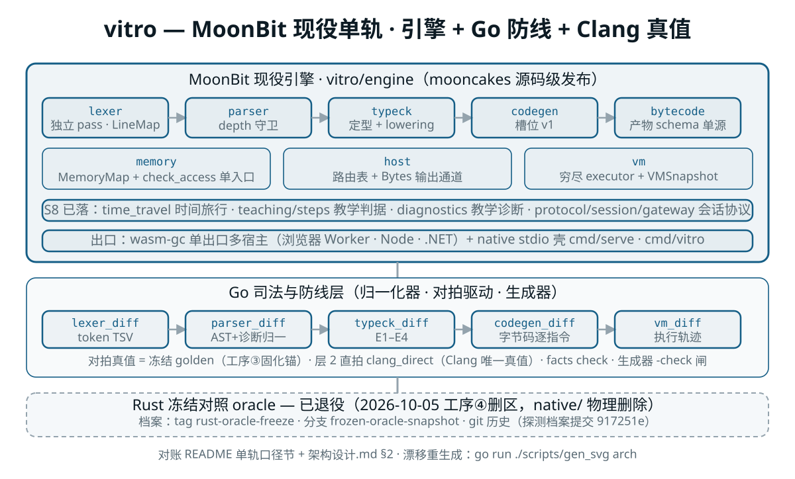
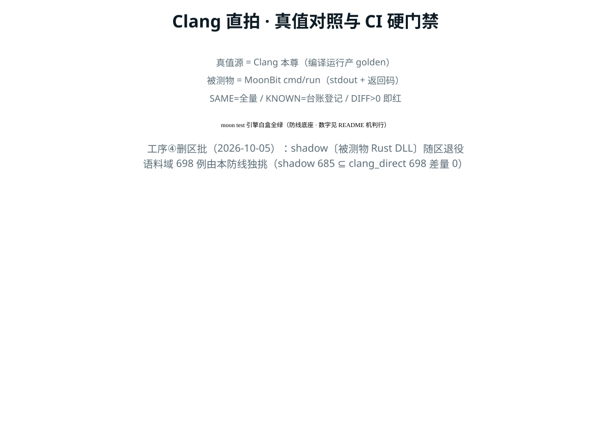
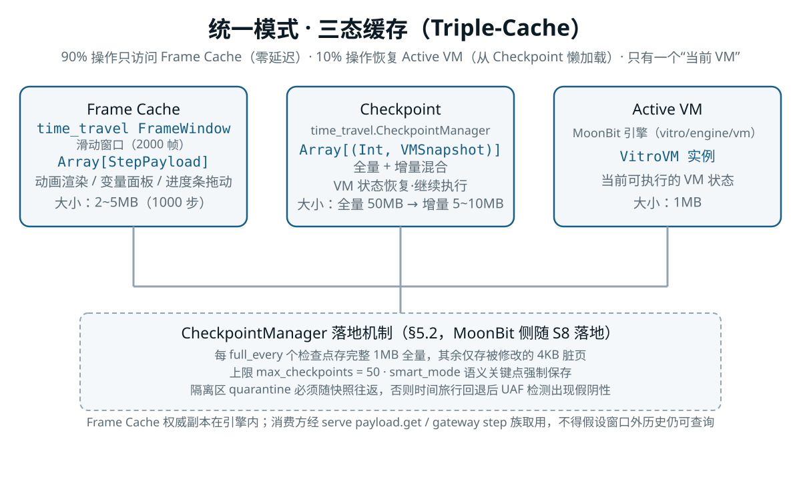
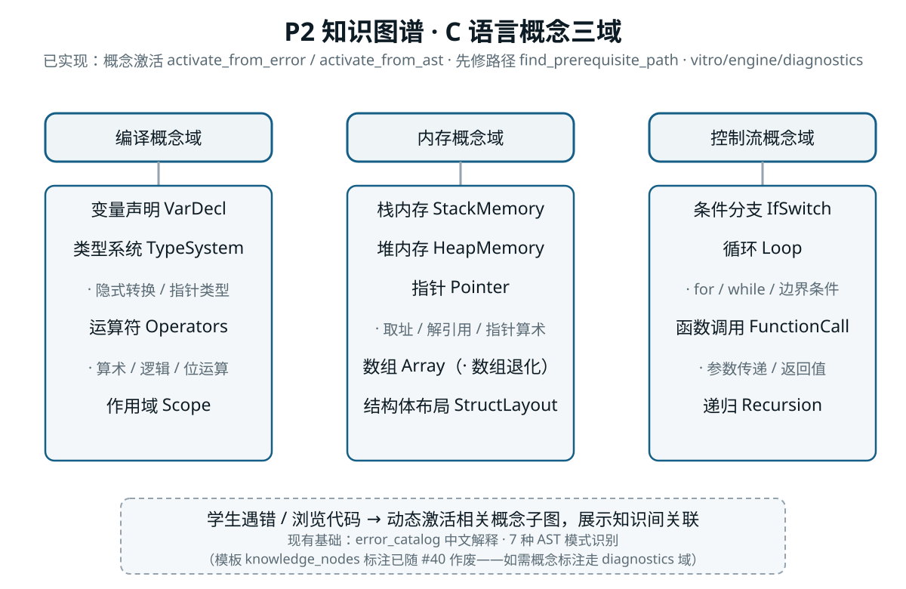

<p align="center">
  
</p>

<p align="center">
  <a href="https://github.com/rustin-beep/Vitro/actions/workflows/ci.yml"></a>
  <a href="LICENSE"></a>
  <a href="https://rustin-beep.github.io/Vitro/"></a>
</p>

# Vitro

> 教学 C 子集参考执行引擎（白箱后端）

一个教学 C 子集编译器与字节码虚拟机：**Lexer → Parser → TypeChecker → BytecodeGen → VitroVM** 全链路自研，以 Clang 为行为基准做诚实对照，把"程序究竟怎么跑"变成可见、可解释、可回放的教学素材。**现役且唯一的实现是 MoonBit**（`moonbit/`，mooncakes [`vitro/engine`](https://mooncakes.io/docs/#/vitro/engine/)）；迁移期的 Rust 对照实现已于 2026-10-05 退役删除（S9 工序④删区，档案 = tag `rust-oracle-freeze` + git 历史），对拍防线全部切换为冻结 golden + Clang 直拍。

> **本仓库只做后端（MIT 许可）。** 2026-09-11 完成前端切割：`CideFlutter/`、FRB 桥接、web 部署 workflow 与全部 Flutter 构建脚本已迁出，前端交给社区；原生移动端放弃（"看"的场景由 wasm32 + 任意 Web 前端的移动浏览器天然覆盖）。切割前最后完整状态由标签 `before-frontend-split` 保留（`git checkout before-frontend-split -- CideFlutter` 可取回）。为展示 0.7.0 的 wasm-gc 单出口，仓库附带一个**无前端框架的静态单页 demo**（`demo/`，浏览器直调 gateway，[在线体验](https://rustin-beep.github.io/Vitro/)）——它是引擎能力的展示面，不是前端产品。
>
> **MoonBit 迁移（2026-09-18 起，同仓绞杀者模式）**：S2–S8 已收官——lexer / parser / typeck / codegen·bytecode / memory·host·vm / 协议会话与 wasm-gc 单出口 / 时间旅行与教学智能四域全部落地并对拍闭环；mooncakes 已发布至 **0.8.0**（S8 收官版，2026-10-05）。迁移 v1 范围 = **C only**（C++ 已裁砍，2026-09-20），目标出口为 **wasm-gc 单出口多宿主**。形态裁定、包切分与逐片进度见 [MoonBit迁移总计划](docs/current/01-定位与路线/MoonBit迁移总计划.md)，活跃区操作手册见 [`moonbit/AGENTS.md`](moonbit/AGENTS.md)。
>
> 定位转型的决策依据与路线见 [`docs/current/01-定位与路线/后端定位与白箱计划.md`](docs/current/01-定位与路线/后端定位与白箱计划.md)。

## 现役引擎：MoonBit（`vitro/engine`）

- **wasm-gc 单出口（F-5）**：`vitro/engine/gateway`——NDJSON 帧协议层（4 函数导出 invoke/reset/protocol_version/engine_version，String 零拷贝直传），Node 宿主驱动与 16 断言冒烟见 [scripts/wasm_gateway](scripts/wasm_gateway/host.js)；native stdio 壳 `cmd/serve` 与 wasm 宿主消费同一 dispatch
- **已发布**：mooncakes [`vitro/engine`](https://mooncakes.io/docs/#/vitro/engine/) 0.1.0 → 0.5.0（2026-09-23）→ 0.6.0（S6 收官版，2026-09-27 发布）→ 0.7.0（S7 协议层与 wasm-gc 单出口版：`fs`（vendored，module 依赖清零）/ `protocol` / `session` / `gateway`(+`gateway/wasm`) 五新包 + `cmd/serve`，2026-09-30 发布）→ **0.8.0**（S8 收官版：净增 4 包共 24 包 + `cmd/vitro` 总入口与 `vitro api` 万能单帧，2026-10-05 发布，线上验收三件全绿）——变更与性能披露见 [moonbit/CHANGELOG.md](moonbit/CHANGELOG.md)
- **已收官片**（各片收官时点数字，历史快照不连坐当前真值）：S2 lexer（token TSV 差分 6002 逐字节一致）/ S3 parser（597 语料 AST+诊断归一逐字节一致）/ S4 typeck·names·libc（598 语料 E1–E4 全绿）/ S5 codegen·bytecode（**A 级对拍 598/598 全闭环**，含 code 段逐指令）/ S6 memory·host·vm（135 opcode 穷尽执行器 + `VMSnapshot` 快照体系 + 110 host 路由 + `cmd/run` 端到端 runner）/ **S8 时间旅行与教学智能四域**（`time_travel` 检查点体系与 FrameWindow + `teaching/steps` 43 算法族 311 条标注 golden 对拍全绿 + `diagnostics` 教学七元组 + serve step/dump 族全接；白箱招牌能力——每步可回放、算法自动识别、根因提示——均已进现役引擎，总览见 [S8时间旅行与教学智能总览](docs/current/05-教学体验/S8时间旅行与教学智能总览.md)）
- **验证**：`moon test` **672 用例**全绿 + **全部闸门绿**（分解明细见 [moonbit/README.md](moonbit/README.md)，裸总数真值以 facts `moonbit_test_passed` 为准；本行为现值行，不写日期——留在 facts 数字对账管束内，漂移即红即连坐）
- **验证明细**：对拍四件（token / AST / 诊断 / 字节码逐层）+ 运行期 `vm_diff`/`clang_direct`（层 2 直拍全量语料逐例对照，已知差异清单与计数见 scripts/clang_direct/known_direct.json〔活文档，数字不锚此处〕）+ **实机代码勘探**（真实世界 C 语料 [TheAlgorithms/C 的 fork 基线](https://github.com/rustin-beep/C/tree/vitro-probe-baseline)逐文件 vs Clang 差分——累计开立 20 个缺陷 issue（见 [台账](https://github.com/rustin-beep/Vitro/issues?q=is%3Aissue)，as_of 2026-10-02）且形态收敛（运行差异全部可归因，零未知形态），金样本回归锚 + fork 语料随修复批重跑作外部印证；GPL 语料外置不进仓，工具见 [scripts/realcode_diff](scripts/realcode_diff/)）+ 卫生与生成器闸；闸清单以 [ci.yml](.github/workflows/ci.yml) 为权威（core + hygiene 两 job 全表，闸随批增长**不锚闸数**——2026-09-29 起统一口径，此前「十五闸/十二闸」为各自时点计数）；对外面以 `moonbit_surface -check` 机判对账
- **已知限制与差异**（主动披露，as-of 0.8.0）：已知缺陷 9 条（已排 0.9.0 脱钩批修复轨道）/ 教学语义设计 6 条（受检访存、E3070 栈缓冲校验等——**有意为之的产品语义**，Clang 在同输入下是未定义行为）/ 与 C 标准·Clang 的架构差异 8 条（32 位指针模型等）/ 路线图缺口——分类清单见 [docs/current/07-质量与裁定/已知限制与差异.md](docs/current/07-质量与裁定/已知限制与差异.md)，每条标注 Clang 对照状态；机器单源 = 差异台账 `scripts/diff_ledger/ledger.json`（28 条）
- **性能现状**（同机对拍 Rust oracle〔该基线随 2026-10-05 删区退役，此后对照通道为 Clang / CPython〕；2026-09-26 首测，2026-10-04 S8 收官批全量复跑）：端到端小程序中位 **1.42×**（编译主导）；计算密集 fib(20) 1.92× / 冒泡 6.32× / 500×500 嵌套 15.7×（S8 复测 1.58–1.74× / 6.43–6.89× / 15.8×，同量级）；**HEAD vs 0.7.0 同时段 A/B 判「无回归」**（四层管线 0.86–1.01× / 执行层 0.99–1.08×）。S8 交付面首次有 mb 侧实测：时间旅行 28 万帧纯引擎 **14.2 μs/帧**、seek 越窗 55.6ms（检查点+正向重放）、teaching 判据 ~62μs / diagnostics ~44μs/轮——详见[性能探究实录 §13–§15](docs/current/07-质量与裁定/20260922_性能探究实录.md)
- **出口与短板（诚实披露）**：**wasm-gc 同请求对照全部七场景快 native CLI 1.5–6.3×**（step 帧流 21.4 μs/帧 vs native 88.5；compile 差距最显著；对照对象为已退役的 Rust native CLI，历史实测）——「wasm-gc 主出口」的实测印证；全速执行仍慢 CPython（纯解释器，最公平基准）**9.6–19.8×**（wasm）/ 31–54×（native），系 VM 解释循环本身（自 Rust 期继承——历史实测 oracle VM 亦慢 CPython ~2×），优化挂 issue #41（bytecode→wasm 生成器实测仅 2–2.8×，量级不足以补齐，需单独评估）；解释器形态持续服务单步语义与时间旅行
- **其后**：0.9.0 = S9 裁定批执行 + 解锁修复面（#3~#24 等 22 条）——排期权威见[总计划 §10](docs/current/01-定位与路线/MoonBit迁移总计划.md)

## 架构总览与 Rust oracle 退役档案

<p align="center">
  
</p>

**单轨格局** —— 主体 **MoonBit 现役引擎**（`vitro/engine`：编译管线 → 字节码 → VM，memory/host 底座；出口收敛为 wasm-gc 单出口多宿主）；中带 **Go 司法与防线层**（差分 golden 对拍 · Clang 直拍 · 生成器 · facts 对账）；真值源 **Clang**（golden 唯一来源）。迁移期的下轨 **Rust 冻结对照 oracle** 已于 2026-10-05（S9 工序④删区）物理删除。详图与决策：[架构设计.md](docs/current/01-定位与路线/架构设计.md)

**Rust oracle 历史快照（删区前终态，2026-09-23 实测口径）**：C Shadow Verification 685 用例（680 匹配 + 4 known_issue + 1 gap_extension）、cargo test 1029 用例全绿、capi ABI 2.1.0、wasm32 构建 3.75MB——完整终态见 tag `rust-oracle-freeze` 与 [0.8.0 发布档案](docs/current/08-发布档案/0.8.0.md)；语料域差量已由 clang_direct 吸收（shadow 685 ⊆ 698，差量 0），历史失败记录见 tag 内 `native/tests/*_FAILURES.md`。现行差异台账 = `scripts/diff_ledger/ledger.json`。

> 失败与差异一律如实记录（现行于 [已知限制与差异.md](docs/current/07-质量与裁定/已知限制与差异.md)），禁止通过修改测试预期值粉饰数据。

## 项目图览

<p align="center">
  
</p>

**Clang 直拍门禁** —— 同一份 C 语料喂给 Clang 与 Vitro 逐字节对拍，"通过 / 非预期差异"分流驱动扩展优先级；CI 硬门禁，图内规模数字由 facts 台账机判防漂移。（shadow 验证已随删区吸收为本防线，2026-10-05）
机制与判定表：[Clang直拍门禁.md](docs/current/04-标准库与防线/Clang直拍门禁.md)

<p align="center">
  
</p>

**统一模式三态缓存** —— 时间旅行教学交互的三层缓存：Frame Cache 承接动画与面板的零延迟浏览，Checkpoint 支撑状态恢复，Active VM 保持唯一可执行现场（**MoonBit 侧已实现**——随 S8 收官：`time_travel` 包 FrameWindow O(1) 窗口 + step 族五方法上线；Rust 侧历史实现随删区退役）。
设计与落地口径：[统一模式设计.md](docs/current/05-教学体验/统一模式设计.md)；S8 落地面：[S8时间旅行与教学智能总览](docs/current/05-教学体验/S8时间旅行与教学智能总览.md)

<p align="center">
  
</p>

**认知推理知识图谱** —— 把 C 语言离散知识点建模为编译 / 内存 / 控制流三域概念图，学生遇错时动态激活关联子图（**MoonBit 侧已实现**——教学智能随 S8 收官：teaching 43 族识别与推断 + diagnostics 教学七元组〔概念激活 / 先修路径〕，算法识别经 compile 帧 `algorithm_matches` 直出）。
节点分类树与已实现范围：[认知推理系统设计.md](docs/current/05-教学体验/认知推理系统设计.md)；教学智能落地面：[S8时间旅行与教学智能总览](docs/current/05-教学体验/S8时间旅行与教学智能总览.md)

<p align="center">
  
</p>

**Agent Skills（`.agents/skills/`）** —— 一组踩过实锤的项目专属操作手册（工具链升级 / 生成器 `-check` 契约 / 语料用例义务链 / facts 判读 / 发版彩排 / 仓库审阅规程），通用 Agent Skills 格式、不绑定特定工具；ZCode 直接扫描工作区，其他工具 `go run .agents/install_skills.go --all` 安装。图由 `gen_svg` 从盘上 skill 目录与 frontmatter 扫描生成——skill 增删改名 / 描述变更必使图失步、CI `-check` 即红，杜绝「AI 改了手册而人不知情」；skill 内容全部可读，frontmatter 校验同样入 CI。
清单与安装：[.agents/README.md](.agents/README.md)

> 以上插图由 `go run ./scripts/gen_svg` 从 `reports/facts.json` 生成（快照数字带 `data-fact` 锚，`go run ./scripts/facts check` 机判漂移），勿手改；全部 15 张插图（另含 MoonBit 包切分两张 / 统一模式架构与状态机 / 内存布局 / MoonBit 验证防线全景 / StepPayload 帧结构 / wasm 并发隔离 / 冻结协议层全景 / Agent Skills 全景 / 教学智能流水线）见 [`docs/README.md`](docs/README.md) 插图约定。

## 技术栈

| 层级 | 技术 |
|------|------|
| 现役实现 | **MoonBit**（`vitro/engine` workspace：L0–L8 共 24 包 + 9 个 `cmd` 工具；mooncakes 发布） |
| 执行 | 自研字节码解释器（135 opcode 穷尽 match，1MB 线性内存，指令级边界检查）+ `VMSnapshot` 快照体系（时间旅行基座） |
| 加速规划 | 0.7.0+ bytecode→wasm-GC 生成器（全速执行）；解释器持续服务单步语义与时间旅行 |
| 行为基准 | Clang / Clang++（Golden 唯一来源，禁止来自 Vitro 自己） |
| 已退役对照 | ~~Rust oracle~~（迁移期差分对照实现，2026-10-05 删区退役；档案 = tag `rust-oracle-freeze` + git 历史；模板 JIT 随之退役、MoonBit 侧不复刻——裁定见 S9 判定书） |
| 许可 | MIT |

## 项目结构

```
moonbit/                   MoonBit 活跃区（vitro/engine workspace）——现役实现，全部新开发在此
├── source/ … util/ fs/    基础层（SourceLoc / 135 opcode / diag 生成物 / AST / 零语义机械件 / vendored 文件系统件）
├── lexer/ parser/ typeck/ 前端（S2–S4 收官）
├── bytecode/ codegen/     字节码与生成器（S5 收官）
├── memory/ host/ vm/      运行时（S6 收官：1MB 内存状态机 / 110 host 路由 / 执行器 + 快照）
├── protocol/ session/ gateway/ 协议冻结层、会话与 wasm-gc 单出口（S7 批一~五已落：StepPayload 契约 + 词汇表 / 会话状态 / gateway 4 导出 + wasm 薄壳；step 族与 dump 族 S8 已接）
├── time_travel/ teaching/ steps/ diagnostics/ 时间旅行与教学智能（S8 收官：检查点 + FrameWindow / 43 算法族识别推断 / 教学诊断七元组）
└── cmd/                   差分对拍工具 ×4（dump_tokens / dump_ast / dump_typeck / dump_compile）+ cmd/run 端到端 runner + cmd/serve JSON-lines 出口 + `vitro` 总入口（run/compile/step/api 四子命令，#37 CLI 出口总账）
corpus/                    C 语料（baseline / knr / leetcode / gap / cpp；Clang golden 与 e2e 驱动的输入，原 native/tests/cases 迁入）
templates/                 算法模板源（source.c + meta.yaml；待社区前端或 wasm 出口认领）
scripts/                   Go 防线驱动与工具脚本（clang_direct Clang 直拍、五差分 golden 对拍、facts 对账、gen_diag / gen_svg 生成器；清单见 docs/current/02-构建与上手/脚本总清单与必跑防线.md）
.agents/                   Agent Skills（踩过实锤的项目专属操作手册 + 零依赖安装器；清单与安装见 .agents/README.md）
docs/                      设计文档、规范与事故报告
  ├── current/             当前有效文档
  ├── spec/                语言中立协议 schema
  └── archive/             历史归档（仅供追溯，可能严重过时）
```

> 原 `native/`（Rust workspace：10 子 crate + capi/unified/serve 出口 + runtime_libc + 五层测试防线）已于 2026-10-05 删区退役——完整终态见 tag `rust-oracle-freeze`。

## 快速开始

```bash
# 1. MoonBit 现役引擎：672 测试用例 + 全部闸门绿（构建/闸门/发布全流程见 moonbit/AGENTS.md；闸清单以 ci.yml 为权威，不锚闸数）
cd moonbit && moon check && moon test

# 2. 端到端跑一个 C 程序（`vitro` 总入口：stdout / 返回码 / 1MB 内存映像三通道）
cd moonbit && MOON_CC=clang moon build --release --target native cmd/vitro
./_build/native/release/build/cmd/vitro/vitro.exe run ../corpus/baseline/hello_world.c
# 另有 compile / step / api（万能单帧）三个子命令，见 docs/spec/CLI_PROTOCOL_V1.md

# 3. 测试防线（Clang 直拍：与 Clang / Clang++ 对照全量语料 stdout，吸收原 Shadow 防线）
go run ./scripts/clang_direct
```

> **Windows 提示**：`moon build --target native` 默认走 MSVC `cl` 链接后端，本仓实测病态慢（首跑 ~223s / 热态稳定 87–97s / 持续负载可漂至 180s 级——moon#2254 自述口径）；设 `MOON_CC=clang` 后全量约 17s（[moonbitlang/moon#2254](https://github.com/moonbitlang/moon/issues/2254)）。

完整上手流程见 [`docs/current/02-构建与上手/快速入门.md`](docs/current/02-构建与上手/快速入门.md)，构建细节见 [`docs/current/02-构建与上手/构建指南.md`](docs/current/02-构建与上手/构建指南.md)，CLI 命令手册见 [`docs/current/02-构建与上手/CLI使用手册.md`](docs/current/02-构建与上手/CLI使用手册.md)。

> 历史前端构建（Flutter / Android / iOS）已随前端迁出，脚本见标签 `before-frontend-split`。

## 测试防线

项目采用**分层**的测试防线，核心哲学：*测试不是为了标榜通过率，而是为了诚实地发现自己可能存在的问题*。

**MoonBit 侧（现役）**：

1. **`moon test` 672 用例 + 全部闸门绿**：token TSV / E1 AST dump / E1–E4 诊断 / A 级 codegen（含 code 段逐指令）逐层对拍 + `clang_direct` 层 2 直拍（全量语料逐例对照，已知差异清单与计数见 scripts/clang_direct/known_direct.json〔活文档，数字不锚此处〕）；闸清单以 [ci.yml](.github/workflows/ci.yml) 为权威（闸随批增长不锚闸数）
2. **运行期双防线**：`scripts/vm_diff` 差分（引擎 vs 冻结 golden——工序③固化锚，stdout / 返回码 / 1MB 映像逐字节）与 `scripts/clang_direct` 层 2 直拍（引擎 vs Clang 本尊），共同被测物 = `cmd/run` 端到端 runner
3. **实机代码勘探**（防线外的实测补充——登记制非门禁制）：真实世界 C 语料（[TheAlgorithms/C 的 fork 基线](https://github.com/rustin-beep/C/tree/vitro-probe-baseline)）与 demo 实测用户代码的逐文件 vs Clang 差分——累计开立 **20 个缺陷 issue**（见 [issue 台账](https://github.com/rustin-beep/Vitro/issues?q=is%3Aissue)，as_of 2026-10-02，台账为活文档）；缺陷形态呈**收敛**而非蔓延：后期实测以存量 issue 的实例增补为主，全量勘探的运行差异全部可归因定性（已知缺陷 / UB / 护栏与资源上限 / 交互依赖——零未知形态）；配测量金样本回归锚（缺陷只应向绿迁移），fork 语料在修复批全量重跑即为各 issue 修复的**外部语料印证**；GPL 语料外置不进仓，工具见 [`scripts/realcode_diff`](scripts/realcode_diff/)
4. **对外面对账**：`go run ./scripts/moonbit/moonbit_surface -check` 机判 `.mbti` 接口面

**Rust oracle 侧（已随 2026-10-05 删区退役）**：Shadow Verification（由 `clang_direct` 吸收，语料差量 0）、K&R + LeetCode 真实程序回归（语料迁 `corpus/` 由 MoonBit 侧驱动接续）、三层契约验证（Host Contract 以 103 条冻结名册经 `host_contract_map` 对账承接）、Fuzz 压力测试（不变量自检路 A 已迁入 MoonBit 测试）、`*_FAILURES.md` 一致性监控（随 CI 拆臂退役，现行差异台账 = `scripts/diff_ledger/ledger.json`）——历史终态见 tag `rust-oracle-freeze`。

## 诚实声明：这是一个 AI 实验田

**Vitro 不是由一个完整掌握每一行代码的团队从零手写而成的项目。**

它是人与 AI 协作的产物：

- 项目设计者参与了整体架构、功能方向、关键决策与部分细节调整
- 大量代码、测试、文档由 AI（包括本 README）生成、重构与维护
- 设计者无法保证能够回答社区提出的每一个问题
- `docs/archive/` 中保留一部分协作交互文本

如果你在使用过程中发现：

- 某段代码的设计理由说不清
- 某个边界行为与标准不一致
- 某处文档滞后于实现
- 某些改动看起来是"为了通过测试而绕过问题"

这些都有可能是 AI 实验田的典型痕迹。我们宁可诚实记录，也不想伪装成一切尽在掌控。

**提交署名 = 审阅深度信号**（2026-09-19 起）：git 提交信息中**提及用户**（署名 / 审阅标记）表明该批代码经过项目所有者的深度审阅与探针测试；**未标明**则仅代表浏览过，不构成审阅背书。评估任何一段代码的可信度时，请以对应提交的署名状态为准。

## 如果你感到被浪费了时间

大可抨击我们。

批评是项目继续改进的真实动力。如果你愿意，可以通过 Issue 或 PR 指出问题；如果只想发泄，我们也接受——毕竟一个无法对全部代码负责的项目，本就配不上所有人的信任。

## 许可证

[MIT](LICENSE)
