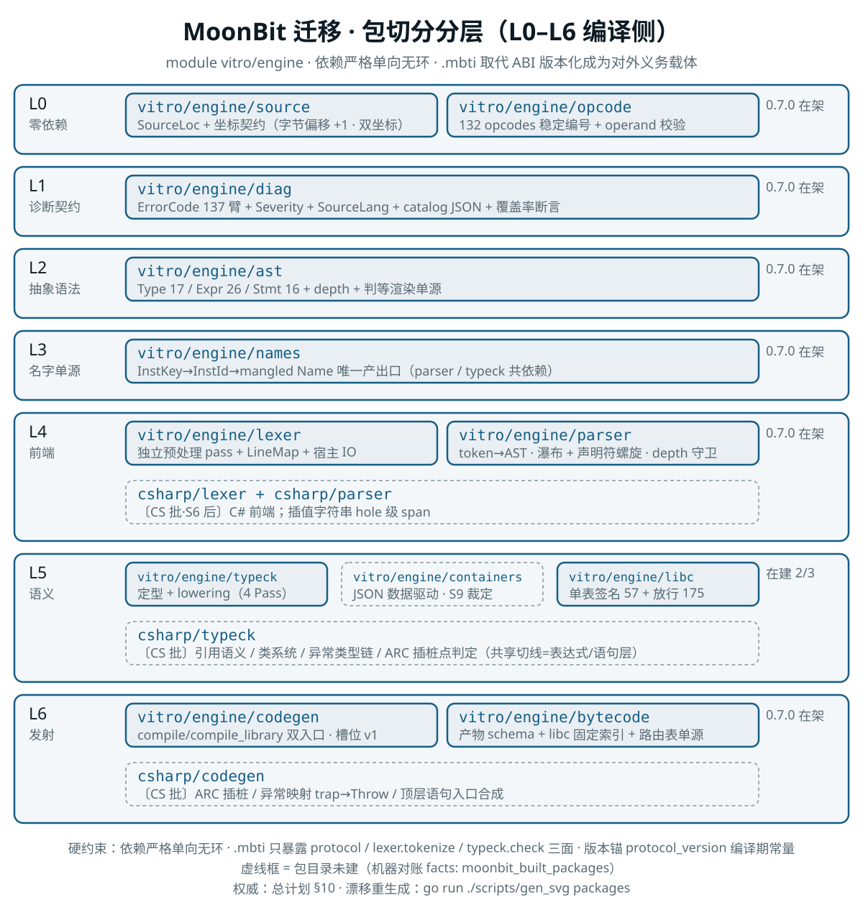
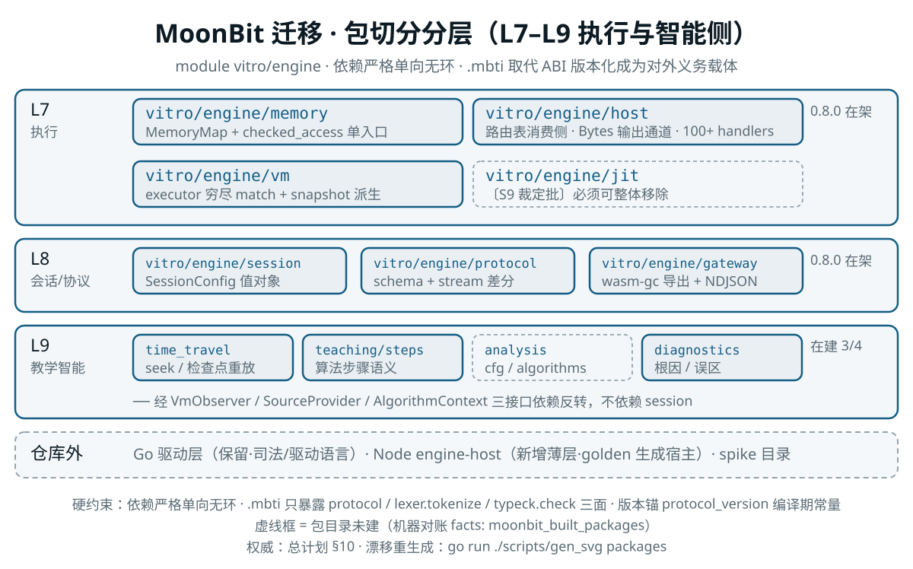

# MoonBit 迁移总计划

> **定稿**：2026-09-18（探测阶段收官版）｜ **性质**：唯一存活计划文档——本文件浓缩并取代探测阶段的 16 份文档（评估报告 + 13 份模块勘察 + 蓝图 v1.1 + 八轮第一手复核记录，全部经提交 `917251e` 保存在 git 历史，取回方法见 §11）
> **证据基线**：四道证伪门全部实测关闭（0 红）+ 27 项丢/继承/改进决定逐项亲证（0 推翻）+ 9 条 MoonBit 语言事实一手实证。所有论断可溯三层之一：勘察报告原文亲读、复核实测、代码亲验。
> **执行文档**：第一阶段（S0 收尾 + S0.5 Rust 止血批 + S1 基础片）的逐项任务清单见 [`MoonBit迁移第一阶段计划.md`](MoonBit迁移第一阶段计划.md)。

---

## 1. 形态与范围裁定

| # | 裁定 | 依据摘要 |
|---|---|---|
| F-1 | **同仓绞杀者渐进迁移**：Rust 版冻结不删、降级为差分对照 oracle；MoonBit workspace 与 `native/` 并列。冻结纪律：Rust 侧只收安全修复，新特性一律 MoonBit 侧 | 项目所有者拍板；"每搬一包趁 Rust 版仍在做差分扫描"是唯一不重踩坑路径 |
| F-2 | **v1 范围 = C only**：C++ 子集（≈6,514 行 / 8.5%）延后 S9 单独裁定；包边界第一天预留；砍 C++ 与 CS2 复用策略冲突须合并裁定；空输入短路可取得"砍"的主要收益。**裁定已出（2026-09-20）：砍**——C++ 零迁移（寄生面由"从不落块"天然完成 U3#6/#9 手术）；CS2 复用冲突合并裁定：Rust oracle 冻结区保留为 C# 类机制**语义参考**（Phase 32/33 实现思路可查），"先在 C++ 上趟平"的垫脚石损失可接受（C++ 栈对象 RAII 与 C# 引用类型+ARC 语义本大异，直接可复用面仅 AST 形态与 vtable 布局思路）；C++ 防线（shadow_cpp 99 / E2E 83 / CI 三 tier）随砍退役归档 | VM 零 C++ 感知（实测 3 处偶然命中）；is_cpp_mode 全在 lexer+parser 最前两层 |
| F-3 | **JIT 倾向不搬**（S9 复核）：宿主 V8 自带 JIT 边际缩水；JIT 与解释器溢出语义分歧现存未修；统一模式下 JIT 录制纯浪费。`jit_path_parity` 八形状外置 JSON 作"复活必全绿"遗产 | 门 1 实测：放弃 JIT 代价收敛为热循环 ~2.8× 且仍快于现役解释器 |
| F-4 | **驱动层 v1 保留 Go**（10,767 行清白资产）；Node 宿主为新增薄层（engine-host 接口：spawn/stdin 字节/stdout 逐行/stderr/超时 kill/退出码/RSS 采样）；golden 生成器由 Node 宿主驱动承担 | D5 刚收官；绞杀者策略新语言只承担引擎本体 |
| F-5 | **wasm-gc 单出口、多宿主**：浏览器（主交付）/ Node 22+（CI 主力）/ Wasmtime（需 `-W gc`，部署文档写明）；宿主接口 4 函数（invoke/reset/protocol_version/engine_version）+ 21 方法表；`memory.regions` 字段当场定型；砍 capi 45 导出 | 门 2 实测 2.34s 真实运行；45 导出中 28 无消费者（亲证） |

## 2. 四道证伪门终局（全部实测，0 红）

| 门 | 判定 | 关键数字 | 随迁条件/遗留 |
|---|---|---|---|
| 门 0 LLM 效率 | **通过（弱）** | 干净上下文 6 真实函数：首过 1/6、每函数 ≤2 轮收敛、6/6 正确（含 quirk 保真与饱和边界断言） | 无同协议 Rust 对照组；三大语言差异进 S1 工程约定 |
| 门 1 VM 吞吐 | **通过** | 真实引擎锚（vm_bench 1k×1k）：现役解释器 512ms / JIT 55ms；MoonBit 迷你 VM（含 NULL/UAF 16,384 条二分/脏页检查链，校验和同口径）native 81ms / wasm-gc·V8 156ms = **快于解释器 3.3×、慢于 JIT 2.8×** | 条件 A：S6 片起 1k×1k 等价基准对照 512/55ms 双基线；条件 B：LeetCode 全量 ≤3s |
| 门 2 Wasmtime | **有条件通过** | 零 import 产物 `-W gc` 下 2.34s 真实运行（哨兵双证红）；v33 CLI 默认拒 GC 模块 | 部署须显式开特性 |
| 门 3 快照往返 | **通过（模块级 + 集成版，2026-09-26 销账）** | 模块级 PASS 5/5 双目标（1MB 逐字节 + freed 全表 + 隔离区三件套 + seek 确定性 + UAF 无假阴性）；**集成版**＝`gate3_integrated_roundtrip_with_libc_setup`（vm wbtest：libc 真装载 3485 条合并 + argv + vfs 预设 + 非平凡堆〔两分配一释放〕下全量快照往返——恢复后 1MB 逐字节 + 区域数/freed 计数/值栈全回滚、恢复态可继续执行至语义终点）+ 第三联 601 例终态映像逐字节对拍佐证（dump 出口与快照同族 1MB 口径，cmd/run 全链）；session/seek 会话层对等随 S8 会话片 | ~~S6 集成版验收~~ 已销 |

**门 1 方法论教训（入档）**：首轮"名义红 7×"系对照物失真（理想化 Rust 孪生比现役解释器快 23×）——**比值结论必须声明分母引擎**。

## 3. 已实证 MoonBit 语言事实（F1–F9，全部一手取证）

| # | 事实 | 后果 |
|---|---|---|
| F1 | `Int` 四则**静默回绕**（`2147483647+1→-2147483648`），全 core **无 checked API**；`1<<1000=256`（位移 mod 32）；`x/0`→RuntimeError | 教学溢出 trap 必须应用层显式检测（`to_int64` 中转 + 范围判定，与 Rust `arithmetic.rs` 同构）；检测成本占每算术指令比已入门 1 数据 |
| F2 | `String` 内部 UTF-16（`"中文".length()=2`，`@utf8.encode().length()=6`）；`to_bytes()` 已弃用 | C 字节流一律 `Bytes`/`FixedArray[Byte]`；坐标单位契约进 `vitro/engine/source` 包 |
| F3 | `Bytes` 不可变且是 `FixedArray[Byte]` 的 `%identity` 视图（core 源码取证）；`FixedArray[Byte]` 可写、**packed**（100M 元素 106.9MB vs Int 406.9MB = 1:3.8，实测） | 1MB 内存载体定案；门 1a 通过 |
| F4 | 21 帧瀑布递归栈深：wasm-gc 854 / js 538 / native 1005（崩溃 0xC00000FD 不可捕获，与 Rust 同形态） | 深度上限必须显式做；`MAX_PARSE_DEPTH` 语义可沿用但阈值重标定 |
| F5 | wasm-gc 产物 imports 仅 `spectest.print_char`（宿主收 Unicode 码点，须自做 UTF-8 编码）；`@env` 无宿主实现、无熵源 | 驱动协议 = 宿主提供的 import 组；引擎 rand 默认种子不得依赖系统熵 |
| F6 | `Hasher` 种子 wasm/wasm-gc=0、native/llvm/js=随机；`HashMap::iter` 序 unspecified | **一切产物输出显式排序/LinkedHashMap**；"同输入两次产物哈希相同"入 CI |
| F7 | `moon check`/`moon build` 下缺臂 enum match **默认即 error**（删臂实验 exit 127）；诊断**列出**缺失变体名 | 穷尽收益成立；CI 用 `moon check` 即可（`-d` 非必需） |
| F8 | moonc v0.10.13 存在跨文件顶层 `pub let` link-core ICE（常量内联即消失） | 工具链不稳信号，A6 持续监控 |
| F9 | `@json` 浮点序列化 `1.0→1`、`-0.0→0`（与 serde_json 不同）；libc 产物 f64/i64/string_data 全空（实测）故暂不触发 | **bundle 禁逐字节比对，解析后结构化比对** |

## 4. 包切分总图（L0–L9，`.mbti` 取代 ABI 版本化成为对外义务载体）

```
L0 零依赖   vitro/engine/source(SourceLoc+坐标契约)   vitro/engine/opcode(135+Instruction+operand 校验；44–46 = C# 异常三件 TryBegin/TryEnd/Throw 进历史空号，2026-09-25 vm 批一号)   vitro/engine/util(零语义机械件单源：utf8_len/str_cmp/i64_to_i32_bits/LE 拼装读——G-1，2026-09-26 已落)   vitro/engine/fs(vendored 自 moonbitlang/x@0.5.5 的 native-only 文件系统件——唯一依赖清除 B 路线批 2026-09-28 已落：pub 收窄 7 函数+IOError，上游漂移由 scripts/moonbit/vendor_drift 内容哈希探针盯〔CI hygiene〕；moon.mod 依赖块自此清空=模块零外部依赖)
L1 诊断契约  vitro/engine/diag(ErrorCode 137+Severity+SourceLang+Diagnostic+catalog JSON+覆盖率断言)
L2 抽象语法  vitro/engine/ast(Type 17/Expr 26/Stmt 16+depth+判等渲染单源；不含 compute_type_size)
L3 名字单源  vitro/engine/names(InstKey→InstId→mangled Name 唯一产出口；parser/typeck 共依赖)
L4 前端     vitro/engine/lexer(facade tokenize→LexResult；internal/{source,pp,host})  vitro/engine/parser
            〔CS 批·S6 后〕vitro/engine/csharp/lexer + csharp/parser（C# 前端；插值字符串 hole 级 span）
L5 语义     vitro/engine/typeck ─ vitro/engine/containers(JSON 数据驱动) ─ vitro/engine/libc(单表签名)
            〔CS 批〕vitro/engine/csharp/typeck（引用语义/类系统/异常类型链/ARC 插桩点判定；表达式定型内核消费 vitro/engine/typeck——共享切线=表达式/语句层，声明层分叉；原 typeck/cpp 预留位随砍 C++ 裁定撤销）
L6 发射     vitro/engine/codegen(internal/{Layout Planner, frame LIFO 池, c})  vitro/engine/bytecode(产物 schema+libc 固定索引)
            〔CS 批〕vitro/engine/csharp/codegen（ARC 插桩/异常映射 trap→Throw/顶层语句入口合成；原 internal/cpp 子目录规划随砍 C++ 裁定撤销）
L7 执行     vitro/engine/memory(载体+MemoryMap+check_access 单入口+bump/隔离堆+freed_logs 有序结构)
            vitro/engine/host(宿主函数域：路由表消费侧+输出通道 Bytes 化+内存族 handlers；vfs 已建〔2026-09-23 余量批三号〕)
            vitro/engine/vm(executor 穷尽 match+snapshot 不可变派生)
            〔S6 开工批二裁定·任务书内部不一致登记（2026-09-23）〕"110 路由表单源"的**定义点落 L6 `bytecode`**
              （`route.mbt` + `host_func_id_gen.mbt`）：本行原表述"路由表单源属 host(L7)"与 §4「依赖严格单向」
              **不可同时成立**——codegen(L6) 在编译期就必须选 `Call <固定索引>` 还是 `CallHost <id>`，
              即路由表是 L6 的必需品，L6→L7 反向依赖被禁；又因派生需 `bytecode_libc_all_funcs`（88 名单源在 L6），
              libc(L5) 亦无法反向 import L6。host 为消费方（执行期分发），落点详见生成器头注与 `route.mbt` 模块头。
            〔CS 批·v1 设计输入非事后补丁〕vm 三执行状态：handler 栈/异常寄存器/UNWINDING + memory region 表 refcount 字段——opcode TryBegin=44/TryEnd=45/Throw=46 进历史空号（对 Rust 对拍面零扰动，双侧皆空号）；VMSnapshot 一等含三状态（时间旅行免费安全）
            〔S9 裁定〕vitro/engine/jit(必须可整体移除)
L8 会话/协议  vitro/engine/session(SessionConfig 值对象)  vitro/engine/protocol(帧+schema 版本+StepPayload/词汇/契约)
            vitro/engine/gateway(wasm-gc 4 函数导出+NDJSON)  vitro/engine/time_travel(时间旅行编排引擎——2026-10-01 自 L9 降层，serve step 族消费同层合法化)
L9 教学智能  vitro/engine/teaching/steps  vitro/engine/analysis(cfg/algorithms)  vitro/engine/diagnostics（**层位变更 2026-10-01**：time_travel 自 L9 降 L8——serve step 族接线暴露「gateway(L8) 消费 time_travel(L9)」违反单向约束；其依赖面全 ≤L8 且语义=时间旅行编排引擎非教学智能〔智能判据词汇已上提 protocol，勘察 ⑤-5.7〕，L9 留真智能三域）
            —— 经 VmObserver/SourceProvider/AlgorithmContext 三接口依赖反转，不依赖 session
仓库外      Go 驱动层(保留) + Node engine-host(新增薄层) + spike 目录
```

包切分分层图（由 `go run ./scripts/gen_svg` 生成，与上图逐层对账；实/虚线与在架版本徽标机器对账 facts——`moonbit_built_packages` / `moonbit_engine_version`，CI hygiene `-check` 兜底，**建包/退役批须连坐重生成**；批次权威仍以本节与 §10 为准）——编译侧与执行/智能侧两张：

<p align="center"></p>

<p align="center"></p>

硬约束：依赖严格单向无环；`.mbti` 只暴露 `protocol` 全量 / `lexer.tokenize` / `typeck.check` 三面；跨包不变量做成可执行断言包；版本承诺锚 `protocol_version` 编译期常量。

## 5. 在途工作接纳（摘要）

- **Rust 侧必修（P1–P7，S0.5 执行，详见第一阶段计划）**：J1 声明符栈溢出、★A 全局字符串指针双侧修复、E 前缀 4 处、string 转义收口、golden 补齐与 fail-loud（含 4 例手写 golden 循环论证处置）、列号口径冻结、AST dump 出口新建；外加 U1（认知链二/三/四层 Rust 侧补最小导出——差分退路现在不存在）与 U2（`vitro_capi.h` 19 声明是 SharpTutor 当前阻塞项，与开工同批拍板）。
- **直接按目标架构实现（要点）**：单态化纯函数化+实例化缓存（1024 上限三处改法：按栈深/带真实 SourceLoc/点名模板）；SourceLang 单源（is_cpp_mode 46 处亲证）；预处理独立 pass+LineMap+双坐标；Layout Planner；LIFO 槽位分配器（8 条事故回归必挂）；统一写路径校验器；freed_logs 有序数组+二分；OutputLog 载体 Bytes 化；VFS 入快照；诊断结构化；note 有界；U6#4；Trap 回退改"检查点+正向重放"（消每步 1MB 快照——engine.rs:169 亲证）；stream 升格窗口表示；语义标注改执行事件；签名真相源单表（printf/putchar/strcpy 三处实测冲突）；golden 生成器换 Node 宿主；memory.regions 定型；"喂入不重置运行态"与"会话级配置不可被初始化覆盖"两条不变量；发布缓冲显式状态类型；`Stmt::Try` 保留标 reserved-for-csharp。
- **放弃并记录**：capi 全部后续批次；双轨管线（生产零调用亲证）；unified/stream 死码（外部引用零亲证）；`OpCode::Strlen`/`TrapBoundsVla` 死 opcode（codegen 零发射亲证）；`compiler/ast.rs` 死文件；`extract_cpp_builtin_layout.py`（OUTPUT_PATH 指向不存在目录亲证）；K&R 语法；`-I` 搜索路径；H-4 存根硬遮蔽；D14（已清零销项）/D16 再拆；诊断切面 38/810（差分锚替代）；vm_benchmark.rs。

## 6. 差分对账分级锚点体系

| 级 | 锚点 | 前提 |
|---|---|---|
| **A 字节级** | ①字节码产物 code 段 ②stdout ③最终 1MB 内存映像 | Go canonicalizer（键排序/转义/缩进固定，fail loud）；**三条冻结**：槽位策略版本化 / 绝对 IP 跳转编码 / libc 固定索引（1000/1024/1089 按名→索引比对）；**排序义务显式继承**（现版产物确定性完全依赖 Go 侧 sort_keys，MoonBit 侧原生有序）；bundle 禁逐字节（F9） |
| **B 结构化** | token TSV / AST dump（依赖 P7 出口）/ 符号表 / 诊断序列 / mangled 名集合 / 实例化产物 / 协议帧 NDJSON / error_catalog JSON / 标注首现序列 | 两侧**显式 emitter**（禁一侧 serde 一侧 ToJson）；serve 补字段级冻结测试（protocol_frames.jsonl 双宿主对拍）；白名单补"缺失即红"；含非 ASCII/\xHH 用例（现覆盖 0） |
| **C 端到端** | Clang golden 733 全量 / replay 61 / serve_smoke 59 / JIT parity 八形状（若复活） | golden 缺失必红；`.out` 只作第二来源，live clang 为主真值 |
| **D 三联 diff** | stdout+返回码+1MB 映像 × 30 例矩阵（JIT 形状+UAF/隔离区+快照往返+字节通道+浮点+调用栈+VFS+路由分叉） | 内存 dump 出口新增 |

## 7. 裸奔期最小防线与重建里程碑

最小防线 = **24~26 例**（全部 baseline、已有 golden、无 stdin；五条选例标准；必含 `engine_note_lookalike.c` 与 `codegen_soundness_regression.c`）；三条防假绿纪律（空集不得绿 / golden 缺失必红 / 字节层比对）；M-0 基线冻结（shadow 快照+facts 入版本控制）；重建里程碑 M-1~M-9（驱动骨架→golden 解析→全量→live-Clang→三层契约→fuzz→facts→台账 CI）。

### 7.1 测试防线补充路线（2026-09-26 六轮审阅落档，实测口径）

**验收口径**：Rust 侧每条防线，要么在 MoonBit 侧找到对等物，要么显式裁定不需要——补语义覆盖面，不补行数。实测基数：native/tests 52 文件 23,684 行 vs MoonBit 测试 12,996 行 / 481 个（2026-09-27 S7 批一号+段二连坐更新；六轮审阅时点为 434）；其中 ~16k Rust 单元/管线测试的对等物 = S2–S6 白盒锚 + 四级对拍（已付讫）；语料 708 个 .c 双方共用不消失。真净缺口与承接（五层，按性价比排序）：

| 层 | 内容 | 落点/形态 | 时序 |
|---|---|---|---|
| 1 | **✅ 已落（2026-09-26 当日）vm_diff 全量化 + verdict 三级**（SAME / DIFF-known / DIFF-unexpected）：30 例抽样 → 601 全量；SKIP 白名单 ×8（e2 include 族 ×5 + vfs 预设/SourceProvider 工具层 ×3）与 known 白名单 ×2（case+digest 精确豁免，digest 漂移即降级红防白名单腐化；条目转绿即空转红逼移除——shadow known_issue 双向监控同构）外置 JSON；**首轮回收获**：SAME 591 / DIFF-KNOWN 2 / SKIP 8 + **e1_va_copy 真缺陷实锤**（变参第二调用起 va_arg 全零——30 例抽样零覆盖）→ **同日修复批闭环**（根因 = `apply_reply` 对 `value=None` 无条件压 0，void host 函数每次调用泄露幽灵栈值；修后 SAME 592/601，known 双向监控自动报空转逼移除条目，红绿锚 `host_void_call_stack_balance`） | `scripts/vm_diff` 改造 + 首轮全量归因 | **已落** |
| 2 | **✅ 已落（2026-09-26 提前——原排期 S7 稳定片期，用户拍板前移至 S6 收官窗口「减少 0.6.0 发包前 bug 概率」）`scripts/clang_direct`**：真值源 = Clang 本尊（非 Rust oracle），cmd/run 的 stdout+返回码 vs Clang golden；形态复刻 shadow Clang 侧（缓存 `.clang_cache_cd/`〔cd1 schema，key=源码+stdin+clang 版本+参数〕/并发 8 路槽位隔离/重试 3 次）+ vm_diff 提取器口径（Go main 包不可 import 故为形态复刻，三文件口径互指）；**全量 601 例 SAME 596 / KNOWN 5 / DIFF 0**——known_direct.json 五条全可归因（指针 4 字节 ×2 = shadow KNOWN 同源 DIFF-PTR-4BYTE-01 / keyword_compat = gap 扩展语义 / file_fread = vfs 预设特有注入 / engine_note_lookalike = 提取器限制与 vm_diff 同例）；**首跑收获**：① Windows 并发下 Defender 实时扫描锁目标文件使 clang 非零退出（首跑 127 例瞬态误判——重试判据修正为 shadow 同款「编译成功且非异常才接受」，教训=shadow 的「编译失败也重试」不是浪费是 Windows 并发必要条件）；② 两侧归一口径（clang 文本模式 \r\n剥行尾 + MoonBit Latin-1 双字节折回单字节）；③ DIFF-LIB-PUTCHAR-01 配方未触发（601 语料 putchar≥128 域两侧经归一后一致——oracle 实测锚的 Clang 差异在 shadow 防线形态下才暴露，直拍形态被 Latin-1 折回归一消化，差异面收窄登记）；J9：digest 篡改证红（deadbeef 注入 → DIFF 红 → 恢复绿）；CI 已接线（vm_diff 步骤后 + cache path 纳入 .clang_cache_cd） | `scripts/clang_direct` | **已落** |

**层 2 模板语料缺口与拆分约束（2026-09-27 用户调查 + 首跑实测）**：
- **缺口清单**：`cases_template_generated/` 82 例（shadow 五目录 683 vs 层 2 四目录 601 的差值）为最大未纳入面；`.in` stdin 34 例（baseline 5 + knr 29）是 **runner 能力缺口**（cmd/run 无 stdin 读取，shadow 曾靠 .in 修过真 bug——层 2 空跑同口径公平但 34 例只测 EOF 形态）；codegen_skeleton 13 例可选（codegen_diff 已覆盖）。合理排除：cpp/（已砍）、bytecode_libc_consistency（防线 3b 语义）。
- **82 例首跑（--cases 显式清单，2026-09-27）**：SAME 80 / DIFF 2——①`bTree_default` = 模板 UB（未初始化子节点指针，E2E_FAILURES.md 已登记，shadow known 同款）→ 纳入时进 known_direct；②`kruskalMST_default` = **MoonBit 独有真缺陷候选**（oracle/Clang 双侧一致输出 `(0,1)=2`，MoonBit 越界 trap @0x1048620 超上界 44 字节 + 1MB 映像栈区 63 字节分叉首差 @0xFFF00——栈帧布局形状分叉，独立调查批）。
- **✅ 纳入已落地（2026-09-27 当日）**：corporaDefault 路径化（+codegen_skeleton 13 +cases_template_generated 82；裸名仍兼容 --corpus baseline 旧用法）——**全量 696 例 SAME 688 / KNOWN 8 / DIFF 0**；known_direct 增两条（bTree=模板 UB 正当归因；kruskalMST=真缺陷候选以「修复转绿即空转红强制移除」形态收编监控）。
- **✅ 拆分前置已落地**：`--check-known` 静态校验子命令（免 runner/clang：条目悬空/digest 形态/空台账；J9 悬空条目注入证红闭环）已接 CI（全量步前）；动态转绿监控仍由全量运行承担。**同 job 拆步不解决 696 串行，真提速须拆并行 job**（届时 known 静态校验已独立、无拆分障碍）。
- **遗留**：stdin 34 例（runner 能力缺口，cmd/run 无 stdin 读取——shadow 曾靠 .in 修过真 bug；补齐须先动 runner，独立工程项登记）。
| 3 | **host_contract 对账**：Rust 侧 103 条 vs MoonBit host 侧 105 条锚——数量反超但注入面未必对齐；做三态映射表（有锚/合并覆盖/缺失），缺失补锚（wbtest HostMemReply 三件断言模式）；架构红利 = 纯语言层白盒，不复刻 capi 形态 | host 包 wbtest | S7–S8 |
| 4 | **fuzz 形状枚举版**：不移植 RNG——两侧 host 语义同源照搬，Rust fuzz 红过的形状转 MoonBit 确定性锚（oracle 缺陷修复模式）；候补升级 = 层 2 直拍天然支持 fuzz 模式（Go 随机生成 C 程序双侧比对，真值直连 Clang） | wbtest 锚 + 层 2 扩展 | S8+，事件驱动 |
| 5 | **differential_stress**（3c Host vs Bytecode 交叉）：libc 自举已落（批四号），缺口在形态开关（同函数强制 Host/Bytecode 路由各跑一遍）——随 S9 libc 机制裁定定形态，不预付 | 随 S9 | S9 |

连坐义务（每批）：测试数三处同步 + facts 真值 + testcount 闸 + 新防线 J9 证红 + CI 接线 + 闸计数更新。终态防线形态 = **shadow 改造版（MoonBit exe + Clang 直拍）+ 11.7k 单元锚 + 治理闸**——量减半真值升。

> **kimicc 调查输入（2026-09-26，[调查报告](../07-质量与裁定/kimicc外部参考调查报告20260926.md) §4.5）**：层 2 落地与后续扩展可参照的外部形态五件（择机吸收不预付）——① quickcheck 属性测试三件套（按「AST 规范像」写生成器 + 固定种子**双种子**防幸运语料 + 反例打印成可读文本，先例 `qc_test/roundtrip_qc_test.mbt`）；②「测试的测试」元闸（awk 检查测试结构完整性，先例 `check-strict-mir-interop.sh`）；③ allowed-residue 白名单闸（已知缺陷诊断串白名单修一删一 + clang 非零但无识别 error 也 fail，先例 `printed_output_compiles_test.mbt` 98 行——层 2 直拍直接可用）；④ Failure Ledger（每 bug 一行 = 复现命令 + 根因 + 修复，先例 sqlite-conformance-plan.md:351-447）；⑤ pin/doc/脚本三处一致性机器闸 + 分级 opt-in conformance + skip marker。层 2 harness 直接模板 = kimicc `test/e2e/harness_test.mbt`（双二进制差分/确定性临时路径/shell 引用/skip marker 全套原语）。

## 8. 差异台账 v0（机器单源，S8 片落地；**批零号全落 2026-09-30**：一段 a 单源迁入 + 一段 b 实测复核〔24 条：蓝图 14 全翻转 + 补录 10；新实锤 = cmd/run 出口层 ≥0x80 双重 UTF-8 编码 DIFF-EXIT-STDOUT-ENCODE-01，DIFF-LIB-PUTCHAR-01 转 open〕+ 二段闸 `scripts/diff_ledger`——schema/枚举域/17 键锁定 + 三防线 known 双向对账〔正向不虚报/反向必收编=守门规则机判化〕+ `--selftest` 五路证红〔J9〕+ CI core job 接线；shadow known 外置化〔闸内清单形态〕登记技术债随防线维护窗口）

格式：`DIFF-<域>-<序号>`；`class ∈ {architectural, implementable, pedagogical}`；`carry_over ∈ {inherit, fix, drop, retest}`；JSON schema 含 `anchors`（与 shadow KNOWN 常量双向对账）与 `detectable_by_defense` 诚实字段；capability_flags **17 项**；落地三步（单源→CI 对账→J9 埋雷）。初始条目 14 条代表项（DIFF-PTR-4BYTE-01 / DIFF-LAYOUT-PACKED-01（防线零覆盖，先立 golden）/ DIFF-LIB-PRINTF-01 / DIFF-LIB-PUTCHAR-01（golden 缺口）/ DIFF-PREPROC-MULTILINE-01（规范反向漂移，先修规格）/ DIFF-TYPE-SHORT-01 等）。守门规则：引擎行为与台账冲突时要么改行为要么改台账，禁止沉默漂移。

## 9. 风险登记册（终态）

A2 实测关闭（有条件）；A3 实测关闭（方向有利）；A7 实测关闭（弱）；A8 持续监控（F8 ICE）；R1 门 1 条件 A/B；R2 HashMap 种子（排序义务）；R3 UTF-16 三单位（坐标契约）；R5 双头维护（冻结纪律）；R6 裸奔期（最小防线）；R7 生成物门禁；R9 拖延（分片可停可续）；R11 wasm 冒烟证据链（重建：真 E3070/E3061 断言+体积断言+产物更名，每条护栏先证红）；R12 rand 种子（wasm-gc 无熵源）。

## 10. 里程碑切片

| 片 | 内容 | 验收（锚点级） | 发布 |
|---|---|---|---|
| S0.5 | Rust 止血批 P1–P7 + U1/U2 | 每条红→绿留痕；M-0 基线冻结 | — |
| S1 | `vitro/engine/{source,diag,opcode,ast}` | E1 AST dump（B）+ error_catalog JSON（B）+ 码表生成幂等 | `vitro/engine/diag` 首发 |
| S2 | ✅ `vitro/engine/lexer`（独立 pass+LineMap+宿主 IO；2026-09-19 收官——[执行记录](../07-质量与裁定/20260919_S2词法器执行记录.md)） | ✅ L1/L2 token TSV + 随机差分 2400 例（4800 TSV）+ 真实语料 444 例逐字节一致 | ✅ `vitro/engine/lexer`（0.2.0 首发 + 0.3.0 审阅修复批——real_line 归属通道 + 打包卫生） |
| S3 | ✅ `vitro/engine/parser`（深度统一入口；J1 语义不复刻；2026-09-19 收官——[执行记录](../07-质量与裁定/20260919_S3解析器执行记录.md)） | ✅ E1–E4 全绿：597 真实语料 AST+诊断序列归一逐字节一致 + 病态 12 样本同等拒绝 + 活性 stall=0 + E4 反向锚（1200 层声明符两侧存活且一致） | —（随 0.4.0 发布） |
| S4 | ✅ `vitro/engine/{names,libc,typeck}` 主体收官（2026-09-20 T5-b/c/d + T6：typeck 4 Pass 全接线——call/init/builtin/decl 四文件 + bytecode_libc_sig 表入 libc；**598 语料 E1–E4 归一逐字节一致**（2 条 F3-v2 白名单 FORK(known)——parser 层分叉的 typeck 消费面放大，S8 台账）；quote-include 哨兵入 gap；183 测试；**containers 延后 S9**：内置容器全是 C++ 模板路径，C only 零活跃路径，F-2 推论） | E1–E4；**改形登记（2026-09-20 审阅 F4）**：E2 符号表/E3 mangled 名集合不独立出口，由 E4 typed_ast 投影派生（typeck 内部 Map 状态不外溢产物——C 输入下投影≈快照可辩护：classes 恒空、static_func_sigs/templates 合并差异均以诊断形式落在 E1 面）；**mangled 名集合在 C 子集无对象**（C 侧零模板/方法 mangling——names 的 type_mangle_suffix/method_mangled_name 消费面全在 C++ 路径，S9 后才有差分锚）；勘察 §5 架构优化 M1（单态化两阶段）C only 无对象、M3（诊断结构化）协议层不动照搬旧 TypeError、M4（尺寸单一表达式）/M9（声明定型统一）随 init/decl_types 批、M7（诊断顺序显式化）以 Vec push 序照搬达成隐式确定——均未按『目标架构』形态落地，等价优先 | names——**C 子集零差分覆盖**（8 消费点全在 C++ 语法路径，5 测试为白盒自证；发布形态待 S4 收官时裁定：推迟至 S9 后或以白盒锚为发布锚） |
| S5 | ✅ `vitro/engine/{codegen,bytecode}`（**已收官**，0.5.0 已发布 2026-09-23；开工批 2026-09-20：bytecode 建包——产物 schema 13 字段 + libc 固定索引 88 函数（数组单源 + 索引派生断言锚，S4 坑②索引表入产物层落地）+ R1 布局纯函数（r1 第 7 道断言全量搬）+ canonical dump emitter；codegen 骨架（**flat 四文件起步**——L6 包图 internal/{Layout Planner, frame, c} 切分随扩展批；2026-09-21 审阅登记）——BytecodeGen C only 裁剪（47 字段剔 C++ 专属 7 项：顶层 6 + 嵌套 1）+ Pass 1 全量（T-P0-1/2 位模式 + P2 字符串延迟回填）+ Pass 2/3 最小集（Block/Expr/Return + 四字面量/Identifier）+ libc 预注册（strcpy/strcat Host 例外）+ 入口 wrapper；**槽位策略 v1 逐位兼容**（**勘察 §5 契约偏差登记（2026-09-21 审阅）**：原定"直接按目标架构实现 LIFO 分配器（8 条事故回归必挂）"，本批改判 v1 先行——A 级 code 段逐位 diff 以现行槽位策略为前提；LIFO v2 批补挂 8 条回归并以 `SLOT_STRATEGY_VERSION` 常量分档——v1 常量已落 codegen 包；**get_temp_slot 越界已改 fail loud**（Rust 静默回退 slot0 不继承））；差分锚已立——Rust `vitro_cli dump-compile`（CompileDump 14 键，含 L4 五字段出口，防线维护）+ MoonBit `cmd/dump_compile` + Go `scripts/codegen_diff`（四类判定 SAME/AGREE-ERROR/ONE-SIDED/CONTENT-DIFF；--baseline 显式豁免 one-sided；J9 selftest 注入证红 ✅）；**A 级对拍**：13 条骨架语料（2026-09-21 审阅批 +3：2^64 溢出/浮点 inf/__func__）归一逐字节一致含 code 段逐指令；未接线语句/表达式族 fail loud（红面基线期；**baseline 363 例归因（2026-09-21）**：lex 7 + parse 2 = AGREE 已闭环；**扩展批一号（2026-09-21）已接 VarDecl + CallPtr**（host 路由 110 对生成器 `scripts/gen_host_route` 三件套：落款 sha + fmt 内置 + -check 幂等——2026-09-21 审阅 P2a 修复"假生成物"；S6 host 建包时上提）——SAME 0→56；**扩展批二号（2026-09-21：二元/一元/Cast/sizeof 族六臂——隐式提升链/指针算术/U 族/短路规范化/IncDecKind 分派/跨包 enum 只读规避）SAME 56→174 / 剩余 180 / CONTENT-DIFF=0**；全语料累计 SAME 190/598（baseline 174 + knr 7 + leetcode 2 + gap 7）；剩余首错：赋值 67 > for 30 > Index 23 > if 17 > while 12 > 三目 10 > Member 5 > switch 5；**扩展批三号（2026-09-21：赋值+三目+控制流五件——emit_compound float 分支照搬遗漏由 kr_1_15 对拍实锤修正）后全语料 SAME 325/598（54%）：baseline 262 + knr 35 + leetcode 18 + gap 10，CONTENT-DIFF 全 0**；F3-v2 白名单（parser 分叉的 codegen 消费面放大）入 codegen_diff；下批 Index/Member 族 + leetcode 复杂组合；**扩展批四号（2026-09-21：Index/Member 全接线 + struct 返回拷贝 + _Generic + 复合字面量；base_kind Pointer 一层语义纠偏——8 例步长真红实锤）后 A 级对拍面全语料闭环：598/598（SAME 583 + AGREE 13 + FORK 2），CONTENT-DIFF=0/ONE-SIDED=0**；codegen 剩余义务：libc 自举 + LIFO v2 + r1 端到端（S6 协力）；**收尾批（2026-09-21）**：收面 27 符号 + moonbit_surface 审计闸（CI 接线，白名单 10 条）+ parser cpp_mode 剔除（F-2 终局）+ moon.mod **0.4.0 已于 2026-09-21 15:49 发布**（本机 registry 实测：0.1.0→0.1.1→0.2.0→0.3.0→0.4.0；mooncakes 模块页显示 16 个包在架）——架构报告待办①闭环，且**收面赶在发布之前完成（"未发布包零成本收面"窗口用尽）**）；**MoonBit 语言事实新增**：String compare/`<`/`>` 非字典序（长度优先疑——emitter 键序自写码元比较，moonbit/AGENTS.md #29） | A 级产物 code 段 + libc 自举 + LIFO 八条事故回归 + r1 7 道 + `--dump-compile-output` 工具 + codegen 自建单测（**开工批**：dump-compile ✅ / r1 纯函数段 ✅ / 骨架自建单测 6+7 ✅ / code 段骨架面对拍 ✅；**在途**：语句族（var_decl/if/while/for/switch/call）与表达式族（二元/赋值/index/member/取址）逐批接线 + libc 自举 + LIFO v2 八条回归 + r1 端到端 7 道（VM 侧，S6 协力）） | — |
| S6 | ✅ `vitro/engine/{memory,host,vm}`（**代码链已收官**——三包全落 + executor/CallHost 全接线 + 门 3 集成版销账 + 双防线 601 例全绿，2026-09-26；0.6.0 发版件就绪待彩排发布；开工批 = memory 建包 2026-09-23：1MB 载体 `Memory`（`FixedArray[Byte]` + 脏页位图；`bytes`/`dirty` **priv** ⇒ 包外无裸字节） + `MemoryMap`（regions = **addr 键插入序 Map**——平行索引取消，坑 6 失配面归零；free_list / quarantine FIFO / `release` 三条释放路径**单一出口** / `check_access` 单入口（NULL 区→上界→UAF）/ `verify` 不变量自检） + `FreedLogs`（**有序数组 + 二分**：单次探测 + 降序提前 break + 部分重叠精确裁剪）+ `MemFault` 结构化故障（文案归 vm）；**常量不双写**——地址布局常量仍以 L6 `bytecode/memory.mbt` 为定义点，本包只消费 4 个（其余 3 个的消费者是 vm 片，已登记 surface_allowlist 待清理）；红锚照搬坑 6/7/10 + churn 超预算不撞墙 + 1MB 墙返 NULL；**J9 双路注入证红**（`remove_overlapping` 退化为整条删除 → 4 用例红；`find_overlapping` 二分差一 → 13/27 红）；27 测试（白盒 21 + 黑盒 6，黑盒兼作对外面消费面）；八闸 + `moon check --target all` 全绿；**已知代价登记**：有序数组 `remove` 是 O(n) 搬移，旧块复用路径下标近 0 时搬移接近全长（10 万次 churn 实测 1.6s，暂不构成问题；换 `@sorted_map` 时区间算法与全部红锚不变）；**登记未落地**：快照批量装载 `load_*`（形状待 vm 定 `VMSnapshot`/`MemoryImage`）、`MemoryFragmentData`（L8 导出 DTO）、cstring 通道（`\xHH≥0x80→Latin-1` 口径单源在 L6 `codegen/init.mbt` 且 priv，跨层复用须先上提为独立单源）。**host 开工批二已落（2026-09-23）**：`vitro/engine/host` 建包——① 路由表单源（`bytecode/route.mbt`：`CallRoute` 二分形态 + `call_route` 派生 + **遮蔽集显式清单**（20 个"有实现但按名调用到不了"的 handler 从"无处可查"变成可断言事实）+ `is_host_rerouted` 两条例外（strcpy/strcat 的 E3070 理由）；`gen_host_route` 产物自 codegen 上提至 bytecode 并补出 `host_func_pairs` 全名表——**`by_user_name` 带 PURE 短路，不能当成员判定**）；② **输出通道 Bytes 化**（`OutputKind/OutputChunk/OutputLog`：非 UTF-8 字节保真 + 16MB 环形丢最旧保最新 + 截断注记 + 64B 小段合并；**读取走只读视图不改状态**——否则"读一次再写小段"就不再合并，与 Rust 分叉）；③ 内存族 handlers（`host_malloc/calloc/realloc/free` 返回 `HostMemReply{value?,note?,trap?}` **不碰值栈** ⇒ 内存语义可脱离 VM 锚定；受检访问一律经 memory 单入口，`calloc` 置零/`realloc` 搬运走段级 `fill`/`copy` 而非 Rust 的逐字节 `store_i8`）；28 测试（白盒 25 + 黑盒 3）；**两条 oracle 存量缺陷已两侧同修（2026-09-23 审阅批）**（① `calloc` 置零先于清理 freed_logs ⇒ 复用驱逐块时 UAF **误报**——清理提前到置零之前；② 尺寸链 `saturating_mul`+`align4` 回绕 ⇒ 超大尺寸不失败反登记 `addr=0/size=-1` 垃圾区域——对齐前 `total > MEM_SIZE` 预检走堆耗尽；MoonBit 侧红锚翻转为 `calloc_reuse_after_eviction_no_uaf` / `calloc_oversize_reports_heap_exhausted`，Rust 侧红→绿锚 = `baseline/calloc_reuse_after_eviction.c`（修复前 UAF 误报）与 `host_contract_tests::test_calloc_oversize_size_chain_reports_heap_exhausted`（旧实现 panic 证红））；**同批审阅修复 P1–P6**（`realloc(p,0)` 对已释放指针报 E3027 兜底对齐 oracle / E3060 文案补动作词 / `is_host_rerouted` 单点接线收口（gen.mbt 预注册跳过）/ README 测试数修正 / 生成器三闸接 CI（含 gen_stubs「flag 包 + 内置 fmt」前置修复——原态干净仓库上 `--check` 必红）/ host moon.pkg 死依赖清理）；十闸 + `moon check --target all` 全绿。**host 余量批一号已落（2026-09-23，28→68 测试：白盒 62 + 黑盒 6）——70 个 VM 无耦合 handler**：ctype 14（纯函数）+ math 22（位模式进出，`@math`/`Double::sqrt/abs/mod` 对位 libm——`log→ln`、`fmod(x,0)=NaN` IEEE 语义探针锚；**pow 先弹 x / atan2 先弹 y 的 oracle 弹参序不一致登记为 vm 接线义务**；@math 与 libm 的 ULP 级差异是 D 级对拍风险，差异台账收口）+ 字符串/内存 19（**读侧一律受检**——oracle `read_cbytes` 裸读三缺口〔NULL 静默零/UAF 静默读/越界当 0，坑 16/18〕转教学 trap，合法输入逐字节一致；界内软夹紧照搬〔memset 超长截断/strncpy 负 n 补零到尾，U5#3 形状〕；memset/memcpy/memmove 写侧受检化与 oracle U5#1 无检的分叉**登记两侧同修候选**；strpbrk/strspn/strcspn 字节语义替代 oracle lossy-char 语义〔ASCII 域一致〕；strcpy/strcat E3070 双重校验——堆块容量 + 栈缓冲容量〔`StackBufferSpan` 显式参数，vm 侧展平 call_stack，命中即停〕；memcmp/strncmp 有符号字节差符号扩展压栈、strchr 无符号字节匹配（c=200 命中 0xC8、负 c 恒不中）均照搬）+ 转数值 6（strtol/strtod 纯字节扫描**已证与 oracle lossy 管道逐位等价**；base=0→10 且不剥 0x 前缀照搬；errno 以 `errno_addr : UInt?` 参数化解耦符号表；atof 整串 parse 失败→0.0 的 C 偏差是 oracle 既有行为照搬；strerror 消息**含内嵌 NUL 计入 size**〔勘察 §3.2-9〕、区域 ty 落 "int" 与 oracle "char" 元数据微差登记）+ 杂项 9（`RandState` LCG〔seed=42 首值 3611 硬锚〕/deterministic 时钟恒 0/unreachable 文案/va_* 4 件纯内存操作）。**`HostMemReply.value` 加宽 UInt?→UInt64?**（64 位压值需求；0.6.0 面变更入 CHANGELOG）。黑盒承担对外面消费面点名（70 新 pub 全部 `@host.` 消费，新消费边 20 条已登记边表）。**余量批二号已落（2026-09-23，68→88 测试）——printf/scanf/字符 IO 族 10**：printf 引擎（`format_fixed` = `@bigint` 精确十进制展开 + **half-even**〔oracle release 实测锚全套：0.125→0.12 / 3.5→4 / 999999.5→1000000 / -0.0→"-0"〕、`%g` 边界与 `{:+#03}` 指数段、`powi10` 位级对齐〔不走 `@math.pow`〕、U2#9 预算闸、oracle 既有偏差照搬〔`%+` 旗标无效/`%.1s` 忽略精度/`%c` 高位字节两字节化〕）+ `InputState`（游标/EOF 粘滞〔A1〕/ungetc/Batch-Interactive；`InputOutcome{Value/Waiting/Trap}` 承载 `waiting_input`）+ scanf V-P1-13 流式游标（虚拟流 + 映射表推进，五连锚；字面量不匹配流不动不置 EOF；`%s` 栈缓冲校验）+ getchar/ungetc/putchar/puts/fprintf（stderr 分流 E-P1-5）+ sprintf/snprintf（截断返全长）/sscanf（无守卫逐臂计数——坑 17 族内不一致照搬）；读侧受检化分叉续登（fmt/`%s` 实参；sscanf 源串字节化——A-10 族）。**余量批三号已落（2026-09-23，88→100 测试）——VFS 17 + vfs 本体**：`VirtualFileSystem`（文件/描述符/fd 表；数据存 VM 堆、区域名 `vfs:<name>`/`FILE:<path>`；文本模式 CRLF 伸缩 + 逻辑↔物理互转；扩容 2×/对齐 4）；**坑 13 修复**（append 建文件——oracle 死分支，登记分叉）；17 handler（FILE\* 堆协议、哨兵流等价分支、fputs 通道分流、perror→stderr）；登记分叉：VFS 内部走受检单入口（FILE\* 释放进 UAF 窗口——二次 fclose trap vs oracle 返 -1〔缺口②〕，分叉锚已设）、`fgets` 二进制也压 CRLF（oracle 现状）。**登记未落地**：fd 元数据进 `VMSnapshot`（随 vm 片落形——VFS 数据结构本身即克隆态）。**审阅修复批已落（2026-09-23，100→104 测试，用户 blob 级审阅 + 五阶段复核）**：① **P1 `powi10` 重写**（oracle `10f64.powi` 语义：`@bigint` 精确 10^e + 最近舍入平局向上 + e=126 已知偏离显式锁定；**633 指数全表与本机 Rust 1.95 位模式对拍**——修复前逐乘链 e≥23 起分叉、次正规区 `infe-320` 泄漏；DBL_TRUE_MIN 两侧同形 `infe-324` 照搬）；② **P2 `memchr` 补实现**（110 路由唯一未登记缺口，红锚→实现→绿）+ 新闸 **`host_route_coverage`**（路由↔实现覆盖，规则外置，白名单双向对账，J9 双路证红）；③ **P3 `%%` 语义锚**（M4 突变实证盲区→补锚→复验会红；含 oracle 实测守卫偏差"实参耗尽后 %% 原样输出"与 typeck 尾 `%` 计数形状登记）；④ 弃用 API 清零（36 处 + `FmtScan/ScanfItem` priv）；⑤ **`host_test.mbt` 7 处真 NUL 修复**（git 判二进制致 15KB 黑盒测试 diff 不可见）+ 新闸 **`source_hygiene`**（tracked 文件真 NUL 扫描，J9 证红）——连带冻结区 `vitro_lexer/src/string.rs` 索引侧 `i/-text` 潜例修复（`'<NUL>'`→`'真 NUL 字面量改为等价转义写法'` 等价字面量，cargo workspace 1029 测试复跑全绿）；⑥ **P3-3**：`.gitattributes` 补 `scripts/** text eol=lf` + 33 文件工作区归一 + gofmt -w 清 13 处存量格式漂移 + **gofmt 入 CI hygiene**；⑦ 三个新步骤入 CI（source_hygiene / host_route_coverage → core，gofmt → hygiene）。**未开工**：控制流/回调族（exit/abort/assert_fail/guards×2/STEP/OUTPUT/qsort/bsearch——随 vm 片，`set_finished` 与 `call_user_function` 宿主回调哨兵是 VM 状态）；**vm 片批一号已落（2026-09-25，状态定形）**：`vitro/engine/vm` 建包——`VitroVM` 状态机（C-only 新设计裁剪：砍 JIT 全族〔F-3〕/`global_count` 恒 0 死字段/C++ `new[]` 守卫/`trace` 死路径/`local(_global)_sym_map` 常驻索引〔→装载期派生索引 `locals_by_func`/`global_syms`，结构性消坑 12 每次 Call/Ret 全量重建热点〕；宿主回调哨兵 `usize::MAX`→`return_ip : Int?`）+ **三执行状态 v1 入形**（handler 栈/异常寄存器/UNWINDING 状态机 + 展开中间态三件一等进快照——opcode `TryBegin`=44/`TryEnd`=45/`Throw`=46 进历史空号，C 前端零发射，对拍面零扰动；opcode 契约 132→135、空号收缩 47–49）+ **ARC 双占位**（memory `MemoryRegionData.refcount` v1 入形 + vm `arc_cleanup` 帧退出清理表，C 恒空，retain/release 随 CS 批）+ `VMSnapshot`/`MemoryImage` 定形（两端单点 + 拷贝即快照 + fd 元数据/VFS 进快照）+ memory 快照对偶 `dump`/`load`（装后 verify fail loud）+ host 快照通道三件（OutputLog/InputState/VfsSnapshot——修 Rust「VFS 不入快照」P1 缺陷的落点）+ cstring 通道单源上提 bytecode（vm argv 装载同口径；A 级对拍 601 文件 CONTENT-DIFF=0 零漂移）；vm 10 测试（快照全字段往返/快照独立性/reset 会话配置/UNWINDING 中间态/register 上限/派生索引/argv 布局/write_cstring 边界 + 黑盒 2），全仓 365/365 + 十三闸全绿；**批二号段一已落（2026-09-25，executor 骨架）**：`step`/`run` + **单层穷尽 match 135 臂**（两级分发合并——兜底臂消失，opcode 增删即编译红）+ 八族照搬（栈/局部/全局/内存/算术/比较/位运算/教学观测；溢出语义 = 有符号族 i64 中转教学 trap + U 族静默回绕 + MIN/-1 先拦截〔坑 8〕）+ trap 渲染单点四函数逐字照搬（UAF/数组越界含最近数组扫描/除零/无限循环）+ 受检访存封装（MemFault→文案单点）；`base_kind` 自 codegen priv 上提 ast（`Type::base_kind()`——对拍 601 零漂移）；F/D/Q 三族与控制流族**段二接线**（本批 fail loud 带_opcode 名文案）；零发射死码 Strlen/TrapBoundsVla 到达即 trap（死路径不继承）。vm 24 测试、全仓 379/379、十三闸全绿。**批二段二已落（2026-09-26，executor 全量收官）**：F/D/Q 三族〔转换契约探针实证 saturate/截断语义；DivF/DivD 教学除零 trap；Q 族 wrapping 分口径〕+ 控制流族〔do_call 四重栈防护/宿主回调哨兵 Ret/depth 限；rebuild_local_sym_map 热点在派生索引下零调用〕；fail loud 剩余 = CallHost（批三号）+ C# 三件；vm 45 测试、全仓 400/400、闸与对拍全绿。**批三号一段已落（2026-09-26，CallHost 分发 50 臂：ctype/math/内存/exit 族 + waiting_input/ip 回退协议；两轮用户审阅修复：fmod/NegF/note 去重/trap loc 对齐）+ 二段已落（2026-09-26，字符串/转数值/VFS/va_* 族 46 臂 + **义务②③落位**〔stack_buffer_spans 从 call_stack 展平/resolve_errno_addr 符号表解析〕——**CallHost 110 臂中 96 臂已接线**；FILE\* 堆协议经分发有锚）**；**批三号三段已落（2026-09-26，printf/scanf 族 + qsort/bsearch〔call_user_function 11 字段保存恢复 + U2#13 诊断 + 哨兵帧〕+ guards 死面直通 + STEP——**CallHost 110 臂全接线**；受检 read_cstring/format_spec_kinds/set_eof 三通道上提 pub）/ 批四号一段已落（2026-09-26，libc 产物装载）：`gen_libc_data` 生成器三件套（Rust include_str! 同源 JSON 派生 MoonBit 扁平数据字面量 + sha 落款 + 内置 fmt + -check 同流程比对 + J9 + 接 CI）+ `load_libc_artifact`（file_id 置 1 + 游标断言）+ `setup_from_output` 12 步（Jump 重定位/双注册/globals 覆盖序/入口偏移/argv）；428 测试。**批四号二段已落（2026-09-26，CheckpointManager + 门 3 模块级验收）**：检查点管理器照搬（智能模式/全量-Delta 交替/淘汰不变量三件套〔step-0 锚点永不裁 + 删 Full 级联 + 删 Delta 不级联〕）+ 增量快照（脏页 ctz 枚举整页拷）+ nearest Delta 链重建；**门 3 五锚全绿**（全量往返/增量脏页中间点/淘汰不变量/智能模式/隔离区三件套+UAF 无假阴性——总计划 §2 门 3「模块级 PASS 5/5」的 MoonBit 侧对等）；433 测试。→ **批五号已落（2026-09-26，发包前就绪）**：`cmd/run` 端到端 runner（首次实证：hello 42 / 循环+malloc+浮点 / qsort 比较器回调+bsearch+VFS 全链路）+ `scripts/vm_diff` D 级 diff 驱动（stdout+返回码两联 diff + 1MB 映像自包含校验——oracle 映像出口待建后补第三联；**30 例矩阵 SAME 29 + SKIP 1 + DIFF 0**；e2 include 搜索面 SKIP 登记）+ 条件 A 实测（300×300 外推：oracle JIT 141ms / MoonBit 完整引擎 1425ms = 10.1×——超迷你 VM 3.3× 判据〔完整引擎 vs 20 opcode 直汇〕，优化空间明确不阻发包）+ `dump_memory_raw` 导出通道；**批六号已落（2026-09-26，S6 收官窗口收尾批——用户六项指令）**：① **性能披露拍板落档**（README 双语「性能现状」节 + moonbit/CHANGELOG.md 0.6.0 起建册：端到端 1.42× / 计算密集 1.92–15.7× / 条件 A 10.1× + **0.7.0+ 优化预告〔bytecode→wasm-GC 生成器路线〕**）；② **G-1 util 包落地**（L0 零语义机械件单源：utf8_len 8 处散拼收口 + str_cmp 两份孪生收口 + i64_to_i32_bits 上提 + le_u32/64_at 上提；7 测试；rules.json/边表/README/AGENTS 全同步）；③ **vm_diff 第三联闭环**（oracle 侧出口 = vitro_cli run --dump-memory → VitroVM::memory_bytes 只读访问器〔防线维护〕；Go 侧真 diff + 修「自包含校验 defer 先删文件的死代码」；cmd/run 四连对齐：argv[0]=源路径 + vfs 预设注入〔test.txt/numbers.txt——oracle execute_run 无条件注入的教学演示通道〕 + heap_base 上移〔argv 非空 ⇒ GLOBAL_REGION_LIMIT〕 + argc=1；**SKIP 8→0、全量 601 = SAME 596 / KNOWN 5 / DIFF 0**；首跑实锤 qsort/bsearch 比较器栈残渣 4 例〔排序算法内部比较序列差、生命周期外栈数据，stdout/返回码一致——压参序两侧本一致，known 登记归因〕）；④ **门 3 集成版销账**（gate3_integrated_roundtrip_with_libc_setup：libc 真装载 + argv + vfs 预设 + 非平凡堆下全量快照往返 1MB 逐字节回滚 + 恢复态可继续执行；§2 状态更新「通过（模块级 + 集成版）」）；⑤ **层 2 Clang 直拍提前落地**（原排期 S7 稳定片期，用户拍板前移「减少 0.6.0 发包前 bug 概率」——scripts/clang_direct：601 例 SAME 596/KNOWN 5/DIFF 0，known_direct.json 五条全可归因，首跑收获 Defender 并发锁 127 例瞬态误判〔重试判据修正为 shadow 同款〕+ 两侧归一口径〔clang 文本模式 CRLF + MoonBit Latin-1 折回〕，J9 digest 篡改证红，CI 接线 + 缓存入 cache action）；全仓 443/443 + 十五闸 + vm_diff/clang_direct 双防线全绿 + shadow 复核无非预期差异 + cargo〔vitro_vm 11 测试 + clippy 零警告〕；**✅ 0.6.0 已于 2026-09-27 发布**（发布彩排〔干净项目安装+全包编译实测〕完成 → moon publish；mooncakes 线上 200 OK + CI 双绿 + 线上安装验收全绿；发布后对外面变更携带兼容义务，moonbit/CHANGELOG.md 0.6.0 建册生效）；**发版决策已拍板（2026-09-26 用户）：性能披露口径 = 直接披露**——moonbit/README 双语「性能现状」节 + moonbit/CHANGELOG.md（0.6.0 起建册）落实测三口径（端到端 1.42× / 计算密集 1.92–15.7× / 条件 A 完整引擎 vs JIT 10.1×）+ **0.7.0+ 优化预告（bytecode→wasm-GC 生成器路线，解释器持续服务单步/时间旅行）**；**面闸口径修复批一段已闭环（2026-09-23，余量批前置——见下遗留条目①）**） | D 级 30 例三联 diff + 门 3 集成版 + 条件 A 性能锚；**vm 设计输入（C# 前置，砍 C++ 后新增）**：handler 栈/异常寄存器/UNWINDING 三执行状态 + region refcount 字段进 v1 状态机（见包图 L7）——C# 异常与 ARC 不走 Rust 侧"事后打补丁"路线 | `vitro/engine/vm` |
| S7 | `vitro/engine/{session,protocol,gateway}` + Node 宿主；**批一号已落（2026-09-27）`vitro/engine/protocol` 建包——schema 契约 + 词汇表 + DTO 族（零依赖自持）**：① SCHEMA_VERSION("v0.1")/SCHEMA_V0_1_FROZEN_AT("2026-09-12") 常量 + v0.1 十四字段白名单 `step_payload_fields_v0_1`（对账单源 = `scripts/replay/v01_payload_fields.json`，白盒硬编码第二份逐条锚——任一侧漂移即红）+ v0.2 预留位 4 条/字段台账 7 条/激活清单 5 条/行为契约表 5 条（照搬 contracts.rs，tripwire 语义保留）；② `check_unwinding_granularity` 可执行判据 + 5 锚照搬（错误文案逐字对齐含全角箭头 ≥ ≠ ——可观测行为对拍面）；③ semantic_label 受控词汇表 14 条（10 active c 域 + 4 reserved csharp 域）+ `classify` 前缀/等值映射 + `kind_by_id` 逆查 + 词汇三元组硬编码对账锚；④ 协议 DTO 族 17 类型（StepPayload 14 字段全家 + VisEvent/RootCauseHint **自 session.rs/unified/root_cause.rs 收拢进本包**——StepPayload 字段类型协议内自持，session 批自此消费不造孪生；**全部 `pub(all)`**——协议字段即协议面，HostMemReply 同款先例）；⑤ contracts/vocabulary 双显式 emitter（紧凑形态对齐 Rust serde；值域受控直拼，任意值 emitter 随 gateway serve 批）。25 测试（白盒 21 + 黑盒 4 消费面点名）；J9 篡改 swap→swapx 证红 5 例闭环；468/468 + check --target all 零错 + fmt/info/mbti_sync/pkg_deps(25 包)/surface/testcount/facts 全绿；README×2 + 根 README + 快速入门 + 项目路线图 443→468 连坐（路线图 S6 陈旧状态句同批更新）。**段二已落（2026-09-27，`d0089a1`；审阅修复 `f09c8ec`/`abfe083`）**：stream 差分编码（SymbolTable + Ref/Delta 全族 + encode/decode 往返）。**批二号已落（2026-09-27）session 建包**：SessionConfig 值对象（**单一真相源 + 单一写入口**——§4 L8 行的目标架构命名在 Rust 侧并不存在〔配置散在 VitroVM 字段 + 两方法，setup_vm 硬编码覆盖→config 不回显→capi 静默丢弃三段事故链〕，本侧收拢为显式值对象，set_* 写 config 后立即经 vm setter 应用；vm 非 Option 持有〔设计红利：配置永有所宿，消 get_or_insert〕）+ Session 骨架（CompileState 聚合 @bytecode.CompileOutput 非散装复制）+ 多文件安全 source_line_at（P0-4 file_ranges 换算，lines() 尾随换行语义对齐）+ 会话侧 DTO 族九型（VisEvent 消费 protocol 不造孪生）；11 测试（白盒 8 含 reset 存活/单一写入口双达锚 + 黑盒 3）；J9 写入口断裂证红闭环；「2000 步真停」端到端锚与 **file_ranges 生产者**两条登记义务已随**批三号二段（2026-09-28）闭环**——`cmd/serve` compile/run 接线：`serve_compile.mbt`（merge_units 合并通道 = Rust merge_compile_units 逐语义照搬〔尾换行补 `\n`/空文件 0 行不产区间〕+ 四 pass 管线 + 诊断出口十字段〔E 码/severity 名/end 起点退化/catalog explanation fallback——fix 族分叉登记随 diag 教学批〕+ preprocessor_trace 真〔lexer TraceEntry::render 通道，探针实证带参宏 1 条〕+ struct_fields 派生）与 `serve_run.mbt`（execute_run 等价五步 + 六字段出口 + input/argv/batch_input 参数域 + is_resume 续跑语义）；**2000 步真停锚** = `serve_run_max_steps_2000_true_stop`（Rust 事故对照——vm 非 Option + 装载通道禁写下结构不可丢，J9 突变①复刻事故形态证红）；**file_ranges 锚** = `serve_compile_multifile_file_ranges_produced`（J9 突变②行数差一证红）；**诊断 filename 反查锚** = J9 突变③证红；**关键实证**：Rust `InputMode` 默认 **Interactive**（#[default] 首变体）与 vm 构造 batch=true 的差须在 run 帧模式对齐（缺省 scanf → waiting_input 而非 EOF）；vm 侧配套三装载通道（set_input/reset_vfs/clear_waiting_input——跨包 mut 只读）+ vfs 升 mut；Session 增 runtime_argv/runtime_batch（argv 跨 run 存活）；serve 34 锚（compile 9 + run 11 + 一段 14）；EOF 级联诊断行号越界回 main.c（Rust resolve 未命中同形）与模式切换游标归零（罕见路径零消费面）两分叉注释登记；nth_line 空源码分叉已修（Rust lines() 空串零行语义对齐 + 锚，审阅⑦取证）。**后续批**：批三号 gateway + cmd/serve（~20 方法接线 L4–L7 全链；**二段已落 2026-09-28**——compile/run 两方法 + 两登记义务锚闭环〔见上〕；**三段已落 2026-09-28**——运行态与静态七方法：`input.feed`〔追加式喂入续跑——host `InputState::push_lines` 新通道 + execute_run 公共段重构共用〕/ `output.delta`〔E-P1-5 四通道游标——`OutputKind::parse` 单源复用；**分叉登记**：delta 按拉丁-1 逐字节折回〔Rust 通道是 UTF-8 String 重编码——DIFF-LIB-PUTCHAR-01 的 serve 面重现，消费方字节域还原〕〕/ `memory.regions`〔C2 三段式合成——全局〔符号表槽位跨度 + type_display_name 私有渲染 17 变体照搬 type_utils.rs，首个引擎侧消费者出现时上提 ast〕/栈〔caller_line + 帧跨度〕只导出层合成 + 堆统计；**实测锚定**：首全局 addr=GLOBAL_START+libc 预留段 1024、vfs 预设两块占堆〔Rust inject_preset_files 同形〕〕/ `capabilities`〔**分叉登记**：abi_version/engine_version 不出〔无 capi 层——.mbti 取代〕+ languages.cpp 节不出〔F-2〕〕+ error_catalog/semantic_labels/contracts 三静态导出〔emitter String → 自写 json_parse 通道内嵌，字段序=emitter 序=Rust serde 序〕；serve 46 锚〔34+12〕+ J9 四突变证红〔feed 不追加/游标恒 0/栈区跳过/版本漂移〕；剩余 step 族〔step.begin/step.next/seek/payload.get/breakpoints.set 依赖 unified 引擎——S8 时间旅行片〕+ dump 族〔ast/symbols/typeck.dump + diagnostics_probe——随批四号对拍接线判序〕）→ 批四号对拍接线（serve_smoke/replay 加 MoonBit 臂 + protocol_frames 双宿主对拍 + gen_protocol_ts 权威源切 MoonBit〔**2026-09-28 已落**：生成源 = moonbit/protocol/types.mbt——parseMoonbitTypes 对称替换 + tsTypeMB 映射（Int 族→number / Array[T]→T[] / T?→|null / 元组 fail loud / mut 剥离——存储细节非 wire 形态）；**过渡期三向对账** = MoonBit↔schema 文档 + MoonBit↔Rust oracle（legacy_rust_sources 新段，字段/变体集双向只比名字集——两侧类型语法不同；Rust 区整体删除时移除）；**切源零语义变更实证** = 产物 diff 仅头注源路径行、interface 声明体逐字节一致、fields.mjs 零差异（批一号照搬忠实度的机器实证）；selftest 3→4 路 + 真源注入证红（types.mbt 加字段→产物陈旧红）；TS 消费者 protocol/consumer.mjs PASS〕；**2026-09-28 serve_smoke 双臂已落**——`--moonbit` flag 跑 cmd/serve exe 同一请求表与断言集〔43 断言 = 29 PASS + 14 豁免；豁免面外置 `scripts/serve_smoke/moonbit_exemptions.json`：step 族 S8 九断言 + 栈区中间态依赖二 + abi/engine_version 分叉二 + quarantine_budget 欠账一 + 边界/串帧/RSS 三整批——PASS 也豁免防僵尸条目，表外断言名红即真红，J9 双路证红：删表 fail loud + 删条目真红〕；**首跑战果：抓到一段真缺陷——config.set 返回裸 config 对象未包 serve_ok 帧**〔Rust 侧是帧；一段锚只 contains 数字未锁帧结构故未暴露；已修 + 帧结构锚 + openseek ②帧 golden 双锚〕；Rust 臂 57/57 零变；CI core job 接线〔moon test 后〕；**同批顺手**：依赖清除后 CI 死代码清除〔core job 的 moon update 步骤——存在理由「解析 moonbitlang/x」已消失，d29a347 后 deps 空；hygiene 同名步骤保留服务 toolchain_probe〕；replay 臂与 gen_protocol_ts 切源留批〔replay 的 S1-S5 帧断言依赖 unified 引擎——S8〕；**对拍白名单已知必红点**：capabilities 的 abi_version/engine_version/languages.cpp 四项分叉〔2026-09-28 审阅批 P3-② 登记，CHANGELOG 在案〕+ output.delta 的 delta 拉丁-1 折回与 cursor 无边界前移两分叉〔serve_io.mbt 头注在案，消费方契约 = cursor 只用 total 推进〕；**2026-09-28 审阅批销项**：P1 serve 输入通道 getchar 行间换行丢失〔split_stdin_lines 改 split_inclusive 语义——行含尾换行；InputState.lines 形态约定勘误 + getchar 锚翻转 + 三新锚；oracle "ab
cd
" n=6 双向证明闭环〕+ P2 cursor 边界分叉登记补全〔锁锚 serve_output_delta_cursor_mid_utf8_byte〕+ P3-① not_compiled 早退副作用独立锚〔serve_run_not_compiled_early_exit_no_side_effects〕；**openseek 对照纪律批（2026-09-28 深读评估排期，同语言先行者 moonbitlang/openseek 三处实战教训**——协议同场景不同：其 stdout 是 57 变体单向事件流、Vitro 是 RPC 方法族，架构不互鉴，借的是协议演化纪律与 MoonBit JSON 陷阱解法**）：① **Option→Json 出口 helper（2026-09-28 批四号已落）**：MoonBit 派生 ToJson 把 `Some(v)` 编成单元素数组 `[v]` ⇒ 解码方 string lookup 拒绝、present 字段静默变 absent（openseek `protocol/to_json.mbt` or_null 先例，注释精确记录陷阱）——`protocol::json_or_null` 组合子落位（Some→值 / None→null，绝不省略绝不数组；README doc test 承担消费面点名〔surface 免白名单〕），S8 step 族与 dump 族 emitter 接线时消费；**盘点更正**：serve_compile/serve_run 现状无 Option→Json 散拼点（output 的 None 分支是控制流非 Json 化）——原排期「收口既有散拼点」按零散拼销项；② **serve 帧 golden 补锚**：serve_ok/serve_err 结构钉死（对齐 stream_wbtest 往返锚形态）——单编码者原则「同一帧两个书写者不得有两种拼法」（openseek 实证：双写漂移直到穷举解码才被发现），MoonBit 出口与 gen_protocol_ts 生成器是 Vitro 的双写面；③ **协议演化纪律三条成文（2026-09-28 批四号已落 `protocol/README.mbt.md`——包 README 建册兼补 protocol 包发包件缺位，doc test 2 计入 testcount）**：缺省字段双条件规则（仅「字段晚于冻结引入（git log -S 取证可证）」或「自诞生即可选」可缺省，「无读者使用」不是理由——v0.1「只增不改」的旧读者语义首次成文）/ 未知容忍非对称（读不懂的请求必须报错帧——沉默是调用方唯一无法处置的回应；serve 未知方法回错已同构，补「为什么」文档）/ 单解码器佐证（MoonBit 自写 json_parse 唯一解码器 + TS 侧生成器；openseek usage 类型故意只有 ToJson 无 FromJson 的双解码器教训背书既有裁定））→ **批五号主件已落（2026-09-29，`2f18e10` + 审阅销项）**：gateway L8 建包〔协议层 13 文件自 cmd/serve 上提，serve 变 native stdio 壳〕+ 4 函数导出〔invoke/reset/protocol_version/engine_version——js-string builtins 直传〕+ wasm-gc release 产物〔零功能性 imports〕+ Node 宿主 host.js 16 断言〔E3070/E3061 真 trap——R11〕+ CI 接线〔setup-node 25 pin〕；**审阅销项（2026-09-29）**：P2 quote-include 宿主形态分叉修复〔native 经 set_include_reader 回调注入恢复文件系统解析——统一 vfs 空表曾使 native 静默丢解析；gateway 零 fs 依赖保 wasm-gc 构建图〕+ P3 host.js 三处〔零功能性 imports 口径/两段式实例化兼容 22 系/ENGINE_VERSION↔moon.mod 失联锚——新锚首跑即抓真失联 0.7.0 vs 0.6.0，moon.mod 已 bump 0.7.0〕+ gen_svg 包图重生成〔L8 徽标翻转〕+ CHANGELOG gateway 条补档 + 边表 +6；**✅ 0.7.0 已于 2026-09-30 发布**〔tag `vitro-engine-0.7.0`；publish 200 OK + 干净项目 native run `return_value:42` / wasm-gc 构建双目标验收全绿 + 发布物 deps 字段不存在（依赖清零实证），实录见发布档案 0.7.0.md〕；**0.8.0 = Rust oracle 脱钩批（2026-09-29 方向拍板；2026-09-30 时机与工序拍板）**：**时机 = 闸门非日程**——顺序硬依赖只有两头：S8 之后（标注 golden 三方 diff、replay 帧断言、step 族照搬、教学面新语料均消费 oracle）与 Rust 区删除之前（删除前未脱钩 = 防线塌方）；中间位置自由（S9 前后皆可——裁定批只需读 Rust），动手信号三齐：S8 收官 + 差异台账 CI 化 + 第一个 MoonBit 单侧演化批〔优化/wasm-GC 生成器〕进入排期——贴着消费者排，不留「脱钩后又回炉对拍」空窗。**工序四步（顺序不可换：销账会改行为，golden 只能固化已定稿形态；反序 = 修复失去对拍窗口 + golden 重刷两遍）**：① 销账——以差异台账为清单（盘点源 = 已知限制与差异.md ①类 8 条 + 注释 45 处命中）逐项定性三选一〔有意分叉升台账条目 / 修 MoonBit 侧走红→绿 / 判 oracle 缺陷销案〕，连坐 shadow 计数 + facts + 文档数字；② 全量对拍终验——vm_diff + clang_direct + shadow 全量复跑（**oracle 最后一次全量消费**，验证销账后形态，全绿放行）；③ golden 自基线——终验当轮映像/产物固化，KNOWN 条目口径转台账豁免面，J9 证红；④ 防线收口——clang_direct 吸收 shadow 语料差量〔match/known_issue/gap 三口径等价物〕，CI 移除 Rust 臂，facts 连坐。**销账红线**：抓到「两侧同错」（照搬带入且 Clang 面未覆盖）按语料义务链慢走，勿为赶固化窗口把定性做粗；Rust 区保留只读至 S9 后全量删除 | 协议帧双宿主对拍 + replay/serve_smoke 重建 | `vitro/engine/protocol` + wasm-gc 产物 |
| S8 | `vitro/engine/{time_travel,teaching,analysis,diagnostics}` + 差异台账；**开工勘察已收敛（2026-09-30，探测档案 917251e 两份报告 + 包图对账）**：Rust 侧映射 = time_travel ← unified/{engine 516, collector 478, trace_analyzer ~700}（contracts/stream/vocabulary/root_cause/types 六件 S7 已收进 protocol）；teaching/steps ← vitro_algorithm_steps crate（43 判据 + 43 infer + features；**标注 golden = algorithm_annotations_v3.json 37 模板 / 311 条首现**，双向断言）；analysis ← compiler/{cfg,data_flow,intent}（M7/M8 孤儿零调用者，价值打折随批复核）；diagnostics ← diagnostics/ 目录（勘察核心交付 = 数据层 A1–A14 五张表外置 JSON 硬前置 / 机制层 M1–M15 分列，M9–M12 = 90% 风险量）；两大「直接按目标架构实现」输入 = **Trap 回退改检查点+正向重放**（消每步 1MB 快照，勘察 ⑤-5.1）+ **stream 升格窗口表示**（⑤-5.2）；坑族输入 = 钳位族三连（勘察 ⑥-1/4/5，MoonBit 侧禁裸数值转换/显式钳位）/ 发布缓冲四语义 / 窗口有界不变量（61 条回放断言 S3 A14 锚定窗口语义不可删）；**批切拍板（2026-09-30）**：批零号 = 差异台账落地先行（✅ 全落 2026-09-30——单源 24 条 + 实测复核 + 二段闸 + CI，见 §8）→ **批一号 = time_travel 建包（✅ 一段已落 2026-09-30——CheckpointManager 全家自 vm 迁入〔落点裁定 ⑤-5.7：智能判据是教学语义词汇，vm 只留无策略快照原语 snapshot/snapshot_incremental/restore/apply_to；破坏性面变更入 CHANGELOG Unreleased 段带迁移路径〕+ 门 3 六锚随迁 wbtest 锚名断言原样 + 纯迁移零语义变更〔判据字符串照搬，enum 化随 collector 批〕；全仓 moon test 508/508〔vm 81→75 + time_travel 6〕+ check --target all 零错 + pkg_deps 31 包/surface 边表〔+11 新边 −1 过期〕/mbti/testcount 全绿 + 包图 SVG 连坐重生成；**MoonBit 语言事实新增：跨包 struct 字段只读**——mut 字段写权限仅定义包内〔迁移实测：vm.step_count = st 跨包报 read-only〕）****批一号后续段 = FrameWindow（O(1) 窗口丢弃 + 不变量类型）/ UnifiedEngine 状态定形（发布缓冲显式状态 + is_finished 粘性）/ run_batch·seek_to（Trap 回退改检查点+正向重放 ⑤-5.1）**——✅ 二段已落 2026-10-01：FrameWindow（@deque 承载两端 O(1) 摊还、窗口参数 2_000/0.2/ceil 公式逐字保留、**push 唯一写入口 = U2/坑 2 忘裁形态结构消除**、slice 钳位族防线）+ UnifiedEngine 10→6 字段（Rust struct 实测 10——勘察 §1.3「11」多计，审阅勘误 2026-10-01；窗口内聚 + pre_step_snap 不迁——⑤-5.1 前置；resume 系 MoonBit 保留字改 unpause 实证）；17 锚全绿 + 519/519 全仓 + 闸面连坐（边表 +2：@deque/protocol）；三段-a = ✅ vm 观测面已落（2026-10-01：七方法 + 观测 DTO 照搬 core/{state,memory}.rs + 四锚——call_stack 窄口防可写句柄、观测受检读 Err 防御跳过分叉登记；**连坐三面变更**：type_display_name 上提 ast〔gateway 私有→pub，S7 既定义务兑现〕+ ast 新增 base_element_type + host format_fixed pub 化〔{:.2} half-even 单源〕；全仓 523/523）；三段-b = collector 迁移（infer_semantic_label 判定顺序锚 + algorithm_step=None 占位随 teaching 批）；三段-c = ✅ run_batch·seek_to 已落（2026-10-01：run_batch 五态 + 终结粘性 + U2#7 早退不丢帧；seek_to 协议 §4.2 越窗五步契约；**⑤-5.1 落地**——Trap 回退改「最近检查点+正向重放到 trap 前一步」，pre_step_snap 每步 1MB 快照机制不迁〔常态 O(1MB)→O(1)，trap 帧 O(interval)〕；FrameWindow +5 方法〔frame_at/push_batch 行末去重/push_or_replace_at/reset_to/finish_replay〕；vm +heatmap_count_at 窄读口；分叉登记 root_cause_hint 恒 None 随 analysis 批 + serve 接线 vm.max_steps ≥ engine.max_steps 义务；九锚〔trap 回退专项/越窗往返相等/续跑连续〕，time_travel 34 测试、全仓 542）→ 后续批 teaching/steps（标注 golden 三方 diff）/ diagnostics（数据层外置先行）/ analysis（孤儿件价值复核随批）；serve step 族五方法（✅ 已接 2026-10-01：step.begin/step.next/payload.get/seek/breakpoints.set——编排=UnifiedEngine 三段-c；gateway serve_step + emitter 族 + vm 断点三口 + session.unified；**time_travel 自 L9 降 L8 层位裁定**〔§4 连坐〕；serve_smoke MoonBit 臂豁免 12→4〔step 族七断言+栈帧+edge/pending_leak 两批销项转真跑 54 PASS/0 FAIL〕+ Rust 臂 59/59 零变 + gateway 九锚 69 测试）+ dump 族只读语义（✅ 已接 2026-10-01：ast/typeck/symbols.dump 三方法独立通道不碰会话态 + 只读机判锚 + emitter 零新建〔ast_dump_json 单源〕；diagnostics_probe 随 diagnostics 批） | seek 往返五类相等 + 标注 golden 311 三方 diff + 台账 CI | 认知链切片 |
| S9 | 裁定批：JIT 复核（**kimicc 注记 2026-09-26**：W^X 加载器外部先例 = `jit/stub.c:139-206`「mmap RW→搬基址→dlsym→clear_cache→mprotect RX 全程无 RWX 页」+ image 四件套，约 500 行总代价——模板 JIT 路线复活时直接对标，[调查报告](../07-质量与裁定/kimicc外部参考调查报告20260926.md) §4.4）/ ~~C++ 搬或砍~~（**2026-09-20 已裁：砍**，与 CS2 合并裁定落 C# 计划 §11 v4——寄生收口 U3#6/#9 由零迁移天然完成、容器 containers 包改判 C# 走 BCL 数据驱动）/ libc 机制形态 / Wasmtime 形态 | 各自判定书 | — |
| 全量切换 | 截至 1.0 目标：758 用例 + golden 733 全绿 + facts 双轨收口 | shadow 逐项一致（match/known_issue/gap 三口径） | 1.0 |

**S8 设计输入储备（openseek 对照评估 2026-09-28，均为条件立项项——触发线到了才动）**：① **step 流式推送若立项**（step.delta 推送替代轮询 output.delta）按事件三层分离设计：durable 会话态 / wire 事件（含 transient）/ 内部总线，**transient 事件只存在于 wire 绝不进持久层**（openseek SessionItem/Event/AgentEvent 分层先例，其 `stream_retry`/`assistant_delta` 明文 never represented by SessionItem）；② **教学会话回放若立项**，落盘格式借 header（version+id+system_prompt 单行）+ append-only JSONL + 序号连续性校验 + 撕裂尾唯一容忍 + 下次写原子重写修复 + 多写者 fingerprint 防脏写（openseek store 先例；**边界**：openseek 会话是事件日志可重放，Vitro 会话含 VM 状态快照——格式纪律可借，持久化模型不可照搬）；③ **若加异步 run + 取消**，生命周期不变量三条照搬：每个请求恰好一个应答（含撤回）/ stdin EOF = 关机但在手工作跑完 / 取消前先撤所有悬挂请求否则进程永不退出（openseek approval desk 先例）。

**S6 审阅批结项遗留（2026-09-23 排期，两条）**：

1. **✅ 批一段已闭环（2026-09-23，S6 余量批开工前置完成）——面闸口径修复（P7 盲区）**：`moonbit_surface` 三处口径不一致中的 ①（消费侧取目录末段）与 ③（边表两侧末段形式）已消——闸门重写为**包全名口径**（consumer/provider 一律 `vitro/engine/<pkg>`；`@别名.` 依据消费文件所属包的 moon.pkg import 块解析，别名 = import 路径末段：普通源码/wbtest = main 块 + 自引用（注释自称按自消费归账，保持旧口径）、黑盒测试/doc 测试 = main ∪ for-test ∪ 自引用（被测包按末段别名隐式 import）、模块根 README = 全仓包末段且**歧义即红**（`@host.` 当前即末段撞车）；`as` 显式别名等未知形态 fail loud）。边表/白名单全名化重刷——边 225 条 1:1 纯改名零漂移（根 README consumer 记 `.`、core 库记完整路径）。**J9 留痕**：注入 `host::vfs_provider` 同名对（lexer 经 `@host.` 消费的实为 `lexer/internal/host` 同名符号）——旧闸静默放行、新闸正确分离报「漏收」、撤探针复绿；未知别名与根 README 歧义别名注入均红。验证：moon test 271/271 + 八闸全绿。**②（提供侧 Glob 只扫一层）——批二段已闭环（2026-09-23，0.6.0 发布前窗口用尽）**：全递归落地（13 一级包 + 4 子包同入「无主判定」，J9 复验报错正确显示子包全名）；**实测零暴露**——批一段的 `used` 全名记账已覆盖子包消费，原预期"会暴露一批待收符号"未出现（新增仅 `lexer/token::LineMap` 一个签名闭包，自动免收；可收清单仍 4 条、边表零变更）。收面义务清空 ⇒ 0.6.0 无遗留面债。文件：`scripts/moonbit/moonbit_surface/moonbit_surface.go` / `surface_edges.txt` / `surface_allowlist.txt`。

2. **`DIFF-LIB-PUTCHAR-01` 语料与登记闭环**（§8 已有条目）——oracle `runtime.stdout() -> String` 把 `putchar(>= 128)` 重编码为 UTF-8 两字节（实测 `putchar(200);putchar(201)` → oracle `c3 88 c3 89` / Clang `c8 c9`）；MoonBit 侧输出通道 Bytes 化后与 Clang 一致；现状 shadow 语料**零覆盖**该形状（`putchar(1xx/2xx)` 在 `templates/` 与 `native/tests/cases/` 零命中）故从未暴露。**配方已实测定（先例 `gap/function_pointer_sizeof.c`）**：用例落 `cases/gap/`（e2e 五套件**不跑 gap**，避开 e2e「输出不等」无豁免机制的硬比对）+ 源内 `@category: arch_diff_bug` + Clang 实跑 golden（原始字节）+ 某 `*_FAILURES.md` 唯一记录（供 `ci_three_tier_check` 双向监控：转绿 → CI 硬红逼移除）+ shadow 汇总计数连坐（用例数 / known_issue 计数）+ facts/SVG 连坐 + C 语言子集规范差异注记。**排期：§7 M 系列重建的「golden 解析 / 全量」里程碑之后**（届时 MoonBit 引擎 shadow 对照通道就绪 ⇒ 本项承载「MoonBit 绿 / oracle 红」的差异锚价值；在此之前补录只会得到一条无人消费的 oracle known_issue）。**兜底**：若届时通道未就绪，则顺延与 **S8 差异台账批**合流（§8 的 `anchors`「与 shadow KNOWN 常量双向对账」天然适配本项）。**最小义务已在案**：差异已登记入 CHANGELOG（2026-09-23 审阅批）——防「将来以 oracle 为真值判 MoonBit 错」。

S4 期坑登记（2026-09-20 审阅，S9 裁定批输入）：① parser/decl.mbt 的类外方法定义名 `"{Class}__{method}"` 散拼（names 包『唯一产出口』声明的孪生漏网——照搬 Rust decl.rs:671 现状，收口随 C++ 片）；② libc 放行并集 175 名与 host_func_id/bytecode_libc_index 的单源关系（S4 以 MoonBit 侧 Set 照搬起步，S5/S6 发射/执行侧入库时**以 vitro/engine/libc 为单源回填**，消第四套真相源）。

节奏纪律：锚点未全绿不发版；每片回填 facts（新键空间独立）；任一时刻可停。

## 10.5 代码抽象与多写治理（四轮审阅落档，2026-09-26）

> 输入：另一 agent 的静态抽象分析（经两轮独立复核——计数以四轮审阅
> 修正版为准（双向核实后精确口径）：`Err(x)=>[return] fault_reply` 短路
> **81 处**〔双向确认：本仓按该正则复数恰 81；原分析 112 为宽子串计数〕、
> `self.report_error(` **217 处**〔任意前缀 220——数字依口径声明〕、恒默认
> 字段 149 处核验一致；三处硬伤修正已吸收——热路径是
> **vm→memory** 非 host、**raise 两路径实测都快于 Result 值式**
> 〔成功 1151ms vs 1779ms / 失败 1656ms vs 2799ms，50M 叶调用
> best-of-3，方向可信倍数不可外推〕、错误风格实为**四套**
> 〔累积式/Result 值式/raise 式 + lexer pp 的 CondError〕且
> `cond.mbt:29-38` 已是桥接形态成品实例）。

| # | 项 | 内容与判据 | 排期 |
|---|---|---|---|
| G-1 | **✅ 已落（2026-09-26）L0 纯机械助手包 `vitro/engine/util`**：`utf8_len`（8 处散拼收口——bytecode×2/host/lexer×3/parser/vm；「静默产空串」事故同族根源）+ `str_cmp`（bytecode/emitter 与 cmd/dump_compile 两份孪生收口）+ `i64_to_i32_bits`（parser/decl 上提）+ `le_u32_at`/`le_u64_at`（memory/carrier 手工拼装上提）；7 测试（白盒 4 + doc test 3）；rules.json L0 登记 + 边表 12 新边 + parser 过期 utf8 边清理；全仓 442/442 + 面闸/pkg_deps/mbti_sync 全绿 | 已闭环（随 0.6.0 发布） | 已落 |
| G-2 | **✅ 已落（2026-09-27：一段 `e45db5e` 生产构造点结构展开〔AST Default 基座〕+ 二段 `f3c87ae` 测试码 91 处恒默认结构展开）AST `Default` 化** | `FuncDecl`/`GlobalDecl` 等 derive(Default) + 结构展开，消 149 处恒默认；**坑**：`X::default()` 触发 deprecated 警告 ⇒ 一律 `Default::default()` 或 extend 声明 | 已闭环 |
| G-3 | **✅ 已落（2026-09-27 `d44bcfe`）host raise 桥——消费侧收口形态**：`AccessFault` 单变体 suberror 包装 `@memory.MemFault`（enum 不可直接 raise）+ 十函数 `*_raise` 桥（raise_bridge.mbt）+ 五 handler 文件「`Err(f)=>[return] fault_reply`」短路零残留（66+ 处 4 行 match → 1 行调用 + catch）；**落点裁定**：桥与 catch 均落 host 包（签名不变 ⇒ vm 分发面零扰动；memory 公共 Result 面不动 ⇒ 快照等消费者零扰动——原表述「memory 侧补」按消费侧收口执行）；raise 泄漏由编译期保证（handler 无 `fn…raise` 声明，未 catch 即编译错）；桥保真锚 `raise_bridge_fault_type_fidelity_uaf`（J9 实证 fault 类型不进 D 级比对面，白盒分类锚是唯一防线）。**成本实测（用户审阅 P2 补 + 五轮梯度复测，2026-09-27，独立工程 tmp/bench_raise，1e8 次/组 best-of-3 交替，debug 构建）**：**优势随失败率衰减、全失败反转**——fail_every 梯度：全成功 0.40×（951 vs 2362ms）/ 1.6% 失败 0.45×/ 50% 失败 0.87×/ **100% 失败 1.35×（raise 反慢）**；A（Result）几乎不随失败率变化（+3.6%），B（raise）随失败率急剧上升。**结论（带条件）**：合法访存主导的常规热路径 raise 快 2.3–2.5×（正向）；trap 高频场景（教学演示常态：越界/UAF/空指针反复触发）失败率过半后优势归零转负。G-3 桥的适用性论证因此是「host handler 的受检访存绝大多数合法、trap 是诊断终态（trap 后 run 即停或转诊断，不在紧凑循环里反复 raise）」——该前提成立故 G-3 保持；若未来出现 trap 密集循环的真实负载再评估。release 构建未测（登记） | 已闭环 |
| G-4 | **dup_scan 修复后作抽库依据** | window 提参数（默认 24 与用途相反）+ root 不存在/空目录 fail loud（纪律 #8）+ 剥行尾注释 + 区分生产/测试码；副产物：`cmd/dump_{ast,compile,tokens,typeck}` 四份近同 main（W=8 下最大跨文件重复 ≈400 行，cmd 豁免层可低成本合并） | 随 G-1 用前修；cmd 合并随下个 cmd 触点 |
| G-5 | **✅ 已落（2026-09-27 `e45db5e`，三份收口）成员偏移单点化**（kimicc 调查输入，2026-09-26） | `codegen/index_member.mbt:11-45`（`get_member_offset`）与 `codegen/addr.mbt:78-84` 两份 inline 累加 → 抽 `field_offset(struct,name)` 单点（外部先例：kimicc `FieldLayout/offset_of_path` 单点，[调查报告](../07-质量与裁定/kimicc外部参考调查报告20260926.md) §3.1）；A 级对拍 598/598 全量兜底，低风险 | 已闭环 |
| G-6 | **printf/libc 事实重组（2026-09-27 裁定重估：暂缓统一，登记依据）**（kimicc 调查输入，2026-09-26） | 原判「typeck / codegen route / vm dispatch 三处分居」经 2026-09-27 实测修正：① vm↔host **已共享**（`format_spec_kinds` S6 批三号三段上提 pub）；② `bytecode/route.mbt` 无 printf 专属事实（按名路由经 gen_host_route 生成，110 表整体单源已成立）；③ 真实债仅剩 typeck `parse_format_specs`（String/Char 域，照搬 Rust `check_printf_format`）↔ host `parse_format_specs`（Array[Int] 字节域，照搬 Rust 运行时 printf 引擎）两份文法扫描器——**但两侧在 Rust 侧本就是独立实现**（编译期检查器与运行时引擎两源文件），MoonBit 侧统一 = 偏离 oracle 形态的私改风险，违反照搬纪律（#4）；kimicc ctype `_info/_arg_type` 模板（[调查报告](../07-质量与裁定/kimicc外部参考调查报告20260926.md) §3.2）适用于自有事实而非照搬物。**触发线**：批四号双宿主对拍后若实证两侧文法漂移（同一格式串 typeck 放行而运行时拒绝之类的真缺陷），再做语义审计后的统一——届时按 kimicc 模板落 L5 libc 单源词汇点 | 暂缓（裁定已闭环；触发线外不动） |
| G-7 | **硬编码基线真值外置 JSON——MoonBit 侧一律新形态，不沿用 Rust 期做法**（2026-09-28 全仓盘点 + 用户拍板） | **裁定**：后续 MoonBit 配套闸/生成器的基线真值与规则**一律外置 JSON 文件载入**（AGENTS.md #8「规则外置 JSON」既有纪律的推广），不沿用 Rust 期「expected 值写死在脚本代码」的形态；**YAML 不引入**——判定型脚本零第三方依赖，Go 标准库仅 `encoding/json`（`templates/*/meta.yaml` 是教学产物目录既有形态，不向 scripts 侧推广）。**存量三处待外置**（2026-09-28 盘点实锚；均在 scripts 冻结区，须落防线维护窗口）：① `gen_host_route.go:51-53` expected×3（110/110/14）→ 并入同目录已有 `host_route_rules.json` 加 baseline 节；② `gen_protocol_fields.go:42-44` expected×3（14/4/"v0.1"）→ 新建 rules.json（邻居 gen_protocol_ts/libc_single_source 是现成模板；附带收益：schema 版本在脚本侧收成单源，升 v0.2 闸只改一处）；③ `serve_smoke/main.go` memModel 再断言（global_region_limit=65536）→ 外置 expect 节。**边界（勿过度外置）**：引擎侧数据一律进源码（数据装载裁定：发布产物不带运行时文件依赖；「单源在引擎 + 闸外置对账」即现状正确形态，勿动）；程序化生成样本（parser_diff `rep()` 混合体）不外置；环境推导路径走 `probeutil.MustFindCLI` 不外置；CI 内联值不外置；protocol/consumer.mjs 枚举副本走 gen_protocol_ts 生成器产出、不新增外置文件。**盘点总评**：全仓硬编码纪律总体受控（命名常量面板 + 单源 + `@generated` sha 落款 + wbtest 锚）；两处澄清防误改——`memory/layout.mbt:41` 隔离预算 `1024*1024/4` 是头注裁定「本包自有」**非漏引**（勿改 `@bytecode.MEM_SIZE/4`）；`bytecode/libc_index.mbt:24` `BYTECODE_LIBC_CODE_LEN=3485` 手抄值注释自认无读点属预期（libc 自举消费点接线时补锚）。低优先跟进：`host/vfs.mbt:284-307` 新建文件初始容量 256 字面 ×4 提常量。附带发现：`templates/*/meta.yaml` 88 份当前**零程序消费者**（S8 教学智能预留，预期消费方在 TS/教学导出侧） | 随 S7 批四号对拍接线批或防线维护窗口执行 |
| — | **设计原则入档**（非待办） | 「缺线不一定都要用库补——**收口到单入口**有时比抽库更彻底」（FixedArray LE 读只剩 memory 一处 16 行的反例）；emitter 60+ 分支手写是「显式 emitter 纪律」的代价非可优化项；depth/json_emit/typeck 三种递归**禁抽通用 visitor**（度量/渲染/变换目的不同） | — |

**执行纪律**（本节所有批次通用）：先跑基线门禁拿绿底，改一项验一项；计数一律实采不引旧记录；`moon test` 裸总数经 **testcount 闸**（v2：README×2 ↔ **moon test 实跑真值**——五轮审阅修正：v1 读 facts cached 制品属复述型，「文档与 facts 一起错」场景不红；v2 闸内自跑 moon test，J9 按三层验证〔篡改红 / 原缺陷场景红 / 接 CI〕）机判。

### 10.6 前端路线（2026-09-30 三端实测收敛，用户拍板）

**定性**：S7 批五号的 wasm-gc 单出口（gateway 4 函数导出）+ demo 单页（023ee42）实证了「引擎本体进浏览器」全链路——浏览器从「渲染器」升格为「运行时宿主」。**架构裁定**：原讨论中的 Go 壳 `vitro_web`（静态壳 + SSE↔stdio 桥 + spawn serve 子进程）**降级为可选件**——其承重理由「浏览器拿不到引擎、需本地进程喂它」被 gateway 直调拆掉；修正后形态比原终局还少一个组件（moon 单工具链 + 静态托管，无 Go）。**不变项**：MoonBit SVG 渲染纯函数包 + native CI 快照路线原样（渲染逻辑进 MoonBit 侧、E-08 不开浏览器可测——demo 页 JS 即迁移原型）；vim 手感分层；协议冻结；判定闸纪律（demo_smoke 127 项已接线 core）。

**三端实测证据链（2026-09-30，全部一手）**：桌面 1400px + IAB 移动视口 390px + 真机 iPhone（4G）三端回归零失败；iOS Safari 的 wasm-gc + js-string builtins 由真机实证（首页徽章 `engine 0.7.0` 为引擎导出直调返回值）；GitHub Pages push 24s 部署 + 三资源 200（index 6.6KB / wasm 686,830B / app.js 24.8KB，全套静态载入 ≈716KB——对照：oracle 侧 Skia 二进制数十 MB 级、Flutter 壳上百 MB 级）；**网络层实测（同日）：关闭代理、GitHub 主站不可达的条件下 Pages（github.io，与主站不同路由/CDN）仍可正常打开**——可达性不以主站连通为前提；agent 可测 = ZCode 内置浏览器全程驱动开发回归 + node 协议闸不开浏览器跑 golden。移动端覆盖兑现 README「原生移动端放弃，'看'的场景由 Web + 移动浏览器天然覆盖」的预言，且以引擎本体直调的超集形态。

**排期**（旁路线，不占 S 编号；S8 step 流是协议预留位衔接点）：

| 批次 | 内容 | 验收锚 | 状态 |
|---|---|---|---|
| F-0 | demo 单页 + Pages 部署 + demo_smoke 闸 | 三资源 200 + J9 双向证红 + ci.yml 接线 | ✅ 2026-09-30（023ee42） |
| F-1 | 无后端分享（源码编码进 URL hash，打开即复现）+ 诊断卡片点击跳编辑器行；顺带两个 P3 微优化：app.js 升级 `instantiateStreaming`（线上实测 MIME=`application/wasm`，Pages 已具备流式编译条件）+ demo/README 补「Pages 是静态托管、跑 wasm-gc 的是访问者浏览器」的概念说明 | 手机动线实测：出错程序链接可发可开；跳行命中 `line:column` | 待开工（周级） |
| F-1b | **呈现层体验批（web 栈效果与动效）**：① C 语法高亮——textarea 透明前景 + 背后高亮层叠加（零依赖自写小型 C 着色器：关键字/字符串/注释/数字/预处理指令分色；与引擎 lexer 无契约绑定，页面侧独立实现）；② 动效——CSS transition 性价比之王（既定拍板）：内存条块 addr/size 过渡、诊断卡与手册卡展开渐变、行跳转高亮闪烁定位、tab 切换过渡、stdout 增量淡入——**动效语义随渲染层走**：F-2a SVG 包接管后 transition 原样保留（SVG 元素同样吃 CSS） | 移动视口/真机无卡顿（60fps 级）；高亮零第三方依赖；动效在 F-2a 迁移后无重做 | 待开工（随 F-1 同窗） |
| F-2a | MoonBit SVG 渲染纯函数包建包——内存地图/诊断卡片/条块图三类渲染自页面 JS 迁入（native CI 快照，E-08 不开浏览器） | `moon test` 快照锚 + 页面渲染视觉等价（native 快照 diff） | 待开工（第一刀照旧） |
| F-3 | S8 衔接：step 流落地后时间旅行回放进 demo（`semantic_labels` 14 类词表已消费展示为呈现层词汇） | S8 协议预留位激活后回放可用 | 随 S8 |

**诚实边界**：① github.io 与 github.com 走不同路由/CDN：2026-09-30 关代理实测「主站不可达时 Pages 仍可打开」；极端受限网络的兜底路径仍为仓库 clone + 本地静态服务器（`demo/README.md` 三步）；② 纯浏览器宿主无会话持久化——F-1 的 URL hash 分享补位（无后端设计，非缺省）；③ 浏览器兼容面（wasm-gc + js-string builtins：Chrome/Edge 130+ / Firefox 134+ / Safari 真机实证）页面有降级提示；④ 教学负载内性能充足（1MB 内存模型 + 千万步上限），非通用运行时声明不变。

**体积预算（2026-09-30 四类栈实验，探针实测后即删）**：站点传输 259KB 中 **wasm-gc 占 94%**（gateway 686,830B raw / 244,076B gzip，线上与本地 sha256 同一 = `57612d05…`）；HTML/JS/CSS 全部合计仅 15KB gzip。**SVG 是运行时生成——写多了不增大站点体积**（内存地图单帧 gzip 345B、77 卡极端列表态 gzip 1.1KB，上限在渲染性能不在下载）；**MoonBit→wasm 增量系数温和**（空基线 346B；真实感渲染代码约 100 行 → 14.4KB raw / 7.2KB gzip 一包）；文本栈密度 gzip≈raw 的 25–37%。**定量结论：前端路线 F-1 至 F-3 全部做完传输约 +25KB（+10%）；体积不构成任何批次的选型约束，F-2a 按工程正路推进勿为省 KB 留 JS。**唯一有闸意义的体积项 = 引擎本体（1.5MB 闸，现用 45.8%）。

**「为什么是 MoonBit」叙事要点（对外材料口径，全部一手实测）**：教学引擎这类「大量结构化数据 + 要跑在学生任何设备上」的负载，正是为 GC 堆设计的语言对自管内存语言的**代差场景**——2026-09-30 格局：wasm-gc 已随 WebAssembly 3.0 全浏览器落地，Kotlin/Dart/Java/.NET 真支持（诚实的竞争者，但生态位是应用框架语言），Go 不用 WasmGC（自带 GC 进模块 ⇒ 体积大），Rust/C++ 自管内存与 GC 提案结构性冲突（Emscripten 路线几十 MB 级）。MoonBit 的差异不是「独有能力」而是「为 GC 堆而生 vs 迁就」的完整度：687KB 全链路编译器+VM、GC 对象直通宿主堆、String 经 js-string builtins 零拷贝（gateway import 段仅 "_" 常量模块实测）、执行层快于 native。**687KB 对几十 MB 就是这个代差的定价。**

## 11. 探测档案指南（git 历史）

全部 16 份探测文档保存在提交 `917251e`：

```bash
git show 917251e --stat                          # 文件清单
git show 917251e:"docs/current/07-质量与裁定/MoonBit迁移_<模块>模块勘察报告20260918.md"
git log --oneline --follow -- "docs/current/07-质量与裁定/MoonBit迁移蓝图v1_第一手复核记录.md"
```

要点：13 份勘察报告的九节结构（资产/包袱/在途/架构/坑/spike/锚点/包切分/交叉声明）是 S2–S8 各片的执行输入；八轮复核记录含全部实测原始数据（探针输出、vm_bench 数字、门 0 迭代表、wasmtime 哨兵验证、五类工具陷阱）；评估报告含 A1–A9 假设原始表述。**本计划只保留结论与判据，细节以档案为准。**

## 12. 制度随迁

保留直接搬：红→绿纪律、诚实记录（防线哲学第 0 条）、J9 埋雷（升级为脚本上线硬门禁）、事故归档、同类清查义务、指标自报行、预留位 tripwire、KNOWN_* 双向对齐、单源登记义务。保留改写：facts 对账（机制重写，制度保留；覆盖键扩到台账自述数字）、文档数字三分法、RSS 护栏（口径重标定）、磁盘卫生（对象换 MoonBit target/包缓存）、发布节奏（ABI→包版本+.mbti）、产物新鲜度（版本串含 git 短哈希）。作废：ABI 版本化（随 capi）、`#![forbid(unsafe_code)]`、clippy 四规则（找 MoonBit 等价，覆盖度待证）、C ABI 契约测试、双轨驱动制度。新增：wasm-gc 宿主契约、包版本+.mbti 兼容性、每函数预期 1~2 轮编译迭代的排期口径、坐标单位契约、五类工具陷阱规则（SIGPIPE / 管道退出码 / 哨兵证红 / 基准同口径校验和 / 反斜杠 grep）、**MoonBit 侧基线真值/规则外置 JSON 制度**（G-7：不沿用 Rust 期脚本内硬编码基线；YAML 不引入，零第三方依赖下只用 encoding/json）。
