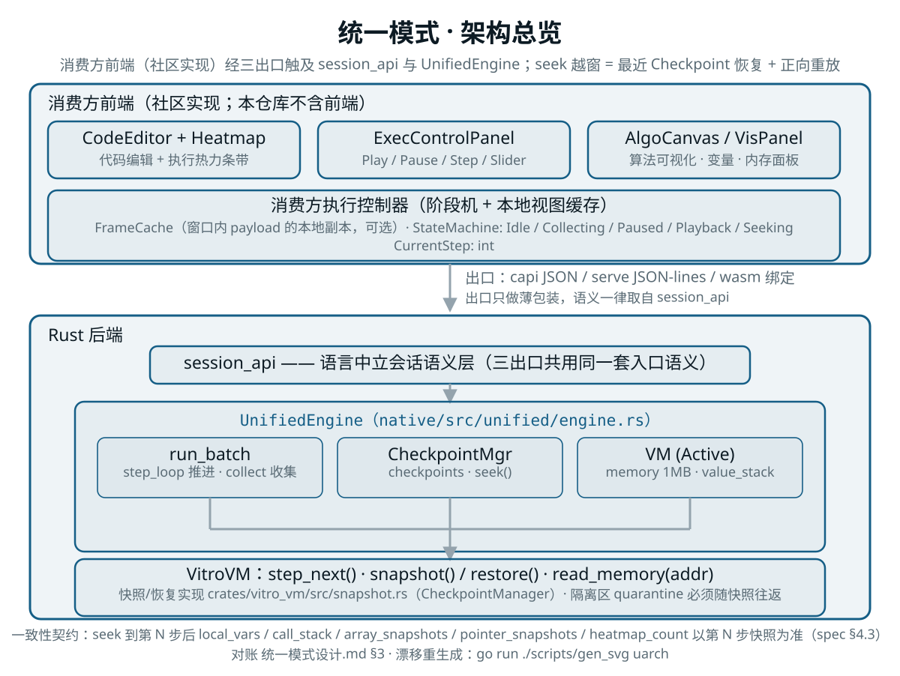
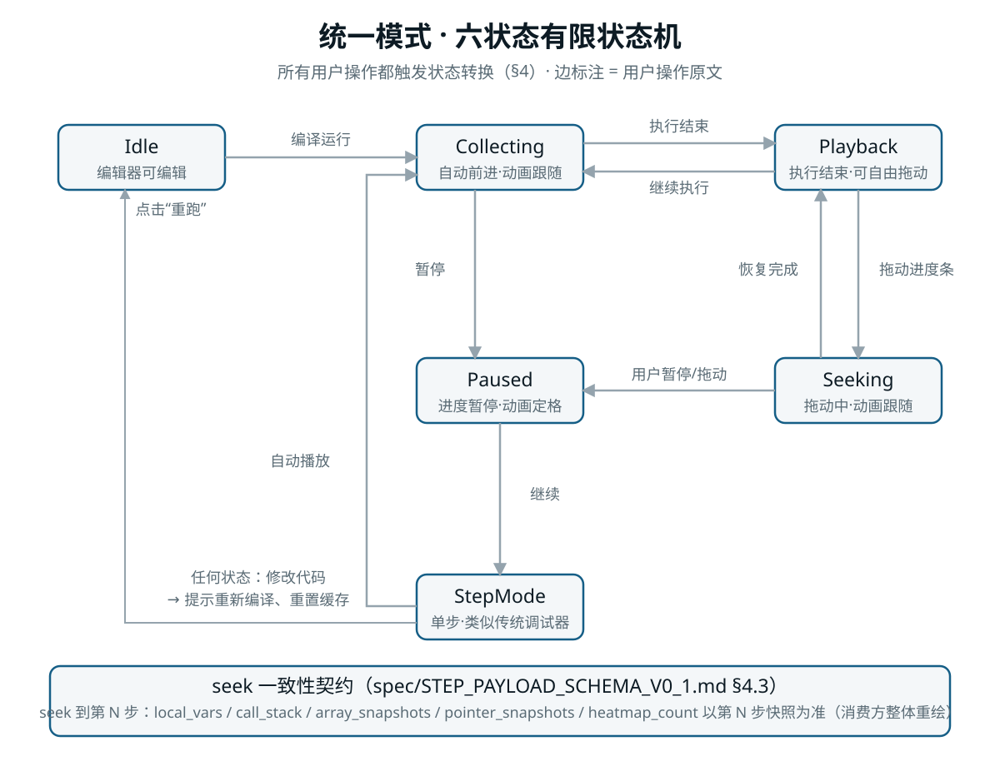

# Vitro 统一模式设计文档

> **版本**：2026-05-17  
> **状态**：✅ 已实现（Rust 后端全链路；对外的框架无关协议见 [`docs/spec/STEP_PAYLOAD_SCHEMA_V0_1.md`](../../spec/STEP_PAYLOAD_SCHEMA_V0_1.md；前端实现已于 2026-09-11 随前端切割迁出）  
> **核心原则**：用户不区分"调试模式"和"回放模式"。写代码 → 编译 → 运行 → 自由探索，一个流程走到底。  
> **最后核对**：2026-09-11（前端切割后文档翻新）  
> **修订记录**：
> - 2026-09-11：前端切割后翻新——§5.4 由"FRB API"改写为**三出口 API 对照**（capi / `vitro_cli serve` / wasm 共用 `session_api`）；§6 由"Flutter 前端"整章压缩改写为**前端消费方契约**（删除 Dart/Riverpod/widget 实现细节，保留状态机阶段、seek 联动一致性、frameCache 窗口、播放/暂停/单步/异常回退等对任何前端都成立的语义要求）；§7 时序图与 §9 集成示例改为语言中立出口调用；§10 路线图路径修正（`vitro_vm::snapshot`）并把已迁出的 Dart 资产集中标注；E-P1-5 输出通道更新（§5.1）保留。
> - 2026-05-17：初版（统一模式设计）。

---

## 目录

- [1. 设计目标](#1-设计目标)
- [2. 核心概念](#2-核心概念)
- [3. 架构总览](#3-架构总览)
- [4. 状态机](#4-状态机)
- [5. Rust 后端](#5-rust-后端)
  - [5.1 VM 快照/恢复](#51-vm-快照恢复)
  - [5.2 检查点管理器](#52-检查点管理器)
  - [5.3 自动执行引擎](#53-自动执行引擎)
  - [5.4 出口 API（capi 第一批 / `vitro_cli serve` / wasm）](#54-出口-apicapi-第一批--vitro_cli-serve--wasm)
- [6. 前端消费方契约（已迁出，见 spec）](#6-前端消费方契约已迁出见-spec)
  - [6.1 执行阶段划分](#61-执行阶段划分)
  - [6.2 执行控制契约（播放 / 暂停 / 继续 / 单步）](#62-执行控制契约播放--暂停--继续--单步)
  - [6.3 进度条与 seek 契约](#63-进度条与-seek-契约)
  - [6.4 可视化面板一致性契约](#64-可视化面板一致性契约)
  - [6.5 代码编辑器集成契约](#65-代码编辑器集成契约)
  - [6.6 异常回退与等待输入的消费方语义](#66-异常回退与等待输入的消费方语义)
- [7. 数据流](#7-数据流)
- [8. 边界情况](#8-边界情况)
- [9. 与现有功能集成](#9-与现有功能集成)
- [10. 实施路线图](#10-实施路线图)

---

## 1. 设计目标

### 1.1 解决的问题

传统 IDE 把"调试"和"回放"当成两个独立功能：
- **调试器**：单步执行、看变量、内存、调用栈。没有动画，没有进度条。
- **算法可视化工具**：有动画、有进度条。但预录帧，没有真实变量值，不能修改代码后继续执行。

学生在两个工具之间切换，认知负担大，学习曲线陡峭。

### 1.2 统一模式的定义

**一个模式，四种自由**：

```
写代码 → 编译 → 点击"运行"
              ↓
    ┌─────────┼─────────┐
    ↓         ↓         ↓
  自动播放  单步调试  拖动进度条
    ↓         ↓         ↓
  随时暂停  随时继续  随时恢复执行
    ↓         ↓         ↓
  查看动画  查看变量  修改代码重跑
```

用户**不需要点击任何模式切换按钮**。系统自动判断用户的意图，提供相应的交互能力。

### 1.3 非目标

- ❌ 不是"预录帧后离线播放"（如视频）
- ❌ 不是"纯调试器加个进度条装饰"
- ❌ 不是"牺牲调试能力换取动画"
- ✅ 是"调试能力 + 动画能力 + 进度条能力"的三位一体

---

## 2. 核心概念

### 2.1 三态缓存（Triple-Cache）

统一模式依赖三种不同粒度的缓存，分别服务于不同的交互场景：

| 缓存层 | 存储位置 | 数据内容 | 用途 | 大小（1000步） |
|:---|:---|:---|:---|:---|
| **Frame Cache** | Rust 后端（`UnifiedEngine` 滑动窗口，2000 帧）+ 消费方本地视图缓存 | `Vec<StepPayload>` | 动画渲染、变量面板、进度条拖动 | 2~5MB |
| **Checkpoint** | Rust 后端（`vitro_vm::snapshot::CheckpointManager`） | `Vec<(i32, VMSnapshot)>`（全量 + 增量混合） | VM 状态恢复（继续执行、查看内存） | 全量口径 50MB；增量快照后实测约 5~10MB |
| **Active VM** | Rust 后端 | `VitroVM` 实例 | 当前可执行的 VM 状态 | 1MB |

三态缓存结构图（由 `go run ./scripts/gen_svg` 生成，对账本表）：

<p align="center"></p>

> **实现更新（2026-09-11 核对）**：Frame Cache 的**权威副本在引擎内**（滑动窗口语义见
> [`STEP_PAYLOAD_SCHEMA_V0_1.md`](../../spec/STEP_PAYLOAD_SCHEMA_V0_1.md §4），消费方通过
> `vitro_get_step_payloads_json` / serve `payload.get` 取用，**不得**假设窗口外的历史 payload 仍可查询。
> 检查点管理器已下沉到 `crates/vitro_vm/src/snapshot.rs`（原 `native/src/unified/checkpoint.rs` 已不存在），
> 采用"每 `full_every` 个检查点一次全量 + 其余仅存脏页"的混合模式，检查点数量上限 50。

**设计原则**：
- 90% 的用户操作（拖动进度条、查看变量）只访问 **Frame Cache**，零延迟
- 10% 的操作（继续执行、查看特定内存地址）需要恢复 **Active VM**，从 Checkpoint 懒加载
- 不需要同时维护多个 Active VM，只有一个"当前 VM"

### 2.2 StepPayload（每步的轻量数据包）

```rust
pub struct StepPayload {
    /// 步骤索引（0-based）
    pub step_index: i32,
    
    /// ① 动画渲染数据
    pub vis_state: VisState,
    
    /// ② 语义元数据（进度条标签）
    pub meta: StepMeta,
    
    /// ③ 调试摘要（零延迟：变量 / 调用栈 / 内存概览）
    pub debug_summary: DebugSummary,
    
    /// ④ 执行热力图数据（该行被执行次数的增量）
    pub heatmap_delta: HeatmapDelta,
}

pub struct VisState {
    pub code_line: i32,
    pub arrays: Vec<VisArray>,
    pub nodes: Vec<VisNode>,
    pub edges: Vec<VisEdge>,
    pub ranges: Vec<VisRange>,
}

pub struct StepMeta {
    pub code_line: i32,
    pub func_name: String,
    pub loop_depth: i32,
    pub loop_iters: Vec<i32>,
    pub is_loop_boundary: bool,
    pub is_func_call: bool,
    pub is_swap: bool,
    pub semantic_label: String,
}

pub struct DebugSummary {
    pub local_vars: Vec<VariableSnapshot>,
    pub call_stack: Vec<FrameInfo>,
    pub memory_summary: MemorySummary,
}

pub struct HeatmapDelta {
    pub line: i32,
    pub count_increment: u64,
}
```

> **实现更新（2026-09-11 核对）**：上面的分层结构（`vis_state` / `meta` / `debug_summary` / `heatmap_delta`）
> 是**早期设计示意**。落地类型在 `native/src/unified/types.rs`，且对外形状是**扁平字段**——
> 权威定义与字段语义以语言中立协议 [`STEP_PAYLOAD_SCHEMA_V0_1.md`](../../spec/STEP_PAYLOAD_SCHEMA_V0_1.md
> 为准（`code_line` / `func_name` / `semantic_label` / `algorithm_step` / `local_vars` / `call_stack` /
> `vis_events` / `heatmap_line` / `heatmap_count` / `accessed_vars` / `array_snapshots` /
> `pointer_snapshots` / `root_cause_hint`）。消费方**不应**依赖本文片段里的 Rust 结构体形状。

### 2.3 Seek 策略

用户拖动进度条到第 `target` 步时，系统根据 `target` 与当前状态的关系选择策略：

```
if target 在当前 frameCache 窗口内 {          // payload.get / vitro_get_step_payloads_json
    // 策略 A：O(1) 直接取该步 payload 重绘
    payload = frame_cache[target];
} else {
    // 策略 B（越窗 seek）：引擎内部执行，顺序契约见 spec §4.2
    checkpoint = checkpoints.nearest(target);
    vm.restore(checkpoint);                   // 增量快照在此重建为全量
    for _ in checkpoint_step..target {        // 正向重放
        vm.step_next();
        frame_cache.push(collect_step_payload());
    }
    reset_window(target);                     // frame_cache_start_step = max(0, target - 1999)
    payload = frame_cache[target];
}
```

**懒加载调试信息**（消费方行为）：
- 拖动过程中：只重绘窗口内已有的 payload（O(1)），**不**触发 VM 恢复
- 停止拖动 500ms 后用户仍停留在该步：发起一次 seek（serve `seek`；capi 侧属第三批 `seek_to_step`），把 Active VM 恢复到该步
- 变量面板与调用栈面板直接读 payload 的 `local_vars` / `call_stack`，**不需要** VM 恢复
- 内存区域等需要真实 VM 的视图，在 seek 返回前显示 loading 指示器

> **一致性契约**（权威表述见 [`STEP_PAYLOAD_SCHEMA_V0_1.md`](../../spec/STEP_PAYLOAD_SCHEMA_V0_1.md §4.3）：
> seek 到第 N 步后，`local_vars` / `call_stack` / `array_snapshots` / `pointer_snapshots` / `heatmap_count`
> 一律以**第 N 步的快照**为准（而非"当前最新状态"），消费方据此整体重绘，不需要自行回退状态。

---

## 3. 架构总览

```
┌─────────────────────────────────────────────────────────────────────┐
│              消费方前端（社区实现；本仓库不含前端）                 │
│  ┌──────────────┐  ┌──────────────┐  ┌──────────────────────────┐  │
│  │ CodeEditor   │  │ ExecControl  │  │ AlgoCanvas / VisPanel    │  │
│  │ + Heatmap    │  │ Panel        │  │ + VarPanel + MemoryPanel │  │
│  │              │  │ (Play/Pause/ │  │                          │  │
│  │              │  │  Step/Slider)│  │                          │  │
│  └──────┬───────┘  └──────┬───────┘  └────────────┬─────────────┘  │
│         │                 │                       │                │
│  ┌──────┴─────────────────┴───────────────────────┴────────────┐  │
│  │        消费方执行控制器（阶段机 + 本地视图缓存）              │  │
│  │  - FrameCache（窗口内 payload 的本地副本，可选）              │  │
│  │  - StateMachine: Idle/Collecting/Paused/Playback/Seeking     │  │
│  │  - CurrentStep: int                                          │  │
│  └────────────────────────────┬─────────────────────────────────┘  │
└───────────────────────────────┼─────────────────────────────────────┘
                                │ 出口：capi JSON / serve JSON-lines / wasm 绑定
┌───────────────────────────────┼─────────────────────────────────────┐
│                         Rust 后端                                    │
│  ┌────────────────────────────┴─────────────────────────────────┐  │
│  │        session_api（语言中立会话语义层，三出口共用）         │  │
│  └────────────────────────────┬─────────────────────────────────┘  │
│  ┌────────────────────────────┴─────────────────────────────────┐  │
│  │              UnifiedEngine                                    │  │
│  │  ┌──────────────┐  ┌──────────────┐  ┌──────────────────┐   │  │
│  │  │ run_batch    │  │ CheckpointMgr│  │ VM (Active)      │   │  │
│  │  │              │  │              │  │                  │   │  │
│  │  │ - step_loop  │  │ - checkpoints│  │ - memory 1MB     │   │  │
│  │  │ - collect    │  │ - seek()     │  │ - value_stack    │   │  │
│  │  └──────┬───────┘  └──────┬───────┘  └────────┬─────────┘   │  │
│  │         │                 │                   │              │  │
│  │  ┌──────┴─────────────────┴───────────────────┴──────────┐   │  │
│  │  │                    VitroVM                              │   │  │
│  │  │  - step_next()                                         │   │  │
│  │  │  - snapshot() / restore()（crates/vitro_vm/src/core）   │   │  │
│  │  │  - read_memory(addr)                                   │   │  │
│  │  └────────────────────────────────────────────────────────┘   │  │
│  └───────────────────────────────────────────────────────────────┘  │
└─────────────────────────────────────────────────────────────────────┘
```

统一模式架构总览图（由 `go run ./scripts/gen_svg` 生成，与上图逐条对账）：

<p align="center"></p>

> 说明：`CheckpointMgr` 的实现在 `crates/vitro_vm/src/snapshot.rs`（`CheckpointManager`），
> `UnifiedEngine` 位于 `native/src/unified/engine.rs`；出口层（capi / serve / wasm）只做薄包装，
> 语义一律取自 `native/src/session_api.rs`。

---

## 4. 状态机

统一模式的核心是一个**六状态有限状态机**，所有用户操作都触发状态转换。

```
                    ┌──────────────────────────────────────┐
                    │                                      │
                    ▼                                      │
┌─────┐   编译运行   ┌─────────────┐   执行结束   ┌─────────┐
│Idle │ ──────────► │ Collecting  │ ───────────► │Playback │
└─────┘              └──────┬──────┘              └────┬────┘
   ▲                      │                           │
   │ 用户修改代码          │ 暂停                      │ 拖动进度条
   │                      ▼                           ▼
   │                   ┌─────────┐                ┌─────────┐
   │                   │ Paused  │ ◄───────────── │ Seeking │
   │                   └────┬────┘   用户暂停/拖动  └────┬────┘
   │                      │                           │
   │                      │ 继续                      │ 恢复完成
   │                      ▼                           ▼
   │                   ┌─────────┐                ┌─────────┐
   └────────────────── │StepMode │ ◄───────────── │  (返回  │
      用户点击"重跑"   └────┬────┘   用户点单步    │ Playback)
                           │
                           │ 自动播放
                           ▼
                      ┌─────────┐
                      │Collecting│
                      └─────────┘
```

六状态机图（由 `go run ./scripts/gen_svg` 生成，与上图及 §4.2 转换清单逐条对账）：

<p align="center"></p>

### 4.1 状态定义

| 状态 | 用户看到的界面 | 允许的交互 |
|:---|:---|:---|
| **Idle** | 编辑器可编辑，"运行"按钮高亮 | 编辑代码、点击运行 |
| **Collecting** | 进度条自动前进，动画播放，代码行高亮跟随 | 暂停、拖动进度条、修改代码（提示将重置） |
| **Paused** | 进度条暂停，动画定格 | 继续、单步下一步、拖动进度条、修改代码 |
| **Playback** | 执行结束，进度条可自由拖动 | 拖动进度条、点击"继续执行"（从当前步恢复 VM）、修改代码 |
| **Seeking** | 进度条拖动中，动画跟随 | 松开进度条后进入 Playback/Paused |
| **StepMode** | 单步状态，类似传统调试器 | 下一步、上一步、自动播放、拖动进度条 |

### 4.2 关键状态转换

**Collecting → Paused**：
- 触发：用户点击暂停按钮
- 动作：停止 `UnifiedEngine` 的批量推进（`pause()`；早期设计中的 `AutoExecutor` 已并入该引擎，见 §5.3）
- 结果：VM 停在当前步，用户可单步或拖动

**Playback → Seeking → Playback**：
- 触发：用户拖动进度条
- 动作：
  1. 立即用窗口内 payload 重绘（O(1)，不碰后端）
  2. 目标步越窗时：引擎从最近 Checkpoint 恢复 VM + 正向重放到 target（**同步执行、由调用方触发**，非后台线程，见 §5.3）
  3. 完成后窗口重置（`frame_cache_start_step = max(0, target-1999)`）并更新 `Active VM`

**Playback → Collecting（继续执行）**：
- 触发：用户在 Playback 状态点击"继续执行"
- 动作：
  1. 从最近 Checkpoint 恢复 VM
  2. 正向重放到当前步
  3. 继续 `UnifiedEngine` 的批量推进
- 注意：从第 50 步继续执行时，输出必须回到"第 50 步所见"的状态——当前实现由 `RuntimeSnapshot.output_chunks`
  整段还原（含通道标记），而**不是**按长度截断（见 §5.1 的 E-P1-5 说明）

**StepMode → Collecting（自动播放）**：
- 触发：用户在单步调试时点击"自动播放"
- 动作：从当前步继续自动收集

**任何状态 → Idle（修改代码）**：
- 触发：用户在执行过程中修改了代码
- 动作：提示"代码已修改，是否重新编译？" → 重置所有缓存 → 回到 Idle

---

## 5. Rust 后端

### 5.1 VM 快照/恢复

> **实现更新（2026-09-11 核对）**：下面是早期设计的字段形状；落地 `VMSnapshot` 见
> `crates/vitro_vm/src/snapshot.rs`（字段为 `memory: MemoryImage` / `stack: Vec<u64>` / `ip` /
> `runtime: RuntimeSnapshot` / `memory_state: MemorySnapshot`，另含 `breakpoints`、`freed_logs`、
> `vis_event_queue` 等），`VitroVM::snapshot()` / `restore()` 实现在 `crates/vitro_vm/src/core/snapshot.rs`。

```rust
/// VM 全量快照（约 1MB + 少量元数据）
#[derive(Clone)]
pub struct VMSnapshot {
    // VM 核心状态
    pub memory: Vec<u8>,                    // 1MB
    pub value_stack: Vec<i64>,
    pub call_stack: Vec<CallFrame>,
    pub pc: u32,
    pub mem_stack_top: u32,
    
    // 运行时状态（包含 rand_seed, input_index, output_lines 等）
    pub runtime: RuntimeSnapshot,
    
    // 内存管理状态
    pub memory_regions: Vec<MemoryRegion>,
    pub free_list: Vec<FreeBlock>,
    pub heap_offset: u32,
}

impl VitroVM {
    /// 创建快照（执行前调用，用于异常回退）
    pub fn snapshot(&self, session: &Session) -> VMSnapshot {
        VMSnapshot {
            memory: self.memory.clone(),
            value_stack: self.value_stack.clone(),
            call_stack: self.call_stack.clone(),
            pc: self.pc,
            mem_stack_top: self.mem_stack_top,
            runtime: session.runtime.snapshot(),
            memory_regions: session.memory.regions.clone(),
            free_list: session.memory.free_list.clone(),
            heap_offset: session.memory.heap_offset,
        }
    }
    
    /// 恢复快照
    pub fn restore(&mut self, snap: &VMSnapshot, session: &mut Session) {
        self.memory.copy_from_slice(&snap.memory);
        self.value_stack = snap.value_stack.clone();
        self.call_stack = snap.call_stack.clone();
        self.pc = snap.pc;
        self.mem_stack_top = snap.mem_stack_top;
        session.runtime.restore(&snap.runtime);
        session.memory.regions = snap.memory_regions.clone();
        session.memory.free_list = snap.free_list.clone();
        session.memory.heap_offset = snap.heap_offset;
    }
}
```

**output_lines 截断处理**：

> **实现更新（E-P1-5，2026-09-11）**：下面这段伪代码描述的是早期设计。当前实现**不按长度截断**，
> 而是在 `RuntimeSnapshot` 中**整体克隆输出分段** `output_chunks: Vec<OutputChunk>`
> （`vitro_vm/src/snapshot.rs`），恢复时整段还原（`vitro_vm/src/core/snapshot.rs`）。
> 原因：输出已按 `OutputKind::Stdout / Stderr / Note` 打标，按长度截断会丢失通道标记；
> 整段克隆同时保证"回到某一步"后程序 stdout 与引擎附注仍各自可分辨。

```rust
/// 从检查点恢复时，截断 output_lines 到检查点时的长度
pub fn restore_with_output_truncate(
    &mut self, 
    snap: &VMSnapshot, 
    session: &mut Session
) {
    let target_len = snap.runtime.output_lines_len;
    session.runtime.output_lines.truncate(target_len);
    self.restore(snap, session);
}
```

### 5.2 检查点管理器

> **实现更新（2026-09-11 核对）**：`CheckpointManager` 已下沉到
> **`crates/vitro_vm/src/snapshot.rs`**（`vitro_vm::snapshot::CheckpointManager`；原 `native/src/unified/checkpoint.rs`
> 已随下沉删除）。落地版本在下面这份早期设计之上增加了：
> - **全量 + 增量混合快照**：每 `full_every` 个检查点保存一次完整 1MB 内存，其余仅保存被修改的 4KB 页；
> - **检查点数量上限 `max_checkpoints`（50）**，防止长程序内存无限增长；
> - 快照内容按 `crates/vitro_vm/src/snapshot.rs` 的 `VMSnapshot` 字段为准（含 `runtime` / `memory_state`，
>   其中隔离区 `quarantine` 必须随快照往返，否则时间旅行回退后 UAF 检测出现假阴性）。
>
> 下面代码块中的 `restore_with_output_truncate` 属早期设计，**当前不按长度截断**，见 §5.1 的 E-P1-5 说明。

```rust
pub struct CheckpointManager {
    /// (step_index, snapshot)
    checkpoints: Vec<(i32, VMSnapshot)>,
    /// 检查点间隔（默认 20 步）
    interval: i32,
    /// 智能检查点：在语义关键点强制保存
    smart_mode: bool,
}

impl CheckpointManager {
    pub fn new(interval: i32) -> Self {
        Self {
            checkpoints: Vec::new(),
            interval,
            smart_mode: true,
        }
    }
    
    /// 判断是否需要保存检查点
    pub fn should_checkpoint(&self, step: i32, meta: &StepMeta) -> bool {
        // 基础间隔
        if step % self.interval == 0 {
            return true;
        }
        
        // 智能模式：语义关键点强制保存
        if self.smart_mode {
            if meta.is_loop_boundary || meta.is_func_call || meta.is_swap {
                return true;
            }
        }
        
        false
    }
    
    /// 保存检查点
    pub fn save(&mut self, step: i32, vm: &VitroVM, session: &Session) {
        self.checkpoints.push((step, vm.snapshot(session)));
    }
    
    /// 找到最近的检查点（<= target）
    pub fn nearest(&self, target: i32) -> Option<(i32, &VMSnapshot)> {
        self.checkpoints.iter()
            .rfind(|(step, _)| *step <= target)
            .map(|(step, snap)| (*step, snap))
    }
    
    /// Seek 到目标步：恢复检查点 + 正向重放
    pub fn seek_to(
        &self,
        target: i32,
        vm: &mut VitroVM,
        session: &mut Session,
        on_step: &mut dyn FnMut(i32, StepPayload),
    ) -> Result<(), String> {
        let (checkpoint_step, snap) = self.nearest(target)
            .ok_or("No checkpoint available".to_string())?;
        
        vm.restore_with_output_truncate(snap, session);
        
        // 正向重放到目标步
        for step in checkpoint_step..target {
            vm.step_next()?;
            let payload = collect_step_payload(vm, session, step);
            on_step(step, payload);
        }
        
        Ok(())
    }
}
```

### 5.3 统一模式引擎（`UnifiedEngine`）

实际实现中，`AutoExecutor` 的职责并入 `UnifiedEngine`（`native/src/unified/engine.rs`），检查点管理器独立在 `vitro_vm::snapshot`。引擎采用**批量轮询**而非后台线程：三个出口（capi / `vitro_cli serve` / wasm）都是调用方驱动的同步模型，引擎只在被调用时推进一批——该设计最初是为兼容 FRB 桥接的同步调用模型，前端切割后依然成立（出口侧无法让后端线程反向推送）。

```rust
pub struct UnifiedEngine {
    pub checkpoints: CheckpointManager,
    pub frame_cache: Vec<StepPayload>,
    pub max_steps: i32,          // 防止无限循环（默认 100_000，会话级可覆盖）
    pub is_paused: bool,
    pub is_cancelled: bool,
}

impl UnifiedEngine {
    /// 批量自动执行，返回收集到的 StepPayload 列表。
    /// 调用方按固定节奏批量拉取（历史前端为每 50ms 一次、batch_size=5；
    /// serve 侧对应 `step.next`，capi 侧为 `vitro_step_next_json`）。
    pub fn run_batch(
        &mut self,
        vm: &mut VitroVM,
        session: &mut Session,
        batch_size: i32,
    ) -> Result<AutoStepResult, String> {
        let mut payloads = Vec::new();
        let mut finished = false;
        let mut trapped = false;
        let mut waiting_input = false;
        let mut trap_message: Option<String> = None;

        for _ in 0..batch_size {
            if self.is_paused || self.is_cancelled { break; }

            let step = vm.get_executed_steps();

            // 检查点保存
            let meta = StepMeta { code_line: vm.get_current_line(), /* ... */ };
            if self.checkpoints.should_checkpoint(step, &meta) {
                self.checkpoints.save(step, vm, session);
            }

            // 执行前快照：用于 Trap 时自动回退
            let pre_step_snap = vm.snapshot(session);

            // 执行一步
            match vm.step(session) {
                StepResult::Ok | StepResult::Paused => {
                    let payload = StepCollector::collect(vm, session, step);
                    payloads.push(payload);
                }
                StepResult::Finished => { /* ... */ finished = true; break; }
                StepResult::WaitingInput => { /* ... */ break; }
                StepResult::Trap => {
                    // 自动回退到上一步状态
                    vm.restore(&pre_step_snap, session);
                    trapped = true;
                    trap_message = Some(vm.get_error().to_string());
                    break;
                }
            }

            if step >= self.max_steps {
                return Err("执行步数超过限制（10,000 步），可能存在无限循环。".to_string());
            }
        }

        self.frame_cache.extend(payloads.clone());
        Ok(AutoStepResult { payloads, finished, trapped, waiting_input, /* ... */ })
    }

    pub fn pause(&mut self) { self.is_paused = true; }
    pub fn resume(&mut self) { self.is_paused = false; }
    pub fn cancel(&mut self) { self.is_cancelled = true; }
}
```

**关键实现细节**：
- **Trap 自动回退**：每步执行前保存 `pre_step_snap`，若发生 Trap 立即 `vm.restore()`，保证消费方看到的始终是安全状态
- **批量轮询**：历史前端每 50ms 调用一次 `run_auto_steps(batch_size)`；capi/serve 侧由消费方自己决定拉取节奏，语义一致（一批 = 最多 `batch_size` 步）
- **Output 截断**：`seek_to` 时 `frame_cache.truncate()` 丢弃目标步之后的旧数据，保证时间线一致性（窗口起点同步为 `frame_cache_start_step`，见 spec §4.2）

### 5.4 出口 API（capi 第一批 / `vitro_cli serve` / wasm）

统一模式的**会话语义只有一份**：`native/src/session_api.rs`。三个出口都只是薄包装，
消费方按自己所在的边界选一列即可，**不应**依赖 Rust 内部函数形状。

| 语义（`session_api`） | 出口 1：capi（C ABI，`native/src/capi/`） | 出口 3：`vitro_cli serve`（JSON-lines） | 出口 2：wasm（`wasm32-unknown-unknown`） |
|:---|:---|:---|:---|
| `compile` | `vitro_compile_json(session)` | `compile` | 经 C ABI 直接可用（绑定层未定型） |
| `run` | `vitro_run_json(session)` | `run` | 同上 |
| `output_delta` / `output_delta_on` | `vitro_get_output_delta`（展示视图）/ `vitro_get_program_output_delta`（纯 stdout，E-P1-5） | `output.delta`（`stream: display\|stdout\|stderr\|note`） | 同上 |
| `step_begin` | `vitro_step_begin(session)` | `step.begin` | 同上 |
| `step_next` | `vitro_step_next_json(session)` | `step.next` | 同上 |
| `payloads` | `vitro_get_step_payloads_json(session, start, end)` | `payload.get` | 同上 |
| `seek` | **第三批**（`seek_to_step`，尚未落地） | `seek`（已可用，过渡形态） | 同 capi |
| `set_breakpoints` | `vitro_set_breakpoints(session, lines_json)` | `breakpoints.set` | 同 capi |
| `memory_regions` | **第二批**（`vitro_get_memory_regions_json`，尚未落地） | `memory.regions`（过渡形态，字段待第二批对齐） | 同 capi |
| 会话级配置（`max_steps` / 调用栈深度 / 判分确定性 / 隔离预算） | `vitro_set_max_steps` / `vitro_set_call_depth_limit` / `vitro_set_deterministic` / `vitro_set_quarantine_budget` | `config.get` / `config.set` | 同 capi |

**消费方必须遵守的语义要点**（与出口无关）：

- **编译与统一模式初始化是两步**：`compile` 成功后才可 `step_begin`（未编译时 capi 返回 `-2` / serve 返回 `state` 错误帧）；
- **断点须在 `step_begin` 之后设置**：`step_begin` 会重建 VM 并清空断点；命中断点时 `step_next` 返回 `paused: true`；
- **越窗取 payload 静默裁剪**：`payload.get` 只返回窗口内子集，配合响应里的 `cache_start_step` / `max_collected_step` 判断；
- **窗口外定位走 seek**：恢复检查点 + 正向重放，属耗时操作，消费方应先给 loading 反馈（见 §6.3）；
- **复杂结构过边界一律 JSON 字符串**，rust-alloc 所有权（capi 侧须 `vitro_free_string` 释放）；
- **Session 句柄非线程安全**，跨线程调用需调用方自行同步。

> 出口细节：capi 函数签名、状态码与所有权契约见 [`CAPI评审回复与实现状态.md`](../06-出口与协议（§10.1 第一批逐项状态）；
> serve 的 id 关联、错误帧同构、方法一览与实测样例见 [CLI使用手册.md](../02-构建与上手/CLI使用手册.md) §6（serve：JSON-lines 会话模式）。
> wasm 出口当前以 C ABI 全链路直接可用（2026-09-11 冒烟实证），薄 JS/TS 绑定包属 Phase 2a 计划——
> 绑定层同样只允许调用上表入口，**禁止**另建语义（三出口漂移是本项目明令禁止的架构反模式）。

---

## 6. 前端消费方契约（已迁出，见 spec）

> **本章说明（2026-09-11）**：前端实现（`CideFlutter/`，含全部 Dart 代码与 FRB 桥接）已于 2026-09-11
> 随"前端切割"迁出本仓库，切割前最后完整状态由标签 `before-frontend-split` 保留
> （`git checkout before-frontend-split -- CideFlutter` 可取回）。
> 本章因此**不再是"本仓库的前端设计"**，而是**任何消费方都必须遵守的契约**——社区前端、SharpTutor 类
> 教学 IDE、脚本化工具、Web 白箱形态都适用：状态机阶段划分、seek 时各视图的联动一致性、
> frameCache 窗口语义、播放/暂停/单步/异常回退的语义要求，这些对任何前端都成立。
>
> 字段级权威定义在 [`STEP_PAYLOAD_SCHEMA_V0_1.md`](../../spec/STEP_PAYLOAD_SCHEMA_V0_1.md；
> 出口调用方式见 §5.4；**具体实现（语言、框架、组件形态）随社区前端，本文不作约束**。

### 6.1 执行阶段划分

消费方需要自己维护一个执行阶段机。它与 §4 的后端六状态一一对应，另加两个**纯消费方本地**阶段：

| 消费方阶段 | 对应 §4 状态 | 触发 | 该阶段允许的交互 |
|:---|:---|:---|:---|
| `idle` | Idle | 初始 / 代码修改后重置 | 编辑代码、发起编译运行 |
| `compiling` | （本地） | 已发出 `compile` 请求 | 等待诊断返回；可取消 |
| `collecting` | Collecting | 编译成功且 `step.begin` 完成，正在批量拉取 `step.next` | 暂停、拖动进度条、修改代码（提示将重置） |
| `paused` | Paused | 用户暂停，或**命中断点**（`paused: true`） | 继续、单步、拖动进度条、修改代码 |
| `playback` | Playback | 执行结束（`finished: true`） | 拖动进度条、从当前步继续执行、修改代码 |
| `seeking` | Seeking | 拖动进度条 / 发起 seek | 等待 seek 返回；期间不重复发起 |
| `step_mode` | StepMode | 用户点单步 | 单步、自动播放、拖动进度条 |
| `error` | （本地） | 编译失败，或运行时 trap | 查看诊断、重置回 `idle` |

契约要点：

- **阶段是消费方本地状态**，后端不推送。后端能给出的只有 `finished` / `trapped` / `waiting_input` / `paused`
  四个标志与 `payloads`；
- `paused: true` 表示**命中断点**（断点在 VM 层判定），消费方应进入 `paused` 而不是 `finished`；
- 任何阶段收到 `trapped: true` + `trap_message`，都必须切到 `error`，并按 §6.6 处理回退后的状态；
- **代码修改 = 回到 `idle`**：执行过程中检测到源码变更必须提示（"代码已修改，是否重新编译？"），
  确认后清空本地视图缓存并重新 `compile` + `step.begin`。

### 6.2 执行控制契约（播放 / 暂停 / 继续 / 单步）

控制面板（运行 / 暂停 / 单步 / 进度条 / 速度）是消费方的主要交互面，语义要求如下：

| 控件 | 可用阶段 | 语义 |
|:---|:---|:---|
| 运行 | `idle` | `compile` → `step.begin` → 进入 `collecting` |
| 暂停 | `collecting` | 停止继续拉取 `step.next`；**不销毁会话**，Active VM 停在当前步 |
| 继续 | `paused` / `step_mode` | 从当前步继续批量拉取（回到 `collecting`） |
| 继续执行 | `playback` | **必须先 seek 回当前步**（恢复 Active VM）再继续拉取 |
| 单步 | `paused` / `step_mode` | 推进一步并更新当前步与各视图；`payloads` 固定 1 个元素 |
| 自动播放 | `step_mode` | 消费方按速度定时器逐帧推进；**优先复用窗口内 payload**，不必每帧打后端 |
| 播放速度 | `playback` / `step_mode` | 纯消费方行为（改变定时器间隔），不影响后端语义 |

> **"继续执行"的正确姿势**：从 `playback` 继续时，先用 `seek(current_step)` 把 Active VM 恢复到当前步，
> 再继续拉取。**不要**假设 VM 仍停在用户看到的那一步——用户可能刚拖动过进度条
> （§4.2 "Playback → Collecting" 已写明该前置步骤）。

### 6.3 进度条与 seek 契约

进度条既是"时间轴"也是"当前步指示器"，语义来自 §4.2 的状态转换与 spec §4 的窗口语义：

1. **拖动中：窗口内 O(1) 切换**。目标步在窗口内时直接取该步 payload 重绘（不触发 VM 恢复），保证拖动跟手；
2. **停手 500ms 后再 seek**。用户停在该步不动时才发起 `seek`（serve `seek`；capi 侧属第三批 `seek_to_step`），
   避免拖动过程中把重放请求打满；
3. **越窗 seek 是懒重算**：后端取最近检查点 → 恢复 → 正向重放到目标步 → 窗口重置为 `[target-1999, target]`
   （顺序契约见 spec §4.2）。期间消费方显示 loading，并**应丢弃"目标步之后"的本地帧**，否则时间线前后不一致；
4. **seek 失败必须可见**：后端可能返回 `success: false` + `error`（无可用检查点、重放中命中 trap 等）。
   消费方要把失败态显示出来，不得静默停在旧位置；
5. **进度条标签用语义而非裸步号**：`semantic_label`（如"循环 i=0, j=1"）比"第 150 步"更利于教学；
   标签为空时退回步号显示。

> **一致性契约**（权威表述见 spec §4.3）：seek 到第 N 步后，`local_vars` / `call_stack` /
> `array_snapshots` / `pointer_snapshots` / `heatmap_count` 一律以**第 N 步的快照**为准，
> 消费方据此整体重绘，不需要自行回退状态。

### 6.4 可视化面板一致性契约

同一步的**所有视图必须来自同一个 `StepPayload`**——这是时间旅行体验成立的前提。

| 视图 | 数据来源 | 契约 |
|:---|:---|:---|
| 算法动画（数组 / 链表 / 树） | `array_snapshots` / `pointer_snapshots` / `vis_events` | 以当前步快照重绘；`vis_events` 是**取走式**的，同一步不会重复投递 |
| 变量面板 | `local_vars` | 当前作用域变量；变量消失由差分层 `removed_var_name_indices` 表达 |
| 值变化提示 | `accessed_vars`（`Read` / `Write`） | 高亮"本步读写"的变量，而不是"值与前一步不同"的变量 |
| 调用栈 | `call_stack` | **自底向上**，末元素为当前帧；`return_line` 当前恒为 0（spec §8 #1），不要据此画返回行 |
| 代码行高亮 | `code_line` | 1 起；`0` = 当前步无源码行（库函数内部），此时不要高亮任何行 |
| 热力图 | `heatmap_line` / `heatmap_count` | 计数单调不减，可增量累加；seek 后必须以当前步的快照为准重算 |
| 指针状态 | `pointer_snapshots[].status` | `Valid` / `Freed` / `Null` / `Dangling`；直接使用后端判定，**不要**自行推导（优先级见 spec §3.1） |
| 内存区域 | serve `memory.regions`（过渡形态；capi 第二批定型） | 需要 Active VM 已恢复；未恢复时显示 loading，而不是伪造数据 |
| 异常卡片 | `root_cause_hint` | 仅陷阱路径填充，常规步为 `null`；字段分层见 spec §2.8 |

契约要点：

- **seek 后整体重绘**，不要"只更新动画、不更新变量面板"——这正是 spec §4.3 要防的不一致；
- **不要跨帧拼状态**：`local_vars` 是当前作用域快照而非增量；差分层中 `null`（沿用上一步）与 `[]`（本步为空）
  语义不同，必须区分（spec §5.2）；
- **快照字段缺失 ≠ 空数组**：字段缺省时保持面板稳定，不要显示成"数组为空"。

### 6.5 代码编辑器集成契约

编辑器属消费方自研/选型范围（本仓库不提供），但统一模式对它有五条契约：

- **当前行高亮**跟随 `code_line`；`code_line == 0` 时不改变已有高亮；
- **变量级高亮**由 `accessed_vars` 驱动：`Read` 与 `Write` 用可区分的底色，且不应破坏语法高亮；
- **热力图侧栏**由 `heatmap_line` / `heatmap_count` 绘制行级执行频度；执行结束后保留，直到用户重新运行或修改代码；
- **修改即失效**：执行中检测到源码变更 → 非阻断提示"代码已修改，重新编译以更新执行结果" →
  用户确认后取消当前会话、清空缓存、回到 `idle`（见 §8.4）；
- **多文件行号**：`code_line` 是**合并源码的全局行号**，payload 暂未携带文件名（spec §8 #9），
  消费方目前无法从 payload 反查"哪个文件的第几行"；v0.2 计划增加 `code_file` 字段，届时按"只增不改"演进。

### 6.6 异常回退与等待输入的消费方语义

- **trap 自动回退由后端完成**：每步执行前保存快照，命中 trap 时自动 `restore` 回上一步状态，并返回
  `trapped: true` + `trap_message` + `root_cause_hint`。消费方看到的**永远是安全状态**：
  不要自行再回退一次，也不要继续拉取 `step.next`；
- **异常卡片分层**：现象（`trap_message`）→ 原因（`root_cause_hint.one_liner`）→ 解法
  （`suggested_fix_desc`，配合 `related_lines` 可点击跳转）；`suggested_fix_kind == "None"` 时不显示修复按钮；
- **等待输入**：`waiting_input: true` 表示程序阻塞在 `scanf` 等输入点。消费方弹出输入框，
  把用户输入作为一次性输入继续（capi `vitro_provide_input_line` / `vitro_set_input`；serve 侧为 `run` 的
  `input`，会话级批量模式为 `batch_input`），**从同一位置继续**，不得从头重跑；
- **步数上限**：达到会话级 `max_steps` 时后端以教学 trap 返回（而非无限等待）。消费方按 trap 处理，
  展示"可能存在无限循环"的提示，并提供"调高上限重跑"的入口（capi `vitro_set_max_steps` / serve `config.set`）；
- **中断与重置**：消费方可随时停止拉取（等价于 paused，不需要销毁会话）；`session.reset` 只清空编译/运行状态，
  **保留会话级配置**（隔离预算、判分确定性、argv）。

> **历史实现细节不在此保留**：Dart 组件命名与层级、Riverpod / Notifier 状态管理、
> `setState` / `notifyListeners` 用法等均属已迁出的前端资产；需要对照时用
> `git checkout before-frontend-split -- CideFlutter` 取回，本文不再复述。

---

## 7. 数据流

### 7.1 正常执行流

```
[消费方] 用户点击"运行"
    ↓ capi: vitro_compile_json → vitro_step_begin（serve: compile → step.begin）
[后端] 编译 → 初始化统一模式会话（装载 VM + 建首个检查点）
    ↓ 消费方按批轮询
[后端] step_next（内部 run_batch）→ 收集 StepPayload
    ↓ capi JSON / serve JSON-lines
[消费方] 收到 StepPayload → 追加到本地视图缓存（窗口外由 payload.get 补取）
    ↓
[消费方] 更新执行阶段 → 按同一步 payload 重绘全部视图
    ├── 编辑器: 高亮 code_line + 热力图着色
    ├── 算法画布: 渲染 array_snapshots / vis_events
    ├── 变量面板: 显示 local_vars / call_stack
    └── 进度条: 前进到 step_index
```

### 7.2 拖动进度条流

```
[消费方] 用户拖动进度条到 step 150
    ↓
[消费方] 立即用窗口内 payload[150] 重绘全部视图（O(1)，不碰后端）
    ↓ 500ms 后用户未继续拖动
[消费方] 发起 seek(150)（serve: seek；capi: 第三批 seek_to_step）
    ↓
[后端] CheckpointMgr.nearest(150) → 找到检查点 140
    ↓
[后端] vm.restore(checkpoint_140) → 正向重放 10 步 → 窗口重置为 [target-1999, target]
    ↓
[后端] 更新 Active VM → 返回 seek 结果
    ↓ capi JSON / serve JSON-lines
[消费方] 标记 Active VM 已恢复
    ↓
[消费方] 内存区域等需要真实 VM 的面板现在可以读取
```

### 7.3 继续执行流

```
[消费方] 用户在 Playback step 150 点击"继续执行"
    ↓ seek(150)
[后端] 恢复 VM 到 step 150（同上）
    ↓
[消费方] 继续批量拉取 step_next
    ↓
[后端] 从 step 150 继续收集 StepPayload
    ↓ capi JSON / serve JSON-lines
[消费方] 追加到本地视图缓存，进度条继续前进
```

---

## 8. 边界情况

### 8.1 无限循环

```rust
// UnifiedEngine 设置最大步数上限（会话级可覆盖）
// 默认 UnifiedEngine::new() = with_max_steps(100_000)
if step >= self.max_steps {
    return Err("执行步数超过限制，可能存在无限循环。".to_string());
}
```

> **数字核对（2026-09-11）**：统一模式默认上限为 **100,000 步**（`native/src/unified/engine.rs`
> `UnifiedEngine::new()`）；会话可通过 capi `vitro_set_max_steps` / serve `config.set` 调低或调高，
> 教学内容建议"可控地撞上限并拿到教学 trap"，而不是无限等待（见 §6.6）。

消费方显示：

```
⚠️ 执行已暂停
程序已执行 100,000 步，可能包含无限循环。

当前代码位置：第 7 行 while (1) {
建议：检查循环终止条件。

[查看当前状态] [强制停止]
```

### 8.2 运行时异常（数组越界、空指针等）

```rust
// VM 的 step_next_safe 包装
try {
    vm.step_next()?;
} catch (trap) {
    // 自动回退到上一步
    vm.restore(&last_snapshot);
    
    // 返回错误信息 + 当前状态
    return Err(format!("运行时错误：{}\n发生在第 {} 行", trap.message, trap.line));
}
```

消费方显示异常面板（回退语义与卡片分层见 §6.6）。

### 8.3 scanf 等待输入

```rust
// host_scanf 中检测到输入已耗尽
if session.runtime.input_index >= session.runtime.input_lines.len() {
    session.runtime.waiting_input = true;
    // 返回特殊状态，消费方弹出输入框
    return StepResult::WaitingInput;
}
```

消费方显示：
```
⏸️ 程序等待输入
scanf("%d", &x);

请输入一个整数：
[________] [确认]
```

用户输入后，input_lines 追加新值，从同一位置继续执行（不得从头重跑，见 §6.6）。

### 8.4 代码修改后重置

用户在执行过程中修改代码：
1. 消费方检测到代码变化
2. 显示非阻断提示："代码已修改，重新编译以更新执行结果"
3. 用户点击"重新运行" → 取消当前执行 → 清空所有缓存 → 回到 Idle

### 8.5 内存不足（FrameCache 过大）

如果程序执行了 100,000 步，全量保留每步 payload 会占用过大内存（早期前端估算：100,000 × 2KB ≈ 200MB）。

**当前实现已经内建边界**（权威语义见 [`STEP_PAYLOAD_SCHEMA_V0_1.md`](../../spec/STEP_PAYLOAD_SCHEMA_V0_1.md §4）：

- 引擎持有**滑动窗口 `frame_cache`，上限 2000 帧**；超限时丢弃**最早**的 `ceil(len × 20%)` 帧；
- 窗口起点由 `frame_cache_start_step` 表达，随窗口滑动同步前移（`reset()` 后为 0）；
- 越窗 step 的帧不从窗口"消失"到不可恢复：需要时由 **seek 懒重算**（最近检查点恢复 + 正向重放）重新收集；
- 消费方**不应**假设窗口外的历史 payload 仍可查询（`payload.get` 对越窗区间静默返回子集），
  需要长期留存的帧必须由消费方自行落地持久化。

> 历史口径：前端曾用"50MB 上限 + 丢最早 20%"的本地缓存策略；该策略在切割前已由引擎侧窗口统一取代，
> 前端本地缓存现在只是窗口内 payload 的可选副本。

---

## 9. 与现有功能集成

### 9.1 与诊断修复系统集成

运行时异常自动回退后，诊断系统可以：
- 根据错误类型（数组越界、空指针、栈溢出）匹配知识卡片
- 提供一键修复建议（如 `i <= n` → `i < n`）
- 记录到学习进度系统（"今天又修复了一个数组越界错误"）

### 9.2 与学习进度系统集成

"运行 → 拖动 → 理解"这条探索路径所需的数据**全部可从出口拿到**，进度记录本身属消费方职责：

- 探索范围：当前步 `step_index` 与已收集到的最大步（`max_collected_step`）；
- 算法识别：payload 的 `algorithm_step.algorithm_name` / `display_name`；
- 停留时长、拖动次数：消费方本地统计（后端不采集用户行为）；
- 陷阱学习：`root_cause_hint.category` 可作为"今天修复了哪类错误"的归类依据。

> 后端只负责**执行与协议**，不做用户行为埋点；学习进度、成就、报告属消费方（或上层教学产品）能力。

### 9.3 与持久化系统集成

统一模式**不做隐式持久化**，会话状态由消费方按需保存与恢复：

| 需要保存的内容 | 获取方式 | 恢复方式 |
|:---|:---|:---|
| 源码 | 消费方自己的编辑器 | `compile`（serve 支持 `files:[{filename,source}]` 多文件） |
| 当前步 | 最近一次 payload 的 `step_index` | `step.begin` → `seek(step)`（越窗时触发检查点恢复 + 重放） |
| 输入（`scanf` 数据） | 消费方自行收集 | serve `run` 的 `input` / 批量模式 `batch_input`；capi `vitro_set_input` / `vitro_set_input_mode` |
| 断点行 | 消费方自己的编辑器 | `breakpoints.set`（**须在 `step.begin` 之后**） |
| 输出游标 | `output.delta` 返回的 `cursor`（字节游标，UTF-8 边界安全） | 传回同一 `cursor` 继续增量取 |

> 注意：后端**不保存**"上次执行到第几步"——`session.reset` 只清空编译/运行状态并保留会话级配置；
> 恢复历史位置依靠 `seek` 重放而非快照落盘，这是有意的设计边界（见 spec §8 #6：窗口外 payload 不可查询，
> 消费方须自行持久化）。

---

## 10. 实施路线图

> **状态总览**：Rust 后端全部完成（快照 / 检查点 / 引擎 / 收集器 / 类型链 → capi 第一批 + `vitro_cli serve`）；
> 前端实现已于 2026-09-11 随前端切割迁出，本节只保留**本仓库的交付物**，历史 Dart 资产集中列在 §10.1
> （标签 `before-frontend-split`）。以下标记为 ✅ 的已在代码库中实现并可用。

### Phase 0：VM 快照/恢复 ✅
- [x] `VMSnapshot` 数据结构（`crates/vitro_vm/src/snapshot.rs`：内存镜像、栈、调用栈、运行时状态、内存管理状态）
- [x] `VitroVM::snapshot()` / `restore()`（`crates/vitro_vm/src/core/snapshot.rs`；另有 `snapshot_incremental` / `snapshot_into`）
- [x] 输出分段随快照整体往返（`RuntimeSnapshot.output_chunks`，E-P1-5 口径，取代早期"按长度截断"，见 §5.1）
- [x] 单元测试：快照 → 恢复 → 状态一致

### Phase 1：检查点管理器 + 自动执行引擎 ✅
- [x] `CheckpointManager`（`crates/vitro_vm/src/snapshot.rs`：固定间隔 20 步 + 智能模式 + 全量/增量混合 + 上限 50）
- [x] `UnifiedEngine`（`native/src/unified/engine.rs`：批量轮询 + 步数上限 + 暂停/继续 + Trap 回退 + frameCache 窗口）
- [x] 会话包装层接线（`native/src/flutter_bridge.rs`，**历史命名**：`run_auto_steps` / `seek_to_step` / `step_next_unified`；
      该文件仍被 `vitro_cli` 的 compile/run/step 路径消费，名称待后续重构收敛）
- [x] 三出口语义统一：`native/src/session_api.rs`（capi 第一批与 `vitro_cli serve` 共用同一入口语义）

### Phase 2：统一模式 API + 消费方状态契约 ✅
- [x] 类型链：`StepPayload`、`AutoStepResult`、`SeekResult`、`HeatmapData`（`native/src/unified/types.rs`，全链路 `serde::Serialize`）
- [x] 协议定稿：[`STEP_PAYLOAD_SCHEMA_V0_1.md`](../../spec/STEP_PAYLOAD_SCHEMA_V0_1.md（字段冻结由 `native/tests/step_payload_schema_v0_1_test.rs` 机械保证）
- [x] 消费方状态契约（阶段机 / seek 一致性 / 播放暂停单步 / 异常回退）→ 本文 §6（框架无关）
- [x] 历史前端：`UnifiedNotifier`（Riverpod + 六状态机）、`UnifiedState`、执行控制面板 → 见 §10.1

### Phase 3：执行路径热力图 ✅
- [x] VM 层：`heatmap.line_counts` 收集（`session.rs`）
- [x] 出口：payload 的 `heatmap_line` / `heatmap_count` 已随 `step.next` / `payload.get` 携带
- [x] 历史前端：覆盖率百分比显示（`ExecutionControlPanel`）→ 见 §10.1

### Phase 4：排序动画 MVP + 语义进度条 ✅
- [x] `StepPayload.vis_events`：数组比较事件（当前唯一产出类型码 `1`，见 spec §3.3）
- [x] 语义标签生成（`native/src/unified/collector.rs`：`infer_semantic_label`，支持循环/交换/递归/函数调用/IO/内存分配）
- [x] 历史前端：柱状图 + 交换动画、进度条语义标签、算法检测信息条 → 见 §10.1

### Phase 5：变量变化历史 + 零延迟面板 ✅
- [x] 数据面：payload 的 `local_vars`（当前作用域）/ `call_stack`（自底向上）/ `accessed_vars`（Read/Write）
- [x] 变量历史可由 payload 窗口派生（`payload.get` 区间查询；窗口外经 seek 重算）
- [x] 历史前端：`VarHistoryTab`、`VariablesTab`、`CallStackPanel` → 见 §10.1

### Phase 6：运行时异常自动回退 ✅
- [x] `pre_step_snap` + Trap 回退（`native/src/unified/engine.rs`）
- [x] 根因推断与知识卡片数据（`native/src/unified/root_cause.rs` + `unified/trace_analyzer/`，出口字段 `root_cause_hint`）
- [x] 历史前端：Trap 提示条 / "查看帮助" 面板 / 自动回退 UI → 见 §10.1

### Phase 7：变量级高亮 ✅
- [x] `accessed_vars` 已收集并进入协议（`StepPayload.accessed_vars`：Read/Write 标记）
- [x] 历史前端：值变化闪烁、编辑器变量底色高亮、行号 gutter R/W 标记 → 见 §10.1

### Phase 8：链表/树可视化增强 ✅
- [x] 数据面：`pointer_snapshots` 四状态（Valid/Freed/Null/Dangling）已进协议，可驱动链表/树视图
- [ ] `LinkedListSnapshot` / `TreeSnapshot` 序列化到 `StepPayload`（后端预遍历，消除拖动时 VM 未恢复的不一致风险）— **低优先级**（属协议增量，需走 spec 版本化流程）
- [x] 历史前端：`LinkedListVisualizer` / `TreeVisualizer` 及对应 Tab → 见 §10.1

**实际用时**：约 2 周（后端 5 天 + 前端 5 天 + 联调 4 天；切割前口径）

### 10.1 历史前端资产（已迁出，标签 `before-frontend-split`）

以下条目由切割前的 Flutter 前端实现，**2026-09-11 随 `CideFlutter/` 迁出本仓库**，不再属于本仓库交付物。
其中的交互语义已按 §6 抽象为框架无关契约，具体实现随社区前端。需要取回参考时：

```bash
git checkout before-frontend-split -- CideFlutter
```

| 资产 | 切割前位置（Dart，已迁出） | 对应的契约条款 |
|:---|:---|:---|
| 统一模式状态管理（Riverpod + 六状态机） | `providers/unified_notifier.dart` | §6.1 执行阶段划分 |
| 统一状态对象 | `models/unified_state.dart` | §6.1 / §6.2 |
| 执行控制面板（Play/Pause/Step/Slider/速度/覆盖率） | `widgets/execution_control_panel.dart` | §6.2 / §6.3 |
| 排序动画（柱状图 + 交换动画） | `widgets/array_vis_tab.dart` | §6.4 |
| 数组可视化动画增强（脉冲 / 光晕 / 弹跳） | `widgets/array_visualizer.dart` | §6.4 |
| 变量历史趋势图 | `widgets/var_history_tab.dart` | §6.4 / Phase 5 |
| 每步局部变量面板 | `widgets/variables_tab.dart` | §6.4 |
| 调用栈面板、链表 / 树可视化 Tab | `CallStackPanel` / `LinkedListVisTab` / `TreeVisTab` 等组件 | §6.4 |

> 该标签同时保留切割前的 FRB 桥接（`native/src/api/`、`frb_generated.rs`）与全部 Flutter 构建脚本；
> 本仓库现有的 `native/src/flutter_bridge.rs` **不在迁出范围内**——它是历史命名的会话包装层，
> 仍被 `vitro_cli` 消费（见 Phase 1 说明），待后续重构收敛命名。

---

## 附录：与 `VM教学体验优势.md` 的关系

| 文档 | 聚焦点 |
|:---|:---|
| `VM教学体验优势.md` | **为什么**要做这些体验（教学价值、竞品对比） |
| `统一模式设计.md`（本文） | **怎么做**统一模式（架构、状态机、API、数据流） |

两文档配合使用：先读前者理解"为什么要做"，再读本文理解"怎么落地"。
