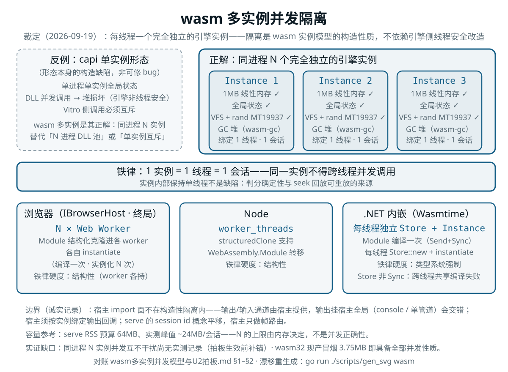

# wasm 多实例并发模型与 U2 拍板

> **裁定日期**：2026-09-19　|　**状态**：已裁定（U2 拍板输入）
> **上位文档**：[MoonBit迁移总计划](../01-定位与路线/MoonBit迁移总计划.md)（F-5 capi 砍除）、[MoonBit迁移第一阶段计划](../01-定位与路线/MoonBit迁移第一阶段计划.md)（§2 U2）
> **关联文档**：[下游需求处置回执](下游需求处置回执.md)（C1 第二批 capi 窗口）、[CAPI评审回复与实现状态](CAPI评审回复与实现状态.md)

---

## 1. 裁定结论

**宿主侧并发模型定为"每线程一个完全独立的引擎实例"**：同一进程内将引擎模块实例化 N 次，
每实例拥有独立的线性内存、全局状态与（wasm-gc 终局下的）GC 堆——**隔离是 wasm 实例模型的
构造性质，不依赖引擎侧任何线程安全改造**。三种宿主形态均为现成能力：

| 宿主形态 | 并发载体 | 实例化方式 | 铁律的硬度 |
|---|---|---|---|
| 浏览器（IBrowserHost，终局） | N × Web Worker | `WebAssembly.Module` 结构化克隆进各 worker 后各自 instantiate（编译一次、实例化 N 次） | 结构性（worker 各持实例） |
| Node | `worker_threads` | 同上（Node 的 structuredClone 支持 `WebAssembly.Module` 转移） | 结构性 |
| .NET 内嵌（Wasmtime） | 每 .NET 线程一个独立 `Store` + `Instance` | `Module` 编译一次（本身 Send+Sync，跨线程共享），每线程 `Store::new` + instantiate | **类型系统强制**（`Store` 非 `Sync`，跨线程共享直接编译失败） |

**铁律：1 实例 = 1 线程 = 1 会话。** 同一实例不得跨线程并发调用——实例内部保持单线程
不是缺陷，是判分确定性与 seek 回放可重放的来源。Wasmtime 宿主下该铁律由编译器保证，
浏览器/Node 宿主下由 worker 结构保证。

并发隔离模型图（由 `go run ./scripts/gen_svg` 生成，对账本节与 §2）：

## 2. 依据

### 2.1 隔离来自 core wasm 实例模型（不必等 wasm-gc）

每次 instantiate 产生的 Instance 自带独立的 linear memory / globals / table，这是
core 规范性质；wasm-gc 只是把对象数据从线性内存挪到 GC 堆（同样挂在 Instance 上，
per-instance）。**因此当前出口 2（Rust→wasm32-unknown-unknown，冒烟实证 3.75MB）
就已具备本文全部并发性质**——引擎的 1MB 线性内存、符号表、会话状态全在实例内部。
下游并发对接**现在就能用 wasm32 产物验证与实施**，不是 wasm-gc 才解锁的能力；
MoonBit/wasm-gc 终局只是延续同一模型。

### 2.2 本仓库实证交叉验证

- **capi 形态是构造性反例**：单进程单实例全局状态，实证"DLL 并发调用 → 堆损坏
  （引擎非线程安全），Vitro 侧调用必须互斥"（`native/AGENTS.md` §D5 实证发现）。
  这不是可修的 bug，是**形态本身的构造缺陷**；wasm 多实例是其正解——同进程内
  N 实例替代"N 进程 DLL 池"或"单实例互斥"。
- **引擎状态全部实例内**（跨实例"同输入同输出"可复现的前提，逐项核对）：
  1MB 线性内存 ✓；VFS 沙盒文件系统（`RuntimeState` 内）✓；rand 状态（引擎内
  MT19937，`pyrandom` 逐比特复刻的确定性正依赖它）✓；教学子集无 time 类非确定
  host func ✓。
- **容量参考**：serve 侧 RSS 先例（预算 64MB、实测峰值 ~24MB/会话）给出 N 实例
  宿主预算量级——N 的上限由内存决定，不是并发正确性决定。

### 2.3 边界（诚实记录）

- **宿主 import 面不在构造性隔离之内**：实例间隔离覆盖引擎内部状态；输出/输入
  通道由宿主提供——若输出挂宿主全局（console/单管道），N 会话输出会**交错**
  （内存安全无虞，会话分流会乱）。宿主侧须按实例绑定输出回调；serve 协议的
  `session` id 概念平移，宿主只做帧路由。
- **实证缺口**：出口 2 冒烟覆盖"C API 全链路 + 安全检测在 wasm 下工作"，但
  **同进程 N 实例并发互不干扰尚无实测记录**。按"实测大于脑测"，拍板生效前
  补一个小锚（见 §4 待办）。

## 3. U2 拍板（`vitro_capi.h` 19 声明的迁移期处置）

以本文并发模型为依据，对 [第一阶段计划](../01-定位与路线/MoonBit迁移第一阶段计划.md)
§2 U2（"`vitro_capi.h` 19 声明与开工同批拍板"）裁定如下：

| 对象 | 裁定 | 说明 |
|---|---|---|
| 第一批 capi 19 声明（W0-3 已补齐 + 三种所有权标注，SharpTutor 现依赖） | **冻结现状，维护至 Rust oracle 退役** | 不再新增能力；缺陷修复与防线维护照常（冻结区纪律）；随 Rust 区整体删除而消失（总计划 §10） |
| 第二批 capi（memory/breakpoints 的"语言中立化 + capi 导出"，回执 §3 C1 窗口） | **裁定不做** | 并发与嵌入诉求由本文模型承担（.NET 宿主走 Wasmtime 多 Store 多实例）；对应能力以 serve 协议为终态载体（C2 的 serve 过渡形态即正式形态，不再语言中立化导出到 capi） |
| SharpTutor 对接形态 | **并发走 wasm 多实例，交互走 serve 协议帧** | .NET 内嵌 Wasmtime 承担多会话并发；协议帧（NDJSON）语义在 wasm 宿主内由适配层承载，出口 3 的会话语义（id 关联 / 错误帧同构 / session.reset）原样平移 |

**通知义务**（按第一阶段计划 U2 规则"若裁不做须通知下游改期"）：第二批 capi 的
裁"不做"须正式通知 SharpTutor——其影响与替代路径：

- 回执 §3 原降级线（"第二批整体后移到 CS2 之后"）升级为**改道**：M3 调试面板
  依赖的三段式 `kind` 以 serve 协议为唯一载体（C2 已落地 serve 过渡形态）；
- CS2 的 region 高亮 / 透视模式内存断点数值形态，改由 wasm 实例 + serve 帧承载；
- 对端集成成本变化：新增 .NET 侧 Wasmtime 依赖（`Wasmtime` NuGet），换取并发
  能力从"单实例互斥"升为"N 实例构造性隔离"——这是能力增强不是降级。

## 4. 待办（拍板生效前的加固动作）

- [ ] **N 实例并发实证锚**：当前 wasm32 产物，同进程 instantiate ×2，两实例分别
  跑同一/不同程序（含 rand / VFS / 输出交错探测），断言输出与状态零污染——
  给下游对接第一手依据（纯推理不作数）。载体：`native/tests/` 新增 wasm 冒烟
  扩展或 scripts 探针，红→绿留痕。
- [ ] **SharpTutor 通知发出**（用户动作，非本仓库任务）：引用本文 §3。
- [ ] S1 `vitro/engine/source` 的列单位契约（双坐标 `Pos{byte_off, col_scalar, col_utf16}`）
  实现时对照本文铁律——单实例单线程语义下坐标口径无需考虑并发快照一致性。
