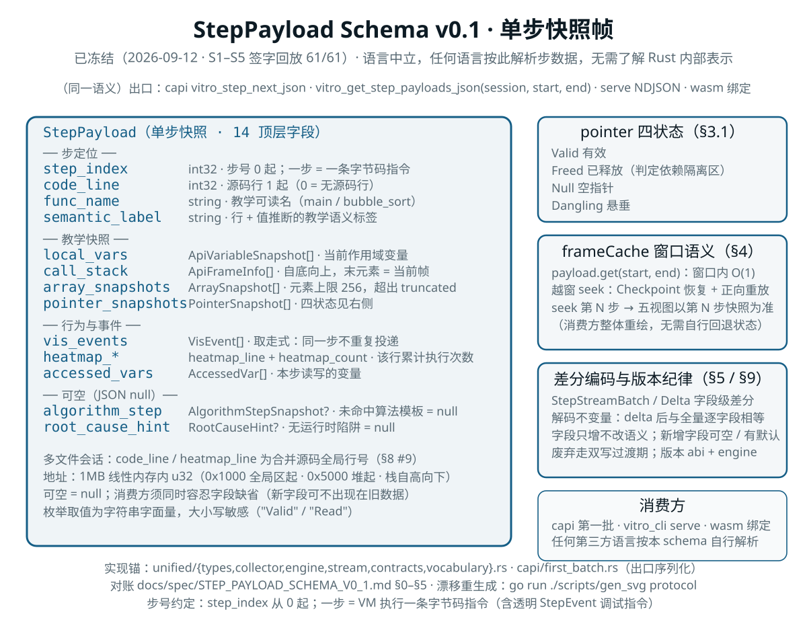

# StepPayload Schema v0.1（语言中立）

> 状态：**v0.1 已冻结**（2026-09-12）——S1–S5 五组签字回放 61/61 PASS（§7.x2），
> 字段冻结测试、出口形状一致性、serve 冒烟与 clippy 零警告全部就位。
> 冻结日期：2026-09-12　|　冻结锚点：`10591ad`
> 后续演进走 **§9 v0.2 激活轨道**（预留位激活 / 新增字段），纪律不变：**字段只增不改语义**。
> 归属：主计划 [`后端定位与白箱计划.md`](../current/01-定位与路线/后端定位与白箱计划.md) §3.2 协议层
> 实现锚点：`native/src/unified/types.rs`（类型定义）、`collector.rs`（字段来源）、`engine.rs`（窗口与 seek）、`stream.rs`（差分编码）、`contracts.rs`（版本轨道与行为契约）、`vocabulary.rs`（受控词汇表）、`native/src/capi/first_batch.rs`（出口序列化）
> 消费者：capi 第一批（`vitro_step_next_json` / `vitro_get_step_payloads_json`）、`vitro_cli serve`、wasm 绑定、任何第三方语言
> 最后核对日期：2026-09-14
> 修订说明（2026-09-14，U2#10）：§2.4 `ArraySnapshot` 新增 `truncated`（bool，
> serde default 缺省 false——旧流/旧消费方零影响，字段只增不改语义纪律内）；
> 元素数超过引擎上限 256 时 `elements` 为截断视图。字段冻结测试白名单同步。
> 修订说明（2026-09-12）：v0.1 冻结；新增 §9 v0.2 激活轨道与附录 B 受控词汇表；
> §2.5 `target_name` 补跨帧解析口径（下游 D3）；§8 #1/#9 计划列指向 §9。
> 修订说明（2026-09-11）：去前端化——§0 明示"语言中立、不依赖任何前端实现"；§7 回放输入的"Flutter frameCache"改为"原生前端 frameCache 消费序列（已切割的历史资产）"并指向 `vitro_cli serve` 复现口径。字段定义与校验记录保持原样。

本文档是**协议层**定义：任何语言按此即可解析 Vitro 的步数据，无需了解 Rust 内部表示。引擎内部优化（CoW 快照等）不得改变本文档的字段语义。

---

## 0. 文档约定

| 约定 | 说明 |
|---|---|
| 传输编码 | UTF-8 JSON。capi 每个入口返回**完整 JSON 字符串**（rust-alloc 所有权，须用 `vitro_free_string` 释放）；`vitro_cli serve` 为 NDJSON（每行一个 JSON 对象） |
| 字段命名 | `snake_case`（与 Rust serde 默认一致） |
| 枚举取值 | **字符串字面量**，大小写敏感（如 `"Valid"` / `"Read"`） |
| 步号 | `step_index` 从 **0** 开始，一步 = VM 执行一条字节码指令（含透明的 `StepEvent` 调试指令） |
| 行号 | `code_line` 为 **1 起**源码行号；`0` 表示"当前步无对应源码行"（如库函数内部） |
| 地址 | 1MB 线性内存空间内的 `u32`（`0x1000` 起为全局区、`0x5000` 起为堆区、栈区自高地址向下） |
| 可空 | JSON `null`；消费方须同时容忍**字段缺省**（只增不改前提下新字段可能不出现在旧数据里） |
| 版本化纪律 | **字段只增不改语义**；新增字段必须可空/有默认值；消费方必须忽略未知字段；废弃走双写过渡期 |
| 版本获取 | `vitro_abi_version()`（capi 契约版本）+ `vitro_engine_version()`（引擎版本，含构建期 git hash） |
| 语言中立 | **本 schema 语言中立，不依赖任何前端实现**：字段语义只由引擎与出口定义，任何前端（含已切割的历史前端资产）都只是消费方；回放校验以出口 JSON 为准（§7.1） |

---

## 1. 顶层对象：`StepPayload`

单个执行步的完整快照。

| 字段 | 类型 | 可空 | 语义 |
|---|---|---|---|
| `step_index` | int32 | 否 | 步号（0 起） |
| `code_line` | int32 | 否 | 当前源码行号（1 起；0 = 无源码行）；**多文件 / 含头文件会话中为合并源码的全局行号**（见 §8 #9） |
| `func_name` | string | 否 | 当前函数名（教学可读名，如 `main` / `bubble_sort`）；未知时为空串 |
| `semantic_label` | string | 否 | 教学语义标签，由源码行 + 变量值推断（如 `循环 i=0, j=1`、`交换 arr[1]↔arr[2]`、`调用 printf`、`内存分配`） |
| `algorithm_step` | object | **是** | 算法步骤语义快照（§2.6）；未命中算法模板时为 `null` |
| `local_vars` | array | 否 | 当前作用域变量快照（§2.1）；无变量时为 `[]` |
| `call_stack` | array | 否 | 调用栈（§2.2）；**自底向上**，最后一个元素为当前帧 |
| `vis_events` | array | 否 | 本步产生的可视化事件（§2.7）；**取走式**：同一步数据不会被重复投递 |
| `heatmap_line` | int32 | 否 | 热力图行号（当前实现恒等于 `code_line`；多文件 / 含头文件会话中随之使用全局行号，见 §8 #9） |
| `heatmap_count` | uint64 | 否 | 该行**截至本步**的累计执行次数 |
| `accessed_vars` | array | 否 | 本步读写的变量（§2.3） |
| `array_snapshots` | array | 否 | 数组快照（§2.4），供条形图/可视化 |
| `pointer_snapshots` | array | 否 | 指针快照（§2.5），四状态见 §3.1 |
| `root_cause_hint` | object | **是** | 运行时陷阱的根因提示（§2.8）；无提示时为 `null` |

帧结构图（由 `go run ./scripts/gen_svg` 生成，对账本节字段表与 §4/§5）：

<p align="center"></p>

### 示例（截断）

```json
{
  "step_index": 42,
  "code_line": 12,
  "func_name": "bubble_sort",
  "semantic_label": "循环 i=0, j=1",
  "algorithm_step": {
    "algorithm_name": "bubble_sort",
    "display_name": "冒泡排序",
    "phase": "比较",
    "description": "比较 arr[1] 与 arr[2]"
  },
  "local_vars": [
    { "name": "i", "addr": 1048576, "is_local": true, "ty_name": "int", "value": "0" },
    { "name": "j", "addr": 1048580, "is_local": true, "ty_name": "int", "value": "1" }
  ],
  "call_stack": [{ "func_name": "main", "return_line": 0 }, { "func_name": "bubble_sort", "return_line": 0 }],
  "vis_events": [{ "ty": 1, "line": 12, "extra0": 0, "extra1": 0, "extra2": 0, "context": "arr[j] > arr[j+1]" }],
  "heatmap_line": 12,
  "heatmap_count": 7,
  "accessed_vars": [{ "name": "j", "access_type": "Read" }, { "name": "arr", "access_type": "Read" }],
  "array_snapshots": [{ "name": "arr", "element_ty": "int", "elements": ["5", "3", "4", "1", "2"] }],
  "pointer_snapshots": [
    { "name": "p", "addr": 1048600, "ty_name": "int*", "target_addr": 20480, "target_name": "arr", "status": "Valid" }
  ],
  "root_cause_hint": null
}
```

---

## 2. 子结构

### 2.1 `ApiVariableSnapshot` — 变量快照

| 字段 | 类型 | 语义 |
|---|---|---|
| `name` | string | 变量名 |
| `addr` | uint32 | 变量自身在线性内存中的地址 |
| `is_local` | bool | 是否局部变量（`false` = 全局/静态） |
| `ty_name` | string | **C/C++ 风格类型名**（如 `int` / `unsigned int` / `const char*` / `int[5]` / `struct Node` / `Foo` / `int&`）。**自 2026-09-11 起为稳定可读名**（此前是 Rust `Type` 的 `Debug` 表示，如 `Int { is_unsigned: false, is_const: false }`，属内部结构泄漏，见 §8 #7）；指针识别见 §3.1 |
| `value` | string | 值的字符串化。`double`/`float` 按定点格式化并去掉尾随 0；整数为十进制；指针为十六进制 `0x…`；**数组为元素摘要**（如 `{5, 3, 1, 4, 2}`，超过 16 个元素截断为 `…`），不再显示首元素 |

### 2.2 `ApiFrameInfo` — 调用帧

| 字段 | 类型 | 语义 |
|---|---|---|
| `func_name` | string | 帧对应函数名 |
| `return_line` | int32 | **当前恒为 0**（MVP 简化，schema 保留字段；见 §8 已知限制） |

数组顺序**自底向上**：`call_stack[0]` 为最外层（通常 `main`），`call_stack[last]` 为当前执行帧。

### 2.3 `AccessedVar` — 本步访问的变量

| 字段 | 类型 | 语义 |
|---|---|---|
| `name` | string | 变量名 |
| `access_type` | string | `"Read"` 或 `"Write"`（§3.2） |

同名变量在同一集合中可能同时出现 `Read` 与 `Write` 两条（如 `x++`）。

### 2.4 `ArraySnapshot` — 数组快照

| 字段 | 类型 | 语义 |
|---|---|---|
| `name` | string | 数组变量名 |
| `element_ty` | string | 元素类型名 |
| `elements` | string[] | 元素值（字符串化，规则同 `value`） |
| `truncated` | bool | U2#10（2026-09-14）：元素数超出引擎上限（256）时置位——`elements` 为前 256 个元素的截断视图，消费方不得当全量。旧流缺省 `false`（serde default，向后兼容） |

### 2.5 `PointerSnapshot` — 指针快照

| 字段 | 类型 | 语义 |
|---|---|---|
| `name` | string | 指针变量名 |
| `addr` | uint32 | 指针变量自身的地址 |
| `ty_name` | string | 指针类型名 |
| `target_addr` | uint32 | 指向的地址（`0` = NULL） |
| `target_name` | string | 被指对象的变量名；给定地址能被**任一活跃帧或全局**快照中的变量槽覆盖时给出，否则空串 |
| `status` | string | 四状态枚举，见 §3.1 |

**`target_name` 的匹配口径（2026-09-12 扩充，下游需求清单 D3）**：搜索范围从"当前帧
快照"扩为"**当前帧 → 全局符号 → 其余活跃帧**"，命中判据为**地址等于变量起始地址**，
或落在**数组**类型变量的元素区间内（`&arr[2]` 归属到 `arr`）。于是 `swap(int *a, int *b)`
体内 `a`/`b` 能解析出调用者的 `x`/`y`（此前恒为空串，见 SharpTutor S3 §6 观测 #2）。

- **空串的语义收窄**：只表示"地址不属于任何可见变量槽"（如指向堆块内部、指向 struct
  字段中间、或指向已出作用域的变量），**不再等同于"跨帧解不出来"**；消费方不得把
  空串当作"悬空指针"信号 —— 悬空与否由 `status` 表达。
- **已知限制**：非数组复合类型（struct/union/class）不参与区间匹配（VM 侧无布局表），
  只做起始地址精确匹配。

### 2.6 `AlgorithmStepSnapshot` — 算法步骤

| 字段 | 类型 | 语义 |
|---|---|---|
| `algorithm_name` | string | 算法标识（如 `bubble_sort`） |
| `display_name` | string | 教学展示名（如 `冒泡排序`） |
| `phase` | string | 阶段（如 `比较` / `交换` / `初始化`） |
| `description` | string | 一句话教学描述 |

### 2.7 `VisEvent` — 可视化事件

| 字段 | 类型 | 语义 |
|---|---|---|
| `ty` | int32 | 事件类型码，见 §3.3 |
| `line` | int32 | 触发事件的源码行 |
| `extra0` / `extra1` / `extra2` | int32 | 类型相关的附加整数（当前实现恒为 0，保留扩展） |
| `context` | string | 人类可读上下文（如 `arr[j] > arr[j+1]`） |

### 2.8 `RootCauseHint` — 陷阱根因提示

| 字段 | 类型 | 可空 | 语义 |
|---|---|---|---|
| `category` | string | 否 | 根因类别，见 §3.4 |
| `one_liner` | string | 否 | 一句话解释（面向学生） |
| `related_lines` | int32[] | 否 | 相关源码行（可点击跳转） |
| `suggested_fix_kind` | string | 否 | 修复类型，见 §3.5 |
| `suggested_fix_line` | int32 | **是** | 建议修复位置 |
| `suggested_fix_desc` | string | **是** | 修复的自然语言描述 |

---

## 3. 枚举

### 3.1 `pointer_snapshots[].status` — 指针四状态

| 取值 | 语义 |
|---|---|
| `"Valid"` | 指向有效内存（栈、全局、已分配未释放的堆块） |
| `"Freed"` | 指向**已释放**的堆内存（地址命中 `is_heap && is_freed` 的已登记区域）——UAF 教学信号 |
| `"Null"` | NULL 指针（`target_addr == 0`） |
| `"Dangling"` | 悬空/越界：地址落在 NULL 陷阱区（`< 0x1000`）或线性内存之外（≥ 1MB） |

**判定优先级（实现契约）**：`Null` → `Dangling` → `Freed` → `Valid`（顺序不可交换：`target_addr == 0` 先于一切；越界先于"是否已释放"）。

**指针变量的识别**：`ty_name` 含 `*` 或 `Pointer` 的变量进入指针快照；`value` 以 `0x…` 十六进制或十进制无符号解析失败者跳过（如函数指针的符号名）。

> 说明：`Freed` 的判定依赖引擎的**有界隔离区**（free 后地址在隔离窗口内不复用，见 [`堆有界隔离决议.md`](../current/06-出口与协议/堆有界隔离决议.md)）。隔离窗口外的 UAF 可能退化为 `Valid`（读到复用块），属已知差异。

### 3.2 `accessed_vars[].access_type`

| 取值 | 语义 |
|---|---|
| `"Read"` | 本步读取了该变量 |
| `"Write"` | 本步写入（含 `++`/`--`）了该变量 |

大小写敏感；无第三种取值（读写同时发生时给出两条记录）。

### 3.3 `vis_events[].ty`

| 取值 | 语义 | 当前状态 |
|---|---|---|
| `1` | 比较（`compare`）——源码中数组元素参与的比较表达式 | **当前唯一产出值** |
| 其余 | 保留 | 预留给交换/移动/递归/指针变更等可视化事件 |

### 3.4 `root_cause_hint.category`

`OffByOne` / `UseAfterFree` / `UninitializedIndex` / `WrongStartIndex` / `SizeMismatch` / `NullDeref` / `DivZero` / `DoubleFree`

### 3.5 `root_cause_hint.suggested_fix_kind`

`ChangeLeToLt` / `AddNullCheck` / `InitVariable` / `FixLoopStart` / `FixArraySize` / `SetNullAfterFree` / `AvoidDivZero` / `None`

---

## 4. frameCache 窗口语义（重要一致性契约）

引擎持有滑动窗口 `frame_cache`（`UnifiedEngine`），窗口内保存最近的 `StepPayload`。

| 参数 | 值 | 说明 |
|---|---|---|
| 窗口大小 | **2000 帧** | 超过即触发裁剪 |
| 裁剪比例 | **20%** | 裁剪时丢弃**最早**的 `ceil(len × 0.2)` 帧（至少 1 帧） |
| `frame_cache_start_step` | 步号 | `frame_cache[0]` 对应的真实步号；窗口滑动时同步前移；`reset()` 后为 0 |
| `max_collected_step` | 步号 | 窗口内已收集的最大步号；窗口为空时为 `frame_cache_start_step - 1` |
| 检查点间隔 | **20 步** | `CheckpointManager::new(20)`；seek 的重放粒度 |

### 4.1 查询 `payload.get(start, end)`

- 语义为**左闭右开** `[start, end)`，按**真实步号**索引；
- 请求区间被裁剪到当前窗口内：窗口外的部分**静默丢弃**，返回数组可能为空；
- 返回数组的第一个元素不一定对应 `start`（若 `start` 早于 `frame_cache_start_step`）。

### 4.2 越窗 seek（懒重算）

目标步不在窗口内时的行为（顺序契约）：

1. 取**最近的检查点**（`checkpoints.nearest(target)`）；无可用检查点 → `success: false` + `error`；
2. 恢复 VM 到该检查点（增量快照在此重建为全量）；
3. **正向重放**至目标步：逐步执行并逐帧收集 payload；重放途中每跨过一个检查点间隔（20 步）保存新检查点（加速后续 seek）；
4. 重放中遇到 `trap` → `success: false`；遇到 `waiting_input` / `finished` → 以该步为终点返回 `success: true`；
5. 重放结束后执行**窗口重置**：`frame_cache_start_step = max(0, target - 2000 + 1)`，并**截断 target 之后的帧**——即 seek 回退后窗口是"目标步及其之前 1999 帧"，不含未来帧。

### 4.3 seek 后各视图的一致性

seek 到第 N 步后，`local_vars` / `call_stack` / `array_snapshots` / `pointer_snapshots` / `heatmap_count` 均以**第 N 步的快照**为准（而非"当前最新状态"）。消费方据此重绘所有视图，不需要自行回退状态。

`vitro_get_step_payloads_json(start, end)` 的响应携带 `cache_start_step` 与 `max_collected_step`，消费方据此判断"我要的区间是否还在窗口内"。

---

## 5. 差分编码：`StepStreamBatch` / `StepPayloadDelta`

用于批量传输（省带宽）：一个 batch = 1 个完整基准快照 + N 个差分。

### 5.1 `StepStreamBatch`

| 字段 | 类型 | 语义 |
|---|---|---|
| `symbol_table` | string[] | 全局去重字符串池；**索引 0 恒为空串**，其余按首次出现顺序分配 |
| `base_payloads` | object[] | 每 batch 的第 1 个完整快照（`StepPayloadRef`） |
| `deltas` | object[] | 后续步的差分（`StepPayloadDelta`） |
| `finished` / `trapped` / `waiting_input` / `paused` | bool | 批次结束状态 |
| `current_line` | int32 | 批次结束时的源码行 |
| `trap_message` | string\|null | 陷阱信息 |
| `cache_start_step` | int32 | 窗口起始步号（与 §4 同义） |

### 5.2 `StepPayloadDelta`（字段级差分）

| 字段 | 类型 | 语义 |
|---|---|---|
| `step_index` / `code_line` / `func_name_idx` / `semantic_label_idx` | 标量 | 同 `StepPayload`，字符串改为符号表索引 |
| `algorithm_step` | object\|null | 同上（`null` = 无；注意与"未变"的区分见下） |
| `var_deltas` | object[] | **值发生变化**的变量 `{name_idx, value}` |
| `new_vars` | object[] | 新出现的变量（完整快照） |
| `removed_var_name_indices` | int32[] | 消失的变量名索引 |
| `call_stack` | array\|**null** | `null` = 调用栈无变化；否则为**完整新调用栈** |
| `vis_events` | array\|**null** | `null` = 无事件；否则为**当前步完整事件列表**（空数组表示"本步确实没有事件"） |
| `accessed_vars` | array\|**null** | `null` = 无变化；否则完整新集合 |
| `array_snapshots` | array\|**null** | `null` = 无变化；否则为新增/替换的数组快照 |
| `removed_array_name_indices` | int32[] | 被删除的数组名索引 |
| `pointer_snapshots` | array\|**null** | `null` = 无变化；否则为新增/替换的指针快照 |
| `removed_pointer_name_indices` | int32[] | 被删除的指针名索引 |
| `root_cause_hint` | object\|null | 同 `StepPayload` |

**`null` 与 `[]` 的区别是契约的一部分**：`null` 表示"与上一步相同（沿用）"，`[]` 表示"本步为空"。消费方必须区分。

### 5.3 解码不变量

对同一 batch：`base_payloads[i]` 依次应用后续 `deltas` 后，必须重建出与逐个 `StepPayload` **逐字段等价**的对象。该不变量已有回归测试覆盖（`stream.rs::test_accessed_vars_and_vis_events_delta` 等）。

---

## 6. 出口形状（capi 与 serve 共用同一语义）

### 6.1 `vitro_step_next_json(session)`

```json
{
  "payloads": [ /* StepPayload[]，本次推进产生的步 */ ],
  "finished": false,
  "trapped": false,
  "waiting_input": false,
  "paused": false,
  "current_line": 12,
  "trap_message": null,
  "cache_start_step": 0
}
```

`paused: true` 表示命中断点（断点在 VM 层判定）。

**一帧发布缓冲（U1#1 P0-1，语义冻结 2026-09-14 R2）**：本入口维护一步发布
缓冲——行末判定需要"下一帧是否同行"的未来信息，故每次调用发布的是**上一步**
的帧（滞后一帧）：

- 首次调用返回 `"payloads": []`（缓冲建立，尚无帧可发）；
- 此后每次恰 1 帧（上一步的 StepPayload；若与当前步同行则该帧是语句中间帧，
  `algorithm_step` 已被清除——赋值前数值不带行末标注）；
- 程序结束（`finished`）时冲刷缓冲帧；
- **暂停（`paused`，断点命中）与等待输入（`waiting_input`）时同样冲刷缓冲帧**
  （断点 UI 依赖断点行帧随暂停发布）；恢复后缓冲**重建**——首个恢复响应为空
  payloads（同首调），此后逐帧发布断点/输入之后的新帧；
- 全序列 `step_index` 严格递增且每真实步恰投递一次（附录 A 冻结不变量；
  R2 修复前首帧被克隆发布后又随缓冲二度投递，实测序列 0,0,1）。

`payload.get`（§6.2）不受缓冲影响——帧缓存按真实步序完整落链，窗口读取
始终可得全部已执行步（含尚未发布的那一帧）。批量推进属第三批 `run_auto_steps`。

### 6.2 `vitro_get_step_payloads_json(session, start, end)`

```json
{ "payloads": [ /* StepPayload[]，已裁剪到窗口内 */ ], "cache_start_step": 0, "max_collected_step": 137 }
```

### 6.3 `vitro_cli serve` 帧

NDJSON；请求带 `id`，响应回填同一 `id`；错误帧与成功帧**同构**（`{"id":n,"ok":false,"error":{"code":…,"message":…}}`）。方法名与 capi 入口一一对应，见 [`CLI使用手册.md`](../current/02-构建与上手/CLI使用手册.md)。

---

## 7. 回放场景校验记录

> 校验输入分两类：**我方（Vitro）现有消费序列**（原生前端 frameCache 消费序列（**已切割的历史资产**，同形口径现由 `vitro_cli serve` 复现）/ StepStreamBatch 的真实调用序列）与**对端（SharpTutor）三组场景**（防抖编译流 / fixtures 判分流 / 单步+seek+内存查询交错流，见 `CAPI评审回复与实现状态.md` §2 与 §8）。

| # | 场景 | 输入序列 | 期望（schema 断言） | 状态 |
|---|---|---|---|---|
| C1 | 原生前端 frameCache 消费序列（**已切割的历史资产**；现由 `vitro_cli serve` 同形口径复现，见 C4） | `compile` → `step_begin` → `step_next` ×N → `get_step_payloads_json(窗口)` → 断点暂停 → 继续 | 顶层 14 字段齐全；`call_stack` 自底向上；`cache_start_step` 单调不减；窗口裁剪后 `payloads` 非空且步号连续 | ✅ 已实测（§7.2，由 `step_payload_schema_v0_1_test` 冻结） |
| C2 | 差分往返 | 同一步序列的 `StepPayload[]` → `encode_payloads` → `decode` | 解码结果与原始 payload 逐字段等价；`null` 与 `[]` 语义区分正确 | ✅ 已有回归测试（`stream.rs::test_accessed_vars_and_vis_events_delta` 等） |
| C3 | 窗口滑动与越窗 seek | 连续执行 >2000 步 → 查询窗口 → seek 回退到窗口外 → 再查询 | 窗口 2000 帧、丢最早 20%；越窗 seek 触发检查点恢复 + 正向重放；seek 后窗口为 `[target-1999, target]` | ✅ 已实测（`step_payload_schema_v0_1_test` + `unified_engine_window_test`） |
| C4 | serve 出口形状一致性（新增） | `vitro_cli serve`：`compile` → `run` → `output.delta` → `step.begin` → `step.next` → `payload.get` → `seek` → `session.reset` | 与 capi 同形：`payloads` 字段、`cache_start_step`、`status` 枚举、iso 帧（`id`/`ok`） | ✅ 已实测（`scripts/serve_smoke.py`（已退役，现役 `go run ./scripts/serve_smoke`），40 项断言；2026-09-12 扩至三段式内存地图 / schema 轨道 / 词汇表） |
| S1 | 防抖编译流（对端） | 高频 `compile_unit` + `compile_json`，期间夹杂 `step_next` | 诊断 JSON 稳定；`payloads` 不因重编译而串步 | ⏳ 待对端执行（Vitro 侧接口已就绪） |
| S2 | fixtures 判分流（对端） | 固定输入程序批量判分：`compile` → `run_json` → `get_output_delta` | `status`/`return_value`/`steps_executed` 稳定可复现（配 `vitro_set_deterministic`） | ⏳ 待对端执行 |
| S3 | 单步 + seek + 内存查询交错流（对端） | `step_next` / `seek` / `memory.regions` 交错 | 三视图一致：指针四状态与内存区域状态不矛盾；`accessed_vars` 枚举值合法 | ⏳ 待对端执行（`memory.regions` 属 capi 第二批；serve 已有过渡形态可先回放） |

### 7.1 校验方法

- Vitro 侧回放以 **capi 入口**（而非内部 Rust API）执行——协议契约必须在出口处成立；
- 断言对象是 **JSON 的字段与取值**，不是 Rust 结构体；
- 每次 schema 变更（v0.1 → v0.2）必须重跑 C1–C3，并在本表追加一行历史记录。

### 7.2 本次实测记录（2026-09-11）

| 项 | 载体（可复现命令） | 结果 |
|---|---|---|
| C1 顶层 14 字段 + 子结构字段冻结 | `cargo test --test step_payload_schema_v0_1_test` → `test_step_payload_top_level_fields_frozen` / `test_substructure_fields_frozen` | ✅ 5 passed（含指针四状态 / accessed_vars 枚举字面量 / 一步全字段序列化） |
| C1 出口形状（capi） | `cargo test --test capi_first_batch_tests` → `test_step_next_and_payload_schema_fields` | ✅ 18 passed（同批含隔离预算、断点、游标等用例） |
| C2 差分往返（`null` vs `[]`） | `cargo test --workspace`（`unified::stream` 单测） | ✅ 全绿（exit 0） |
| C3 窗口 2000 帧 + 越窗行为 | `test_frame_cache_window_2000_frames_with_20pct_trim` + `cargo test --test unified_engine_window_test` | ✅ 窗口上限与 `cache_start_step` 前移断言通过 |
| C4 serve 出口一致性 | `go run ./scripts/serve_smoke`（当时为 Python 版，2026-09-18 退役） | ✅ 26 项断言通过（id 关联 / 帧同构 / 生命周期 / 与 capi 同形的 payload 字段） |
| 静态检查 | `cargo clippy --workspace --all-targets --all-features -- -D warnings` | ✅ 无警告（exit 0） |
| S1–S3 | — | ⏳ **未执行**：SharpTutor 场景由对端提供，本轮无对端输入。已在表内标注为待办，避免"文档宣称已校验"的失真 |

> 字段冻结的工程意义：`step_payload_schema_v0_1_test.rs` 断言的是 **capi 出口 JSON 的键集合与枚举字面量**。任何字段改名/增删都会让该测试失败，从而强制走版本化流程（而不是让 schema 文档悄悄过期）。

### 7.3 对端接入前的预备结论

- 协议层字段已全部 `serde::Serialize` 落链（`vitro_step_next_json` 直接输出），不存在"文档有、出口无"的字段；
- 三组对端场景所需的入口中，**`memory.regions` 属 capi 第二批**（尚未落地）——S3 场景需在第二批完成后才能完整回放，这是**已知的前置依赖**，不是 schema 缺口；
  - 2026-09-12 更新（下游需求清单 C2）：serve 出口的 `memory.regions` 已先行落地**三段式
    `kind`（`global` / `stack` / `heap`）**并为栈/全局区域补上 `name` / `alloc_line`
    （§7.x3），第二批把这套形状语言中立化即可，不再需要"定型后再回头看"；
- S1/S2 所需入口（`compile_json` / `run_json` / `get_output_delta` / `set_deterministic`）均已就绪。

---

## 7.x 预留位：异常域字段（CSharp前端引入计划.md §6-A，随 v0.1 冻结）

以下四个字段为 **C# 前端异常教学**（CS3b 激活）预留，v0.1 消费方**必须容忍其
不存在**（字段可选）；激活前不出现在任何 payload 中：

| 字段 | 类型 | 语义 |
|------|------|------|
| `handler_depth` | int | 当前受几层 try 保护 |
| `unwinding` | bool | 展开态显式标记 |
| `unwind_frames_left` | int | 剩余待展开帧数（展开动画驱动字段） |
| `current_exception` | `{type_name, message, addr, origin_line} \| null` | 当前异常寄存器；`addr` 联动内存面板 region 高亮（ARC 教学闭环）；**`origin_line` 为原始抛点行号**——`throw;` 保留、`throw e;` 改写为当前点（CSharp前端引入计划 §4.4 轨迹考点：知识卡片"原始抛点在第 X 行"直读本字段，**不解析 trap message 文本**；评审补充 2026-09-12） |

语义细则见 `CSharp前端引入计划.md` §6-A；词汇契约（`semantic_label` 异常域
条目）同批进附录。

---

## 7.x2 S1–S5 回放执行记录（2026-09-12，驱动 `scripts/replay/replay_s1_s5.py`，该 `.py` 已退役；现役 Go 版）

对端签字材料（SharpTutor `docs/vitro-replay/`）已采纳回放，**61/61 断言 PASS**：

| 组 | 结果 | 备注 |
|----|------|------|
| S1 防抖编译流 | PASS（A1–A10） | 诊断形状/稳定性/步数据不串全过 |
| S2 fixtures 判分流 | PASS（A1–A6 ×2 轮 ×3 fixture） | 字节级判分、deterministic 可复现 |
| S3 单步+seek+内存交错流 | PASS（A1–A16） | 修复三个引擎缺陷后全绿（见 CHANGELOG 同日 Fixed） |
| S4 异常交错流 | v0.1 阶段 = A0 现状断言（由 S5 A2 覆盖） | 激活契约随 CS3b 回放 |
| S5 预留位缺省语义 | PASS（A1–A5） | v0.1 键集合 ⊆ 14 项全集、预留字段不存在、ABI/版本锚定 |

**回放暴露并修复的引擎缺陷（修复提交见 CHANGELOG）**：
1. 越窗 seek 负下标 → 占位填充无限循环（吃满 63.6GB 内存；越窗路径现重置窗口 + try_from 防御）；
2. step 0 锚点检查点被裁剪 → 越窗 seek 永久失败（锚点永不裁剪）；
3. 重放区间排他 → 目标步自身不在窗口（`..target` → `..=target`）；
4. 断点暂停双层（VM `paused` + 引擎 `is_paused`）清断点只恢复一层；
5. 进入被调函数第一步误标"递归调用 X"（caller_line 归因修正，schema §8 #10 实锤项）。

**语义演进（对端文档同步）**：seek 语义在锚点固化后更新——step 0 检查点恒存在，
任何 >=0 的 seek 都可成功；"success:false" 仅在 0 步场景成立（S3 §6 观测 #5 的
实测基于无锚点固化的旧版，下游文档已注明）。

---

## 7.x3 内存区域三段式（`memory.regions` 过渡形态，2026-09-12，下游需求清单 C2）

`memory.regions` 的 `regions` 数组是统一的**内存地图**，每项带 `kind`：

| `kind` | 来源 | `name` | `alloc_line` | `alloc_by` | 其他 |
|---|---|---|---|---|---|
| `heap` | `session.memory.regions`（malloc/calloc/realloc/strdup/fopen/vfs） | `heap_N` / `FILE:<path>` | 分配点行号 | `malloc` 等 | `is_freed` / `size`（三色堆图数据源） |
| `global` | VM 全局/静态符号合成 | **变量名** | **声明行** | `static` | `ty` 为 C 风格类型名 |
| `stack` | 活跃调用帧合成 | **函数名** | **进入该帧的调用行**（`main` 为 0） | `call` | `size` = 帧跨度 `original_stack_top - locals_base` |

- 数组按**地址升序**排列（全局 → 堆 → 栈自高地址向下）；
- 响应新增 `region_counts{global,stack,heap}`（消费方据此判断三段式是否生效，无需自行扫 `kind`）；
- `free_list` / `quarantine` / `heap_base` / `heap_offset` / `alloc_counter` 字段不变；
- **堆统计口径不受影响**：栈/全局区域**只在导出层合成**，不写回 `session.memory.regions`
  ——否则 `total_allocated` / 碎片率会把栈帧算成"已分配堆内存"；
- capi 第二批把这套形状语言中立化（`kind` + `status` + `alloc_line`），serve 出口先行对齐。

---

## 7.x4 复测记录（2026-09-12，B2 / C2 / D2 / D3 落地后）

v0.1 **字段集合未变**（本次为值语义增强与出口扩容），按 §7.1 纪律复跑全部防线：

| 项 | 载体（可复现命令） | 结果 |
|---|---|---|
| 字段冻结（含新增断言） | `cargo test --test step_payload_schema_v0_1_test` | ✅ 10 passed：预留位缺省（tripwire）/ 预留位字段名冻结 / 词汇闭合 / 展开粒度契约 / 文档↔代码单源 |
| 内存地图与跨帧解析 | `cargo test --test memory_map_segments_test` | ✅ 3 passed：三段式 `kind` / 跨帧 `target_name` / 堆统计护栏 |
| Rust 全量 + 静态检查 | `cargo test --workspace` / `cargo clippy … -- -D warnings` | ✅ 全绿 / 零警告 |
| C Shadow | `python native/tests/shadow_verification/shadow_verify.py`（已退役，现行命令见下方勘误） | ✅ 662 用例（`known_issue` 3，无非预期差异） |
| C++ Shadow | `python scripts/shadow_verify_cpp.py`（已退役，现行命令见下方勘误） | ✅ 94 用例（92 一致 + 2 已记录 `CLANG_COMPILE_FAIL`） |
| serve 出口一致性 | `go run ./scripts/serve_smoke`（当时为 Python 版，2026-09-18 退役） | ✅ 40 项断言（新增三段式内存地图 / schema 轨道 / 词汇表 / 会话语义） |
| 签字回放 S1–S5 | `python scripts/replay/replay_s1_s5.py`（已退役，现行命令见下方勘误） | ✅ **61/61 PASS** |

> **执行路径勘误（2026-09-13 注；上表验收数字仍为 v0.1 签字时快照）**：上表
> 引用的 `native/tests/shadow_verification/shadow_verify.py`、
> `scripts/shadow_verify_cpp.py`、`scripts/replay/replay_s1_s5.py` 三个
> Python 驱动已在 D5 工具链迁移（2026-09-13）中由 Go 版取代退役，文件已
> 删除。现行复现命令：`go run ./scripts/shadow_verify`（C 侧）、
> `go run ./scripts/shadow_verify_cpp`（C++ 侧）、
> `go run ./scripts/replay/replay_s1_s5.go`（签字回放，带 `--selftest`
> 自检）。`go run ./scripts/serve_smoke` 仍在服役（CI 活性件）。

> **锚点与产物新鲜度（2026-09-12 补）**：驱动现在**前置门禁** —— `capabilities.engine_version`
> 必须含当前 `git rev-parse --short HEAD`，否则 fail fast（exit 2）；`--anchor` 缺省从版本串
> 自动取，默认值再也无法过期。动机是一次实测踩坑：release 产物没随提交重建时，回放会在
> "验证陈旧二进制"的情况下 61/61 全绿（S5 A4b 的版本锚定只校验"版本串含传入锚点"，
> 传旧锚点 + 旧产物照样通过）。`native/build.rs` 同时补齐 `.git/HEAD` 的 `rerun-if-changed`
> ——提交本身不改变任何包内文件，原先不会触发构建脚本重跑，版本串会停留在上一次改源码的时刻。

> 本次同时修正了 `semantic_label` 的判定顺序（具体语句模式优先于循环上下文），
> 使词汇表里的 `释放内存` / `调用 printf` / `返回` 从"几乎不可达"恢复为可达——
> 这是词汇闭合防线（§7.x4 第一行）上线当天抓到的实缺陷，细节见 `CHANGELOG.md`。

---

## 8. 已知限制与遗留（诚实记录）

| # | 限制 | 影响 | 计划 |
|---|---|---|---|
| 1 | `ApiFrameInfo.return_line` 恒为 0 | 调用栈视图无法显示返回行 | MVP 简化遗留；**已排入 v0.2（§9 台账：`call_stack[].return_line`）**——属补值不改字段 |
| 2 | 无 **mangled 名**字段 | 计划 §3.2 要求"函数 display_name 与 mangled 双字段"；当前只有单一 `func_name`（教学可读名）。C++ 场景下 `__ctor__Vec` 之类的内部名与源码名不同，消费方无法同时拿到两者 | **已排入 v0.2（§9 台账：`func_display_name / func_mangled_name`）**：只增不改，保留 `func_name` 作为 display 语义 |
| 3 | `vis_events[].ty` 仅 `1`（compare） | 交换/移动等事件无类型码 | 与算法步骤模板一起扩充 |
| 4 | `root_cause_hint` 仅陷阱路径填充 | 常规步恒为 `null` | 按认知推理层需要扩展 |
| 5 | 精确 `end_line`/`end_column` | 属诊断 schema（`compile_json`），不在本 schema 内；当前为"起点 + 1"退化值 | 按诊断类别分批补（高价值跨度优先） |
| 6 | 窗口外的历史 payload 不可查询 | 消费方须自行落地持久化（或依赖 seek 重放）；`payload.get` 对越窗区间静默返回子集 | 设计如此（内存有界）；消费方契约已在 §4.1 写明 |
| 7 | ~~`ty_name` 为 Rust `Debug` 表示~~ | 拼写随内部重构变化，且把内部枚举结构（`Int { is_unsigned: false, … }`）泄漏到教学输出 | **✅ 已修复（2026-09-11）**：改为 C 风格稳定可读名（单一来源 `vitro_runtime::type_display_name`），消费方可直接显示。指针识别规则不变（含 `*`） |
| 8 | `local_vars` 曾含**跨函数**变量与同名重复 | 消费方看到 `helper` 的局部变量出现在 `main` 的 payload（且用错 `locals_base` 读出垃圾值），两个 `for` 各声明一个 `i` 时无法区分 | **✅ 已修复（2026-09-11）**：按函数归属 + 声明行（新增 `Symbol::decl_line`）过滤，同名取"已进入作用域且最晚声明"者；无有效执行位置（`code_line == 0`）时不输出局部变量 |
| 9 | `code_line` 是**合并源码的全局行号**，payload 未携带文件名 | 多文件会话中消费方无法自行把 `code_line` 映射回"哪个文件的第几行"（引擎内部已按 `file_ranges` 正确映射，语义标注不再串文件）。**消费方可见后果（前端期现场实测）**：若按"主文件行数"做比例计算，覆盖率会显示 **>100%**；`heatmap_line` 恒等于 `code_line`（§1）且 `heatmap_count` 按 `code_line` 索引（`unified/collector.rs`），故热力图在多文件 / 含头文件时按全局行号着色而错位。**这不是前端独有问题**：前端只是第一个把该协议缺口显示出来的消费方 | **已排入 v0.2（§9 台账：`code_file`）**：只增不改——`code_line` 保持全局行号语义，避免破坏既有断点/heatmap 口径。现场留痕：`docs/current/工程债务维护方案.md`（2026-09-11 条目"`code_line` 是跨文件全局偏移行号"） |
| 10 | 函数定义行判定为递归调用 | 仅当左花括号与函数签名**同行**时被排除；`int f(...)` 换行写 `{` 时仍可能把定义行标成"递归调用 f" | 需要多行签名识别（教学子集内少见）；已知限制 |

---

## 9. v0.2 激活轨道（预留位 → 激活的既定轨道，2026-09-12）

> 下游需求清单 B2 的落地：把"字段只增不改 + 消费方容忍缺省"从文字共识固化成
> **有机器防线的轨道**。机器可读单源：`native/src/unified/contracts.rs`
> （`RESERVED_FIELDS_V0_2` / `V0_2_ACTIVATION_CHECKLIST` / `V0_2_FIELD_LEDGER` /
> `BEHAVIOR_CONTRACTS`），出口：serve `contracts` 方法 + `capabilities.schema`。

### 9.1 激活清单（**激活提交必须逐条走完**）

| # | 要求 |
|---|---|
| ① | **只增事件**：不得改动 v0.1 既有 14 字段的名称/类型/语义；预留位激活一律以新增字段形态落地 |
| ② | 同步更新**本文档**：§9 台账状态 `pending → active`，并在 **§7 校验表追加 v0.2 历史行** |
| ③ | 重跑引擎侧 **C1–C3**：`step_payload_schema_v0_1_test` + `unified_engine_window_test` + `go run ./scripts/serve_smoke` |
| ④ | 重跑签字回放 **S1–S5**：`go run ./scripts/replay/replay_s1_s5.go --anchor <新短哈希>`；异常域另需 S4 §5 激活契约 A1–A8（第四组回放场景） |
| ⑤ | 解除冻结测试中的预留位断言（v0.1 → v0.2），并知会下游按容忍矩阵回归 T4 投影 |

**tripwire（不是建议，是防线）**：`step_payload_schema_v0_1_test::test_v0_1_reserved_fields_absent`
一旦在任何 payload（含嵌套子结构）中发现预留位字段即失败，并把本清单原样打印——
激活者必须先让测试失败、再显式改写测试，从而不可能"悄悄激活"。

### 9.2 字段台账

| 字段 | 类型 | 状态 | 批次 | 说明 |
|---|---|---|---|---|
| `handler_depth` | reserve | pending | CS3b | 当前受几层 try 保护；与 `unwinding` 正交（finally 步 `handler_depth==0` 但仍展开） |
| `unwinding` | reserve | pending | CS3b | 展开态显式标记；**每帧一 step，不得合并**（见 §9.3） |
| `unwind_frames_left` | reserve | pending | CS3b | 剩余待展开帧数（展开动画驱动字段） |
| `current_exception` | reserve | pending | CS3b | `{type_name, message, addr, origin_line} \| null`；`origin_line` 为原始抛点（`throw;` 保留 / `throw e;` 改写） |
| `code_file` | add | pending | v0.2 | 多文件行号归位（§8 #9） |
| `call_stack[].return_line` | add | pending | v0.2 | 补值不改字段（§8 #1）：字段已在 v0.1，激活 = 记录 VM 帧返回行 |
| `func_display_name / func_mangled_name` | add | pending | v0.2 | §8 #2：内部名与源码可读名双字段，保留 `func_name` 作 display 语义 |

### 9.3 行为契约（不得被性能优化破坏）

| id | 契约 | 状态 | 防线载体 |
|---|---|---|---|
| `step_granularity` | 一步 = 一条字节码指令（含透明 `StepEvent`），同一步不被合并 | active | `step_payload_schema_v0_1_test` |
| `payload_additive_only` | 字段只增不改；v0.1 不得携带未发布字段 | active | 键集合冻结 + 预留位缺省断言 |
| `jit_breakpoint_integrity` | 含断点的循环排除出 JIT trace | active | `jit_unit_test` / e2e 断点用例 |
| `unwinding_step_granularity` | **UNWINDING 每弹一帧 / 执行一个 finally 块 = 一个 VM step；展开不得被合并成单步**（展开动画的根基） | reserved（CS3b） | `contracts::check_unwinding_granularity`（合成序列单测）+ S4 §5 A2/A5 回放 |
| `try_excludes_jit` | 含 `TryBegin` 的函数排除出 JIT trace | reserved（CS3a） | CS3a 批次用例 |

`check_unwinding_granularity` 的判据（对相邻两步）：展开区间内 `unwind_frames_left`
**下降幅度 ≤ 1**（一次弹多帧 = 合并单步 = 违规）；允许为 0（`finally` 步不弹帧）；
回增为违规；进入展开时 ≥ 1，离开展开时必须为 0。

---

## 附录 A：字段与不变式速查

- `step_index` 严格递增（同一会话内连续步）；重放/seek 后仍以真实步号为准，不回退编号。
- `heatmap_count` 单调不减（同一行同一会话内累计）。
- `local_vars` 为**当前作用域**快照，不包含已出作用域的变量（差分层用 `removed_var_name_indices` 表达消失）。
- `pointer_snapshots` 只包含**指针类型**变量；`status` 判定优先级见 §3.1。
- 一个 `StepPayload` 对应**一条字节码指令**，不是"一行源码"；同一源码行可产生多步。
- `vis_events` 是取走式的：同一步不会重复投递（重放时会重新生成）。

---

## 附录 B：`semantic_label` 受控词汇表（词汇只增不改）

> **词汇即契约**：消费端（知识卡片 / 变量面板 / 步骤条）按 `id` 驱动 UI，**不解析
> `template` 文本、不对 label 做模式匹配**。`label` 文本可能带值槽（`i=0, j=1`），
> 但**形态由词汇表固定**。
>
> 机器可读单源：`native/src/unified/vocabulary.rs::SEMANTIC_LABEL_VOCABULARY`；
> 出口：serve `semantic_labels`（完整表）/ `capabilities.semantic_label_kinds`（条数）；
> 防线：`step_payload_schema_v0_1_test::test_semantic_label_vocabulary_closed`
> （引擎产出的每个非空 label 都必须能归类）+ `test_schema_doc_v0_2_track_matches_code`（本附录与代码同源）。
>
> **只增不改**：`id` 与 `template` 一经发布不得改语义，扩充只能追加条目。
> 首批发自 SharpTutor S4 §6（异常域）+ 引擎既有 C 域产出。

### B.1 C 域（active）

| id | 模板 | 样例 |
|---|---|---|
| `swap` | `交换 arr[{i}]↔arr[{j}]` | 交换 arr[3]↔arr[4] |
| `recursive_call` | `递归调用 {func}` | 递归调用 fib |
| `call` | `调用 {func}` | 调用 printf / 调用 qsort / 调用 swap |
| `generic_call` | `函数调用` | 函数调用（函数名提取失败时的兜底） |
| `loop` | `循环 {iter=v, …}` | 循环 i=0, j=1；无值形态为裸 `循环` |
| `return` | `返回` | 返回 |
| `heap_alloc` | `内存分配` | 内存分配 |
| `heap_free` | `释放内存` | 释放内存 |
| `io` | `IO 操作` | IO 操作（`getchar` / `putchar`） |
| `line_fallback` | `第 {line} 行` | 第 12 行（无语义特征的兜底） |

空串（`""`）表示"本步无标签"（`code_line == 0`），**不是**词汇条目。

### B.2 异常域（reserved，CS3b 激活；首批由 SharpTutor S4 §6 提交）

| id | 模板 | 触发步 |
|---|---|---|
| `throw` | `抛出异常` | throw 执行步（含 S4 A1/A4/A8） |
| `unwind` | `栈展开` | 展开步（S4 A2/A5） |
| `catch_enter` | `进入 catch` | catch 块入口步（S4 A3） |
| `finally` | `finally 执行` | finally 块步（S4 A5/A6） |

`reserved` = **已登记、激活前不会产出**：下游可提前把 UI 分支写好，激活是"契约兑现"
而非"新增契约"。CS3b 激活时本表条目状态改为 active，并按 §9.1 清单重跑回放。
